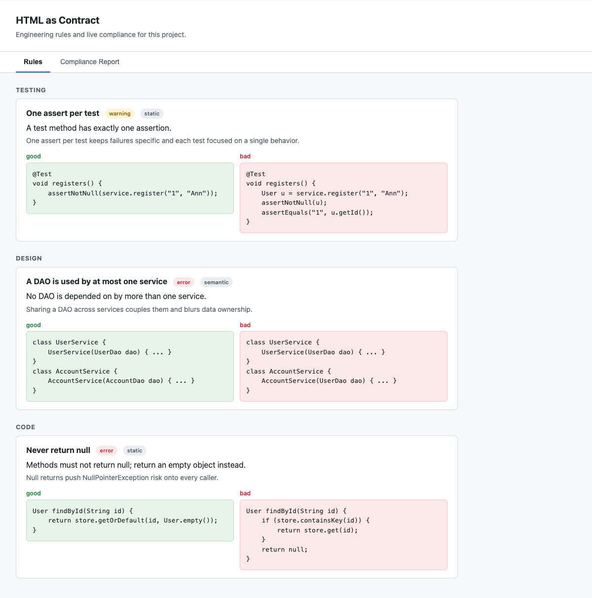
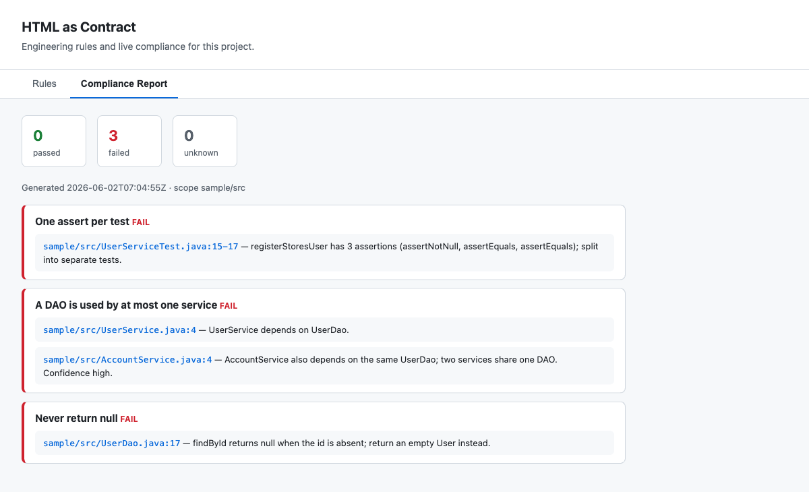

# html-as-contract

A single HTML file as a living engineering contract. It is dual-reader: a human
opens it in a browser (light theme, two tabs); an agent reads the same markup,
extracts the rules, and writes a compliance report back into it.

Inspired by Tariq (Claude Code team) and the "HTML as contract" idea: markup is
both human-renderable and natively parseable by an LLM, so one artifact carries
the rules, the good/bad code, and the current compliance status.

See the [design doc](design-doc.md) for the full design.

## Layout

```
html-as-contract/
  design-doc.md
  install.sh
  uninstall.sh
  skill/
    SKILL.md          skill instructions
    template.html     chrome, tabs, agent-protocol, empty regions
  sample/
    contract.html     scaffolded contract with starter rules and a report
    src/              small project seeded with rule violations
```

## Install

```
./install.sh     copies the skill to ~/.claude/skills/html-as-contract
./uninstall.sh   removes it
```

## Use

```
/html-as-contract           review and accept rules
/html-as-contract suggest   propose rules from the codebase
/html-as-contract check     scan code and regenerate the report tab
```

`check` is non-interactive and idempotent, so a human or another agent can call
it. It rewrites only the report tab and never edits the rules.

## Sample

`sample/` holds a small project seeded with violations of all three starter
rules, plus a scaffolded `sample/contract.html`. Run `/html-as-contract check`
inside `sample/` to refresh the report tab, or open `sample/contract.html` in a
browser to read it as-is.

## Result

`sample/contract.html` renders as one page with two tabs. The first is the
human-authored contract; the second is what the agent writes back after a
`check` run. Both readers see the same markup.

### Rules tab



The source of truth a person reads and edits. Each rule shows its category,
severity (`error` / `warning`), and check type (`static` / `semantic`) next to a
good/bad code pair. The agent parses this tab but never edits it.

### Compliance Report tab



Agent-owned. Running `/html-as-contract check` against `sample/src` produces
this: a passed / failed / unknown summary, a generated-at line, and one entry
per rule. Every violation cites the offending `file:line` with a short reason.
Here all three starter rules fail because each sample source is seeded with one
violation — three asserts in `UserServiceTest`, two services sharing `UserDao`,
and a `null` return in `UserDao.findById`.

For the full design and rationale, see the [design doc](design-doc.md).
