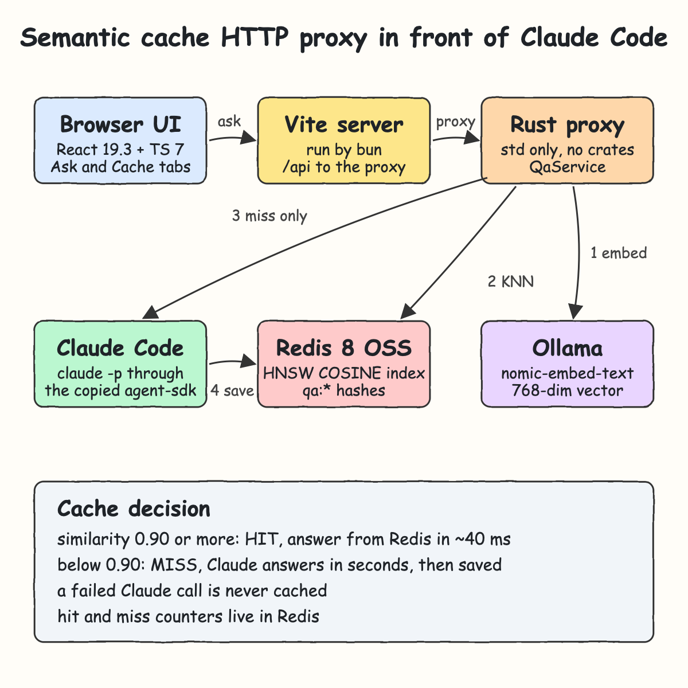
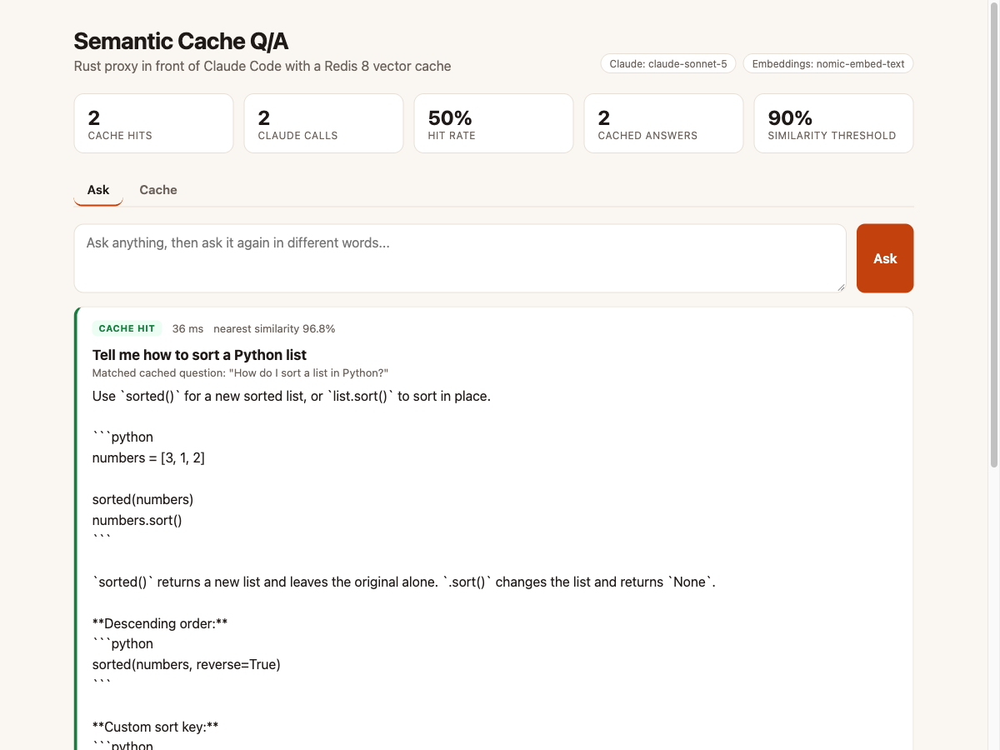
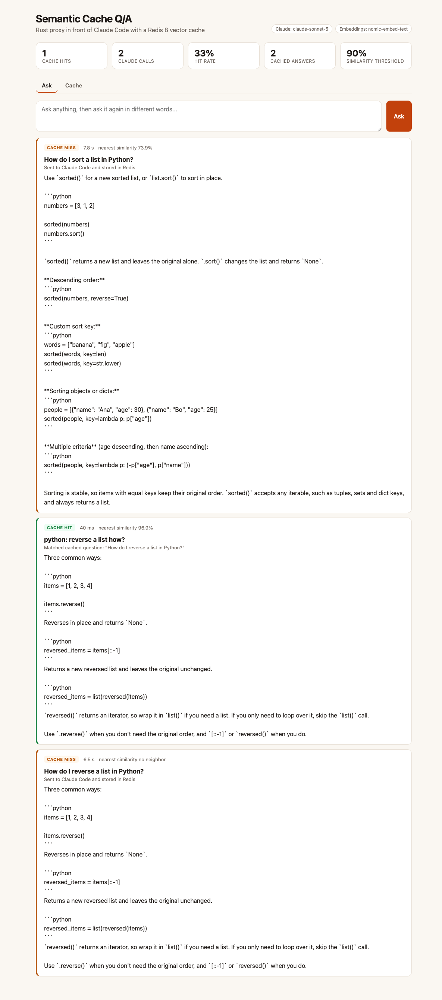
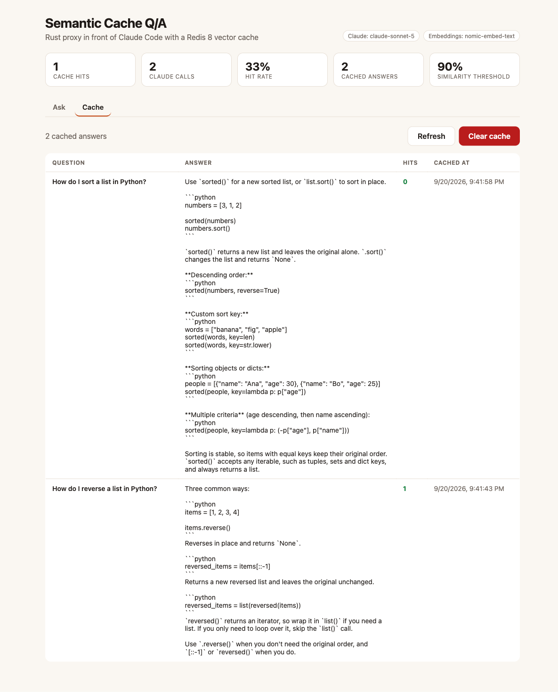

<p align="center"></p>

# Semantic Cache Q/A

A Q/A app with a Rust HTTP proxy in front of Claude Code. Every question is embedded locally with Ollama and searched in an open source Redis 8 vector index. When a previous question means the same thing, the cached answer returns in milliseconds. Otherwise the proxy asks Claude Code, returns the answer and caches it for the next paraphrase.

## How it Works?

1. The React UI posts the question to `/api/ask`. Vite forwards `/api` to the Rust proxy.
2. The proxy embeds the question with Ollama `nomic-embed-text` (768 floats, local, free).
3. It runs a KNN 1 search on the Redis 8 HNSW index with cosine distance, and similarity is `1 - distance`.
4. At a similarity of 0.90 or more it is a **CACHE HIT**: the stored answer is returned and the entry hit counter goes up.
5. Otherwise it is a **CACHE MISS**: the proxy calls `claude -p` through the copied agent-sdk, stores question, answer and vector as a Redis hash, and returns the answer.
6. A failed Claude call is never stored, so an outage is never replayed as an answer.

## Architecture



## Features

- Semantic hits: paraphrases like "python: reverse a list how?" reuse the answer to "How do I reverse a list in Python?"
- Near misses stay misses: "capital of Germany" scores 0.77 against "capital of France", below the 0.90 threshold, so it never gets "Paris".
- Local embeddings: Ollama runs the embedding model locally, so a lookup never calls a paid API.
- Redis 8 OSS vector search: `FT.CREATE ... VECTOR HNSW`, with no Redis Stack or extra modules.
- Hit and miss counters: they live in Redis, so the savings survive restarts.
- Cache tab: lists every cached answer with its hit count. It can also clear the cache.
- Only answers are cached: the proxy calls Claude Code in print mode for plain Q/A, so no tool calls are replayed.

## Stack

- Rust 1.98, edition 2024: a dependency-free proxy with hand-written HTTP/1.1, a RESP client and JSON output (no crates).
- agent-sdk (Rust, copied into `backend/src/agent_sdk`): runs `claude -p --model <model>` without a shell.
- Redis 8 (podman): open source vector search with an HNSW index and cosine distance.
- Ollama `nomic-embed-text`: 768-dimension local embeddings.
- React 19.3: `useActionState` drives the ask form and its pending state.
- TypeScript 7.0: the native compiler typechecks the UI.
- Vite 8: dev server and the `/api` proxy to the backend.
- Bun 1.4: package manager, script runner and the UI test runner.

## Contracts/APIs

| Method | Path | Body | Response |
|---|---|---|---|
| POST | `/api/ask` | `{"question":"..."}` | `{"question","answer","cached","similarity","matchedQuestion","latencyMs"}` |
| GET | `/api/cache` | | `{"entries":[{"key","question","answer","hits","createdAt"}]}` |
| DELETE | `/api/cache` | | `{"cleared":true}` |
| GET | `/api/stats` | | `{"hits","misses","entries","threshold","claudeModel","embedModel"}` |
| GET | `/api/health` | | `{"status":"UP"}` |

A blank or missing question returns `400`. A failure in Claude Code, Ollama or Redis returns `502` with `{"error":"..."}`, because an upstream of the proxy failed.

Configuration is read from environment variables: `PROXY_PORT`, `REDIS_ADDR`, `OLLAMA_ADDR`, `EMBED_MODEL` (`nomic-embed-text`), `CLAUDE_MODEL` (`claude-sonnet-5`) and `SIMILARITY_THRESHOLD` (`0.9`).

## Key data structures and design decisions

- Each cache entry is one Redis hash `qa:<nanos>` with `question`, `answer`, `created_at`, `hits` and `embedding`. The embedding is stored as little-endian FLOAT32 bytes, the format the HNSW index reads.
- The index is `qa_idx ON HASH PREFIX qa:`. Its vector dimension is taken from a probe embedding at startup, so changing the embedding model needs no code change.
- `QaService` depends only on three traits: `Embedder`, `Store` and `Llm`. Unit tests run the whole flow with in-memory fakes. Integration tests run it against real Redis and Ollama.
- The threshold of 0.90 was measured, not guessed. Paraphrases scored 0.957 to 0.969. Different questions on the same topic scored 0.68 to 0.80.
- The proxy sits in front of the Claude Code CLI for Q/A. It does not intercept Claude Code agent traffic through `ANTHROPIC_BASE_URL`. Agent turns carry tool calls and file state that are unsafe to replay from a similarity match.
- The proxy uses one thread per connection and one short-lived Redis connection per command, which keeps it simple enough for a POC.

## How to run the app/tests

Requirements: Rust, bun, podman with podman-compose, Ollama running, and a logged-in Claude Code CLI.

```bash
./scripts/setup.sh
./scripts/start-all.sh
./scripts/ui.sh
./scripts/test-all.sh
./scripts/stop-all.sh
```

`test-all.sh` runs 50 tests:

- 40 Rust unit tests: the service flow with fakes, routes, RESP, HTTP, JSON and the copied SDK.
- 3 Rust integration tests: KNN with real Ollama embeddings and Redis, the full flow over Redis, and a real Claude Code call through the SDK.
- 7 UI tests: the API client and formatters, run by `bun test` after the TypeScript 7 typecheck.

## Printscreens

### Ask: cache hit on a paraphrase



"Tell me how to sort a Python list" matched the cached "How do I sort a list in Python?" at 96.8% similarity. The answer came back from Redis in 36 ms without calling Claude Code. The stats bar shows 2 hits, 2 Claude calls, a 50% hit rate and the 90% threshold.

### Ask: a session with misses and a hit



Newest first:

- "How do I reverse a list in Python?" was a miss. It went to Claude Code (6.5 s) and was stored.
- "python: reverse a list how?" was a hit at 96.9% (40 ms), with the matched cached question shown.
- "How do I sort a list in Python?" is a near miss at 73.9%. It stayed below the threshold, so it went to Claude instead of reusing the reverse answer.

### Cache tab



Every cached answer stored in Redis, newest first, with how many times each one was served from the cache. Refresh reloads the list. Clear cache drops the index with its documents, resets the counters and recreates the index.

## Scripts

All scripts live in `scripts/` and run from any directory of the repository.

| Script | What it does |
|---|---|
| `./scripts/setup.sh` | Installs dependencies and prepares the app |
| `./scripts/start-all.sh` | Starts every service and prints the full link of each one |
| `./scripts/status.sh` | Shows every service port as UP or DOWN |
| `./scripts/test-all.sh` | Runs every test suite |
| `./scripts/ui.sh` | Opens the UI in the browser |
| `./scripts/stop-all.sh` | Stops every service |
| `./scripts/sql-console.sh` | Opens a redis-cli console on the cache |

Ports are declared in `scripts/ports.env`: redis `6380`, backend `8787` (`http://localhost:8787/api`), ui `5174` (`http://localhost:5174`).

```bash
./scripts/setup.sh
./scripts/start-all.sh
./scripts/status.sh
./scripts/ui.sh
./scripts/stop-all.sh
```
