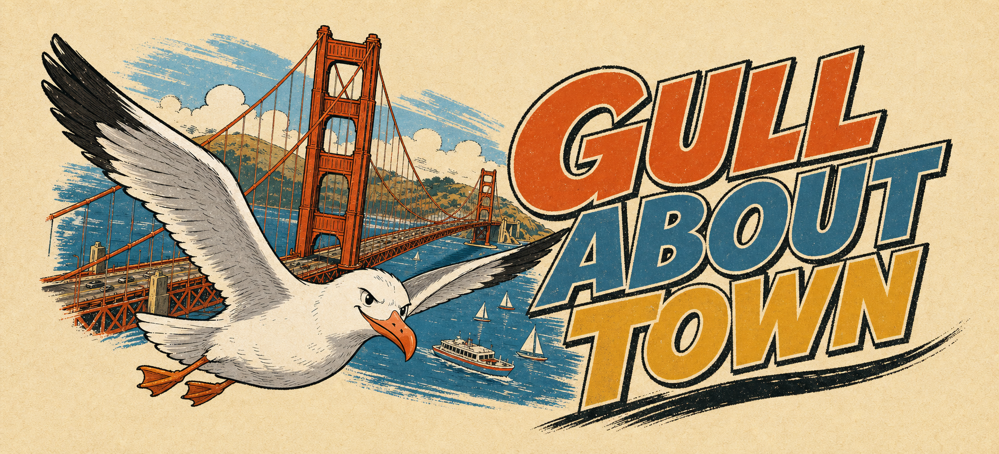

# Gull About Town



A hand-drawn 3D seagull adventure across a playful San Francisco. Fly over the Golden Gate Bridge, walk the waterfront, swim through the bay, visit Fisherman's Wharf, Chinatown, the Embarcadero, and Golden Gate Park, then create a little civic chaos.

## Play

```bash
npm install
./start.sh
```

Open [http://localhost:4173](http://localhost:4173).

```bash
./stop.sh
```

## Controls

| Action | Keyboard | Touch |
| --- | --- | --- |
| Steer | `W` `A` `S` `D` | Left thumb stick |
| Flap and take off | `Space` | Flap |
| Dive | `Shift` | Dive |
| Poop | `Q` | Poop |
| Pause | `Esc` | Top-right pause button |

Movement changes automatically. Land on streets, parks, piers, or the bridge to walk. Settle on the bay to swim. Flap to take off from either surface.

## Mission

Mark three people, two vehicles, and one animal. Consecutive hits within five seconds build a score multiplier. The aiming ring turns orange when a target is lined up.

## San Francisco

The compact world includes:

- Golden Gate Bridge with a driveable roadway, towers, hangers, and suspension cables
- Fisherman's Wharf with a pier, sea lions, posts, and waterfront buildings
- Chinatown gate, lanterns, steep blocks, and a moving cable car
- Embarcadero piers, Ferry Building clock tower, and Coit Tower
- Transamerica Pyramid, Painted Ladies, and Alcatraz
- Golden Gate Park, hills, plants, trees, roads, cars, people, cats, and dogs

## Mobile

The game detects narrow screens and replaces keyboard hints with touch controls. Rendering resolution is capped on mobile for steady performance. Landscape orientation provides the widest view, while portrait mode remains fully playable.

## Build and verify

```bash
./test.sh
```

The production output is created in `dist`.

## Stack

- Three.js
- Vite
- Vanilla JavaScript, HTML, and CSS

The title illustration is an original generated asset. The playable world, characters, landmarks, animation, physics, scoring, audio, map, and touch controls are generated by the application code.
