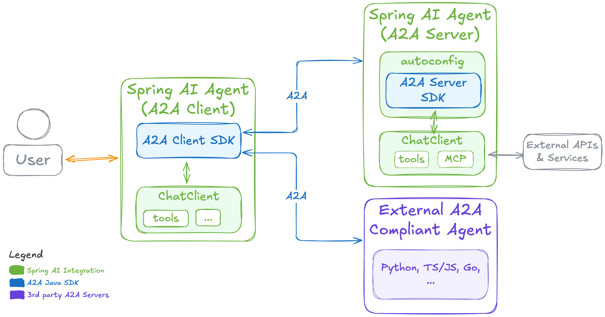
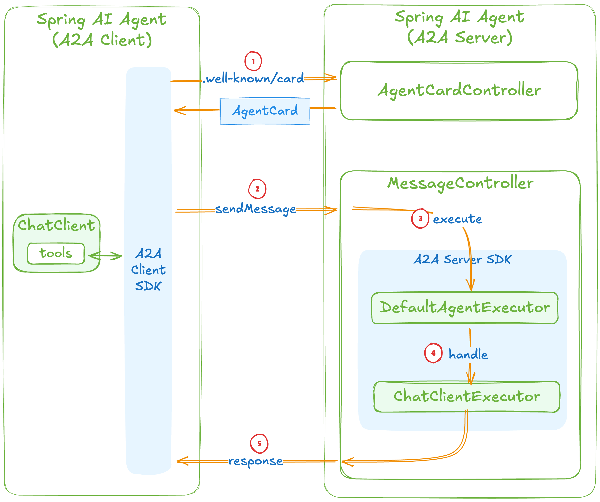

# Spring AI - A2A

https://spring.io/blog/2026/01/29/spring-ai-agentic-patterns-a2a-integration

Overall <br/>



How it works? <br/>




## Result

Run All Agents (spring Boot)
```
❯ ./run.sh
[INFO] Scanning for projects...
[INFO] ------------------------------------------------------------------------
[INFO] Reactor Build Order:
[INFO]
[INFO] java-25-spring-boot-4-spring-ai-a2a-parent                         [pom]
[INFO] weather-agent                                                      [jar]
[INFO] hotel-agent                                                        [jar]
[INFO] trip-planner                                                       [jar]
[INFO]
[INFO] --< com.github.diegopacheco.javapocs:java-25-spring-boot-4-spring-ai-a2a-parent >--
[INFO] Building java-25-spring-boot-4-spring-ai-a2a-parent 1.0-SNAPSHOT   [1/4]
[INFO]   from pom.xml
[INFO] --------------------------------[ pom ]---------------------------------
[INFO]
[INFO] --- clean:3.5.0:clean (default-clean) @ java-25-spring-boot-4-spring-ai-a2a-parent ---
[INFO]
[INFO] -----------< com.github.diegopacheco.javapocs:weather-agent >-----------
[INFO] Building weather-agent 1.0-SNAPSHOT                                [2/4]
[INFO]   from weather-agent/pom.xml
[INFO] --------------------------------[ jar ]---------------------------------
[INFO]
[INFO] --- clean:3.5.0:clean (default-clean) @ weather-agent ---
[INFO] Deleting /Users/diegopacheco/git/diegopacheco/ai-playground/pocs/java-25-spring-boot-4-spring-ai-a2a/weather-agent/target
[INFO]
[INFO] --- resources:3.3.1:resources (default-resources) @ weather-agent ---
[INFO] Copying 1 resource from src/main/resources to target/classes
[INFO] Copying 0 resource from src/main/resources to target/classes
[INFO]
[INFO] --- compiler:3.14.1:compile (default-compile) @ weather-agent ---
[INFO] Recompiling the module because of changed source code.
[INFO] Compiling 3 source files with javac [debug parameters release 25] to target/classes
[INFO]
[INFO] --- resources:3.3.1:testResources (default-testResources) @ weather-agent ---
[INFO] skip non existing resourceDirectory /Users/diegopacheco/git/diegopacheco/ai-playground/pocs/java-25-spring-boot-4-spring-ai-a2a/weather-agent/src/test/resources                                                                                               [INFO]
[INFO] --- compiler:3.14.1:testCompile (default-testCompile) @ weather-agent ---
[INFO] No sources to compile
[INFO]
[INFO] --- surefire:3.5.4:test (default-test) @ weather-agent ---
[INFO] Tests are skipped.
[INFO]
[INFO] --- jar:3.4.2:jar (default-jar) @ weather-agent ---
[INFO] Building jar: /Users/diegopacheco/git/diegopacheco/ai-playground/pocs/java-25-spring-boot-4-spring-ai-a2a/weather-agent/target/weather-agent-1.0-SNAPSHOT.jar
[INFO]
[INFO] --- spring-boot:4.0.2:repackage (repackage) @ weather-agent ---
[INFO] Replacing main artifact /Users/diegopacheco/git/diegopacheco/ai-playground/pocs/java-25-spring-boot-4-spring-ai-a2a/weather-agent/target/weather-agent-1.0-SNAPSHOT.jar with repackaged archive, adding nested dependencies in BOOT-INF/.
[INFO] The original artifact has been renamed to /Users/diegopacheco/git/diegopacheco/ai-playground/pocs/java-25-spring-boot-4-spring-ai-a2a/weather-agent/target/weather-agent-1.0-SNAPSHOT.jar.original
[INFO]
[INFO] ------------< com.github.diegopacheco.javapocs:hotel-agent >------------
[INFO] Building hotel-agent 1.0-SNAPSHOT                                  [3/4]
[INFO]   from hotel-agent/pom.xml
[INFO] --------------------------------[ jar ]---------------------------------
[INFO]
[INFO] --- clean:3.5.0:clean (default-clean) @ hotel-agent ---
[INFO] Deleting /Users/diegopacheco/git/diegopacheco/ai-playground/pocs/java-25-spring-boot-4-spring-ai-a2a/hotel-agent/target
[INFO]
[INFO] --- resources:3.3.1:resources (default-resources) @ hotel-agent ---
[INFO] Copying 1 resource from src/main/resources to target/classes
[INFO] Copying 0 resource from src/main/resources to target/classes
[INFO]
[INFO] --- compiler:3.14.1:compile (default-compile) @ hotel-agent ---
[INFO] Recompiling the module because of changed source code.
[INFO] Compiling 3 source files with javac [debug parameters release 25] to target/classes
[INFO]
[INFO] --- resources:3.3.1:testResources (default-testResources) @ hotel-agent ---
[INFO] skip non existing resourceDirectory /Users/diegopacheco/git/diegopacheco/ai-playground/pocs/java-25-spring-boot-4-spring-ai-a2a/hotel-agent/src/test/resources
[INFO]
[INFO] --- compiler:3.14.1:testCompile (default-testCompile) @ hotel-agent ---
[INFO] No sources to compile
[INFO]
[INFO] --- surefire:3.5.4:test (default-test) @ hotel-agent ---
[INFO] Tests are skipped.
[INFO]
[INFO] --- jar:3.4.2:jar (default-jar) @ hotel-agent ---
[INFO] Building jar: /Users/diegopacheco/git/diegopacheco/ai-playground/pocs/java-25-spring-boot-4-spring-ai-a2a/hotel-agent/target/hotel-agent-1.0-SNAPSHOT.jar
[INFO]
[INFO] --- spring-boot:4.0.2:repackage (repackage) @ hotel-agent ---
[INFO] Replacing main artifact /Users/diegopacheco/git/diegopacheco/ai-playground/pocs/java-25-spring-boot-4-spring-ai-a2a/hotel-agent/target/hotel-agent-1.0-SNAPSHOT.jar with repackaged archive, adding nested dependencies in BOOT-INF/.
[INFO] The original artifact has been renamed to /Users/diegopacheco/git/diegopacheco/ai-playground/pocs/java-25-spring-boot-4-spring-ai-a2a/hotel-agent/target/hotel-agent-1.0-SNAPSHOT.jar.original
[INFO]
[INFO] -----------< com.github.diegopacheco.javapocs:trip-planner >------------
[INFO] Building trip-planner 1.0-SNAPSHOT                                 [4/4]
[INFO]   from trip-planner/pom.xml
[INFO] --------------------------------[ jar ]---------------------------------
[INFO]
[INFO] --- clean:3.5.0:clean (default-clean) @ trip-planner ---
[INFO] Deleting /Users/diegopacheco/git/diegopacheco/ai-playground/pocs/java-25-spring-boot-4-spring-ai-a2a/trip-planner/target
[INFO]
[INFO] --- resources:3.3.1:resources (default-resources) @ trip-planner ---
[INFO] Copying 1 resource from src/main/resources to target/classes
[INFO] Copying 0 resource from src/main/resources to target/classes
[INFO]
[INFO] --- compiler:3.14.1:compile (default-compile) @ trip-planner ---
[INFO] Recompiling the module because of changed source code.
[INFO] Compiling 5 source files with javac [debug parameters release 25] to target/classes
[INFO]
[INFO] --- resources:3.3.1:testResources (default-testResources) @ trip-planner ---
[INFO] skip non existing resourceDirectory /Users/diegopacheco/git/diegopacheco/ai-playground/pocs/java-25-spring-boot-4-spring-ai-a2a/trip-planner/src/test/resources
[INFO]
[INFO] --- compiler:3.14.1:testCompile (default-testCompile) @ trip-planner ---
[INFO] No sources to compile
[INFO]
[INFO] --- surefire:3.5.4:test (default-test) @ trip-planner ---
[INFO] Tests are skipped.
[INFO]
[INFO] --- jar:3.4.2:jar (default-jar) @ trip-planner ---
[INFO] Building jar: /Users/diegopacheco/git/diegopacheco/ai-playground/pocs/java-25-spring-boot-4-spring-ai-a2a/trip-planner/target/trip-planner-1.0-SNAPSHOT.jar
[INFO]
[INFO] --- spring-boot:4.0.2:repackage (repackage) @ trip-planner ---
[INFO] Replacing main artifact /Users/diegopacheco/git/diegopacheco/ai-playground/pocs/java-25-spring-boot-4-spring-ai-a2a/trip-planner/target/trip-planner-1.0-SNAPSHOT.jar with repackaged archive, adding nested dependencies in BOOT-INF/.
[INFO] The original artifact has been renamed to /Users/diegopacheco/git/diegopacheco/ai-playground/pocs/java-25-spring-boot-4-spring-ai-a2a/trip-planner/target/trip-planner-1.0-SNAPSHOT.jar.original
[INFO] ------------------------------------------------------------------------
[INFO] Reactor Summary for java-25-spring-boot-4-spring-ai-a2a-parent 1.0-SNAPSHOT:
[INFO]
[INFO] java-25-spring-boot-4-spring-ai-a2a-parent ......... SUCCESS [  0.053 s]
[INFO] weather-agent ...................................... SUCCESS [  1.117 s]
[INFO] hotel-agent ........................................ SUCCESS [  0.265 s]
[INFO] trip-planner ....................................... SUCCESS [  0.296 s]
[INFO] ------------------------------------------------------------------------
[INFO] BUILD SUCCESS
[INFO] ------------------------------------------------------------------------
[INFO] Total time:  1.894 s
[INFO] Finished at: 2026-02-18T22:18:41-08:00
[INFO] ------------------------------------------------------------------------
Weather agent running on port 10001
Hotel agent running on port 10002
Trip planner running on port 10000
All A2A agents are running
```

