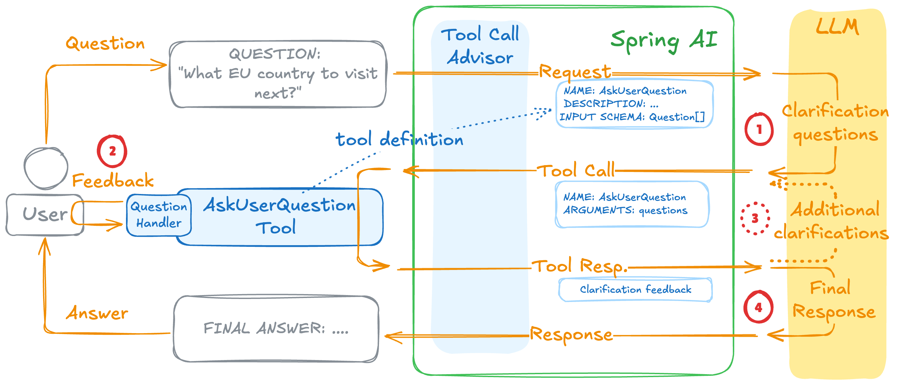

# Spring AI - AskUserQuestion Tool

https://spring.io/blog/2026/01/16/spring-ai-ask-user-question-tool



## Result

```
export OPENAI_API_KEY=your_api_key_here
./run.sh
```

```
[INFO] ------------------------------------------------------------------------
[INFO] BUILD SUCCESS
[INFO] ------------------------------------------------------------------------
[INFO] Total time:  1.260 s
[INFO] Finished at: 2026-02-19T22:09:55-08:00
[INFO] ------------------------------------------------------------------------

  .   ____          _            __ _ _
 /\\ / ___'_ __ _ _(_)_ __  __ _ \ \ \ \
( ( )\___ | '_ | '_| | '_ \/ _` | \ \ \ \
 \\/  ___)| |_)| | | | | || (_| |  ) ) ) )
  '  |____| .__|_| |_|_| |_\__, | / / / /
 =========|_|==============|___/=/_/_/_/

 :: Spring Boot ::                (v4.0.2)

2026-02-19T22:09:56.345-08:00  INFO 80665 --- [ask-user-tool] [           main] c.g.d.s.AskUserToolApplication           : Starting AskUserToolApplication v1.0-SNAPSHOT using Java 25 with PID 80665 (/Users/diegopacheco/git/diegopacheco/ai-playground/pocs/java-25-spring-boot-4-spring-ai-ask-user-tool/target/java-25-spring-boot-4-spring-ai-ask-user-tool-1.0-SNAPSHOT.jar started by diegopacheco in /Users/diegopacheco/git/diegopacheco/ai-playground/pocs/java-25-spring-boot-4-spring-ai-ask-user-tool)
2026-02-19T22:09:56.347-08:00  INFO 80665 --- [ask-user-tool] [           main] c.g.d.s.AskUserToolApplication           : No active profile set, falling back to 1 default profile: "default"
2026-02-19T22:09:57.090-08:00  INFO 80665 --- [ask-user-tool] [           main] c.g.d.s.AskUserToolApplication           : Started AskUserToolApplication in 0.994 seconds (process running for 1.279)

=== Spring AI Ask User Question Tool ===

WARNING: A restricted method in java.lang.System has been called
WARNING: java.lang.System::loadLibrary has been called by io.netty.util.internal.NativeLibraryUtil in an unnamed module (jar:nested:/Users/diegopacheco/git/diegopacheco/ai-playground/pocs/java-25-spring-boot-4-spring-ai-ask-user-tool/target/java-25-spring-boot-4-spring-ai-ask-user-tool-1.0-SNAPSHOT.jar/!BOOT-INF/lib/netty-common-4.2.9.Final.jar!/)
WARNING: Use --enable-native-access=ALL-UNNAMED to avoid a warning for callers in this module
WARNING: Restricted methods will be blocked in a future release unless native access is enabled
```

Call the Agent:

```
./test.sh
```

Result:
```
❯ ./test.sh
Starting trip planning session...
Session ID: ae09b86c-d8fd-42b8-9fcf-58b54f4b0640

Question: What type of destination do you prefer?
  1. Beach: Sun, sand, and water activities — ideal for relaxation and watersports (Recommended).
  2. City: Urban exploration with museums, dining, nightlife, and shopping.
  3. Nature: Hiking, national parks, wildlife, and scenic landscapes.
  4. Cultural: Historic sites, local traditions, museums, and cultural events.
Your answer (enter number or type freely): 2
=> City

Question: What’s your budget range for the trip (per person for the whole trip)?
  1. Moderate: $1,500–3,000 per person for a week — good balance of comfort and value (Recommended).
  2. Economy: Under $1,500 per person for a week — budget accommodations and limited extras.
  3. Luxury: $3,000+ per person for a week — upscale hotels, fine dining, and private experiences.
  4. Backpacker: Very low budget: hostels, public transport, and DIY travel.
Your answer (enter number or type freely): 3
=> Luxury

Question: How long do you want the trip to be?
  1. Long wknd: 3–4 days — quick getaway for shorter trips.
  2. 1 week: 7 days — recommended length to see a destination without rushing (Recommended).
  3. 2 weeks: 10–14 days — more relaxed pace, allows multi-region travel.
Your answer (enter number or type freely): 2
=> 1 week

Question: What is your travel style?
  1. Relaxed: Leisurely pace, downtime, spa/beach days, minimal transit (Recommended).
  2. Active: Packed with activities: hikes, excursions, and sports.
  3. Family: Kid-friendly activities, comfortable pacing, family accommodations.
  4. Romantic: Couples-focused: intimate dinners, scenic views, and privacy.
Your answer (enter number or type freely): 1
=> Relaxed
Question: What type of destination do you prefer?
  1. Beach: Sun, sand, and water activities — ideal for relaxation and watersports (Recommended).
  2. City: Urban exploration with museums, dining, nightlife, and shopping.
  3. Nature: Hiking, national parks, wildlife, and scenic landscapes.
  4. Cultural: Historic sites, local traditions, museums, and cultural events.
Your answer (enter number or type freely): 1
=> Beach
Question: What’s your budget range for the trip (per person for the whole trip)?
  1. Moderate: $1,500–3,000 per person for a week — good balance of comfort and value (Recommended).                                 2. Economy: Under $1,500 per person for a week — budget accommodations and limited extras.
  3. Luxury: $3,000+ per person for a week — upscale hotels, fine dining, and private experiences.
  4. Backpacker: Very low budget: hostels, public transport, and DIY travel.                                                       Your answer (enter number or type freely): 2
=> Economy
                                                                                                                                   Question: How long do you want the trip to be?
  1. Long wknd: 3–4 days — quick getaway for shorter trips.
  2. 1 week: 7 days — recommended length to see a destination without rushing (Recommended).
  3. 2 weeks: 10–14 days — more relaxed pace, allows multi-region travel.
Your answer (enter number or type freely): 2
=> 1 week
Question: What is your travel style?
  1. Relaxed: Leisurely pace, downtime, spa/beach days, minimal transit (Recommended).                                               2. Active: Packed with activities: hikes, excursions, and sports.
  3. Family: Kid-friendly activities, comfortable pacing, family accommodations.
  4. Romantic: Couples-focused: intimate dinners, scenic views, and privacy.                                                       Your answer (enter number or type freely): 2
=> Active

==================================
          TRIP PLAN
==================================
Great — thanks for those preferences. Based on a city trip, a luxury budget, a relaxed pace, and one week, I’ve put together a tailored 7‑day luxury city itinerary. I’m using Paris as my recommended destination (it’s ideal for a relaxed, luxurious city week: world‑class hotels, fine dining, museums, private experiences and effortless downtime). If you’d prefer a different city instead, tell me and I’ll adapt the plan.
Summary — the plan at a glance
- Destination: Paris (recommended) — I can swap to Rome, Tokyo, New York, Barcelona, or another city if you prefer.                - Duration: 7 days / 6 nights
- Style: Relaxed luxury (private transfers, late mornings, spa time, private guided half‑days, Michelin dinners)
- Estimated budget (per person, luxury): roughly $6,500–$14,000 depending on flight class, hotel choice, and dining/experiences. I include a breakdown below.

7‑day relaxed luxury Paris itinerary (day‑by‑day)                                                                                  Day 1 — Arrival & slow start
- Private chauffeur picks you up from the airport (meet & greet).
- Check in at a 5* luxury hotel (see options below). Unpack and relax.
- Light late afternoon: gentle walk in the Tuileries or along the Seine.
- Dinner at the hotel’s signature restaurant or a nearby bistro (reserve table for 8:00–9:00 pm).
                                                                                                                                   Day 2 — Classic Paris, private highlights
- Late breakfast at hotel.
- Morning private half‑day guided tour: Louvre highlights or a custom “Paris for first‑timers” tour (skip‑the‑line access).        - Lunch at a high‑end bistro in Saint‑Germain.
- Afternoon spa treatment (90 minutes) at your hotel or a renowned spa (e.g., spa at Le Bristol).
- Evening: Champagne Seine cruise (private or small‑group) to see monuments lit up.
Day 3 — Montmartre & shopping at a relaxed pace
- Leisurely morning — coffee and pastries near your hotel.                                                                         - Private guided stroll through Montmartre: Sacré‑Cœur, artists’ squares, charming streets.
- Lunch at a top casual spot in Le Marais; then relaxed shopping: Le Marais boutiques or Avenue Montaigne for couture.
- Optional late‑afternoon nap or hotel pool time.
- Dinner at a Michelin‑starred restaurant (see dining suggestions).

Day 4 — Day trip to Versailles (private)
- Private chauffeured day trip to Versailles with a private guide (skip‑the‑line palace tour + gardens; private golf cart in the park if desired).                                                                                                                    - Lunch at a fine restaurant near Versailles or picnic in the gardens (arranged).
- Return late afternoon — quiet evening at the hotel, or a low‑key wine bar in Saint‑Germain.
                                                                                                                                   Day 5 — Art & culinary indulgence
- Late breakfast, then visit Musée d’Orsay in a relaxed paced guided visit.
- Afternoon private cooking class or a wine & cheese tasting (small group/private).                                                - Evening: jazz club in the Latin Quarter or a second Michelin option—choose based on energy level.

Day 6 — Custom luxury experience & downtime                                                                                        - Morning: choose one relaxed experience — private perfume workshop, private gallery viewing, helicopter panoramic flight over Paris, or a private photo tour.
- Lunch at your leisure.
- Spa/nap/pool time mid‑day to recharge.
- Farewell Michelin tasting menu dinner (early reservation recommended).

Day 7 — Departure
- Leisurely breakfast, last minute shopping or a short walk in a neighborhood you loved.
- Private transfer to the airport; assistance with luggage and check‑in.

Luxury hotel recommendations (examples and nightly estimates)
- Four Seasons Hotel George V — classic haute luxe, central (approx $1,200–2,500+/night).
- Le Bristol Paris (Oetker) — refined, excellent spa (approx $1,000–2,000+/night).
- Ritz Paris — historic, iconic (approx $1,200–3,000+/night).
- Shangri‑La Hotel Paris — palace hotel with Seine views (approx $900–1,800+/night).
Choose a suite or prestige room for extra privacy and space.

Dining & experiences (book early)
- Michelin tasting options: Le Cinq (Four Seasons), Epicure (Le Bristol), L’Arpège, Guy Savoy — reserve 4–8 weeks ahead for weekend slots.
- More relaxed luxury meals: L’Avenue, Café de Flore for people‑watching, Monsieur Bleu for views.
- Must‑book experiences: private Louvre tour, Champagne Seine cruise, Versailles private tour, spa treatments at hotel spas.

Transport & logistics
- Airport: private chauffeur (recommended with luggage and for a stress‑free start).
- Around town: mix of private drivers for half‑days/day trips and short taxi/Uber rides. Metro is fast but taxis/private car are more comfortable when you’re in luxury mode.
- Local SIM/eSIM or roaming plan, and a rideshare/taxi app downloaded.

Estimated budget breakdown (per person, approximate)
- International flights (business class roundtrip): $2,500–7,000 (varies by route/time).
- Hotel (6 nights): $6,000–12,000 (based on $1,000–2,000+/night for top hotels).
- Dining & drinks: $600–1,800 (fine dining + breakfast/lunch mix).
- Experiences & private tours: $600–2,000 (private guides, Versailles, cruise, spa).
- Transfers & local transport: $300–800 (private transfers & occasional chauffeur).
- Total estimate: $10,000 (lower luxury end) to $23,000 (top ultra‑luxury), but many can do $6,500–14,000 if flights/hotel choices are optimized. I can tighten these numbers with your dates and departure city.

Packing list — luxury & relaxed
- Smart casual evening wear + one formal outfit for a Michelin dinner.
- Comfortable shoes for cobblestones and strolling.
- Lightweight layers (spring/fall), a trench or a smart coat for cooler months.
- Travel adapters, phone charger, power bank.
- Small day bag for wallet/passport, and a compact umbrella.
- If you plan spa or pool: swimsuit, flip‑flops.

Practical & safety notes
- Language: basic French phrases are appreciated — hotels and guides usually speak English.
- Tipping: service is included in many places; leaving a small tip for exceptional service is standard.
- Health: carry travel insurance that covers trip cancellation and medical emergencies; I recommend a policy with COVID and evacuation coverage if relevant.
- Book high‑demand items (restaurant and private tours) well ahead — especially for weekend travel.

Next steps — how I can help now
- I can finalize this Paris plan for your specific travel dates and departure city (I’ll check flight options, exact hotel availability and prices).
- Or I can adapt this same relaxed‑luxury plan to another city — say Rome, Tokyo, New York, or Barcelona. Tell me which city you’d prefer.
- If you want me to proceed with Paris, tell me: travel dates (or month), departure city/airport, how many travelers and relationship (solo/couple), any dietary restrictions/allergies, and whether you want me to include flight class preference (business/first/economy).

Which would you like to do next — confirm Paris and give dates, or pick a different city?
```