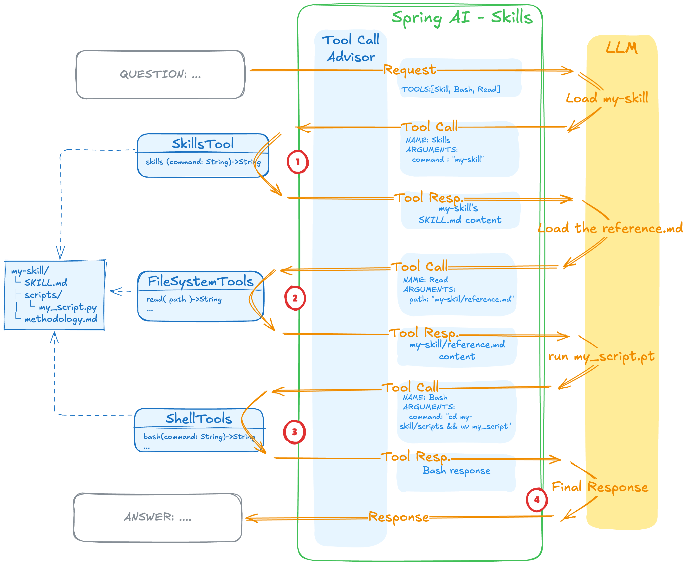

# Spring AI Skill

https://spring.io/blog/2026/01/13/spring-ai-generic-agent-skills



### Build

```bash
./mvnw clean install
```

### Running

```bash
# Run

export OPENAI_API_KEY=your-key-here
./run.sh

# Test endpoints
# Ask anything - skills kick in automatically via semantic matching
curl -X POST http://localhost:8081/agent/ask \
-H "Content-Type: text/plain" \
-d "Explain virtual threads in Java 25"

# List available skills
curl http://localhost:8081/agent/skills
```

### Result

Spring Boot AI Agent
```
[INFO] Scanning for projects...
[INFO]
[INFO] --< com.github.diegopacheco.javapocs:java-25-spring-boot-4-spring-ai-skills >--
[INFO] Building java-25-spring-boot-4-spring-ai-skills 1.0-SNAPSHOT
[INFO]   from pom.xml
[INFO] --------------------------------[ jar ]---------------------------------
[INFO]
[INFO] >>> spring-boot:4.0.2:run (default-cli) > test-compile @ java-25-spring-boot-4-spring-ai-skills >>>
[INFO]
[INFO] --- resources:3.3.1:resources (default-resources) @ java-25-spring-boot-4-spring-ai-skills ---
[INFO] Copying 1 resource from src/main/resources to target/classes
[INFO] Copying 3 resources from src/main/resources to target/classes
[INFO]
[INFO] --- compiler:3.14.1:compile (default-compile) @ java-25-spring-boot-4-spring-ai-skills ---
[INFO] Nothing to compile - all classes are up to date.
[INFO]
[INFO] --- resources:3.3.1:testResources (default-testResources) @ java-25-spring-boot-4-spring-ai-skills ---
[INFO] Copying 0 resource from src/test/resources to target/test-classes
[INFO]
[INFO] --- compiler:3.14.1:testCompile (default-testCompile) @ java-25-spring-boot-4-spring-ai-skills ---
[INFO] Nothing to compile - all classes are up to date.
[INFO]
[INFO] <<< spring-boot:4.0.2:run (default-cli) < test-compile @ java-25-spring-boot-4-spring-ai-skills <<<
[INFO]
[INFO]
[INFO] --- spring-boot:4.0.2:run (default-cli) @ java-25-spring-boot-4-spring-ai-skills ---
[INFO] Attaching agents: []

  .   ____          _            __ _ _
 /\\ / ___'_ __ _ _(_)_ __  __ _ \ \ \ \
( ( )\___ | '_ | '_| | '_ \/ _` | \ \ \ \
 \\/  ___)| |_)| | | | | || (_| |  ) ) ) )
  '  |____| .__|_| |_|_| |_\__, | / / / /
 =========|_|==============|___/=/_/_/_/

 :: Spring Boot ::                (v4.0.2)

2026-02-18T21:11:17.563-08:00  INFO 81888 --- [           main] c.g.d.sandboxspring.Application          : Starting Application using Java 25 with PID 81888 (/Users/diegopacheco/git/diegopacheco/ai-playground/pocs/java-25-spring-boot-4-spring-ai-skills/target/classes started by diegopacheco in /Users/diegopacheco/git/diegopacheco/ai-playground/pocs/java-25-spring-boot-4-spring-ai-skills)   2026-02-18T21:11:17.565-08:00  INFO 81888 --- [           main] c.g.d.sandboxspring.Application          : No active profile set, falling back to 1 default profile: "default"
2026-02-18T21:11:18.075-08:00  INFO 81888 --- [           main] o.s.boot.tomcat.TomcatWebServer          : Tomcat initialized with port 8081 (http)
2026-02-18T21:11:18.081-08:00  INFO 81888 --- [           main] o.apache.catalina.core.StandardService   : Starting service [Tomcat]                                                                                                                                  2026-02-18T21:11:18.081-08:00  INFO 81888 --- [           main] o.apache.catalina.core.StandardEngine    : Starting Servlet engine: [Apache Tomcat/11.0.15]
2026-02-18T21:11:18.104-08:00  INFO 81888 --- [           main] b.w.c.s.WebApplicationContextInitializer : Root WebApplicationContext: initialization completed in 517 ms
2026-02-18T21:11:18.559-08:00  INFO 81888 --- [           main] o.s.b.a.e.web.EndpointLinksResolver      : Exposing 1 endpoint beneath base path '/actuator'
2026-02-18T21:11:18.586-08:00  INFO 81888 --- [           main] o.s.boot.tomcat.TomcatWebServer          : Tomcat started on port 8081 (http) with context path '/'
2026-02-18T21:11:18.591-08:00  INFO 81888 --- [           main] c.g.d.sandboxspring.Application          : Started Application in 1.196 seconds (process running for 1.366)
2026-02-18T21:11:29.943-08:00  INFO 81888 --- [nio-8081-exec-1] o.a.c.c.C.[Tomcat].[localhost].[/]       : Initializing Spring DispatcherServlet 'dispatcherServlet'
2026-02-18T21:11:29.943-08:00  INFO 81888 --- [nio-8081-exec-1] o.s.web.servlet.DispatcherServlet        : Initializing Servlet 'dispatcherServlet'
2026-02-18T21:11:29.944-08:00  INFO 81888 --- [nio-8081-exec-1] o.s.web.servlet.DispatcherServlet        : Completed initialization in 1 ms
WARNING: A restricted method in java.lang.System has been called                                                                   WARNING: java.lang.System::loadLibrary has been called by io.netty.util.internal.NativeLibraryUtil in an unnamed module (file:/Users/diegopacheco/.m2/repository/io/netty/netty-common/4.2.9.Final/netty-common-4.2.9.Final.jar)                                      WARNING: Use --enable-native-access=ALL-UNNAMED to avoid a warning for callers in this module
WARNING: Restricted methods will be blocked in a future release unless native access is enabled
2026-02-18T21:11:30.552-08:00 ERROR 81888 --- [nio-8081-exec-1] i.n.r.d.DnsServerAddressStreamProviders  : Unable to load io.netty.resolver.dns.macos.MacOSDnsServerAddressStreamProvider, fallback to system defaults. This may result in incorrect DNS resolutions on MacOS. Check whether you have a dependency on 'io.netty:netty-resolver-dns-native-macos'. Use DEBUG level to see the full stack: java.lang.UnsatisfiedLinkError: failed to load the required native library
```

Calling the Agent
```
./test.sh
```

```
❯ ./test.sh

  In Java 25, virtual threads are a significant feature introduced as part of
  Project Loom. They provide a new way to handle concurrency by allowing
  developers to create lightweight threads that are ideal for I/O-bound
  workloads. Here's a detailed look at how virtual threads work in Java 25:

  ### Key Features of Virtual Threads

  1. Lightweight Concurrency: Virtual threads are much lighter than
  traditional platform threads. They allow the Java runtime to manage large
  numbers of concurrent threads without the overhead associated with operating
  system threads.
  2. Creation and Management: You can create virtual threads using:
    Thread.ofVirtual().start(runnable);
  This makes it easy to spawn a virtual thread to run a given task without
  worrying about the resource constraints that come with traditional threads.
  3. Ideal for I/O-bound Workloads: Virtual threads are particularly well-
  suited for applications that perform a lot of I/O operations, such as web
  servers or applications that make many network requests. This is because
  they can efficiently handle the blocking nature of I/O operations without
  tying up system resources.
  4. Thread Pools: Java 25 introduces new APIs for managing virtual thread
  pools:
    Executors.newVirtualThreadPerTaskExecutor();
  This allows for easy management of virtual threads, enabling a new thread to
  be created for each task.

  ### Best Practices

  • Use for High-Throughput Servers: Leverage virtual threads in server
  applications where high throughput is required. They are particularly useful
  for handling numerous simultaneous connections or requests.
  • Combine with Pattern Matching: When working with data processing within
  virtual threads, consider using pattern matching to simplify code and
  eliminate the need for  instanceof  checks.

  ### Example Usage

  Here's a simple example showing how to create and use a virtual thread in
  Java 25:

    Runnable task = () -> {
        // Task to be executed
        System.out.println("Running in a virtual thread");
    };
    Thread virtualThread = Thread.ofVirtual().start(task);

  By utilizing virtual threads, Java applications can achieve higher
  concurrency and better resource management, especially in environments where
  scalability and performance are critical.
```

Getting the List of Skills

```bash
curl http://localhost:8081/agent/skills
```

```
❯ curl http://localhost:8081/agent/skills
I have access to the following agent skills:

1. **java-expert**: This skill provides expert knowledge of Java 25 features, including virtual threads, pattern matching, and more. It can assist with detailed guidance on Java programming, especially using the latest features available in Java 25.

2. **spring-boot-helper**: This skill offers expert knowledge of Spring Boot 4 and Spring AI 2.0, including auto-configuration and other advanced functionalities. It helps with in-depth guidance on using Spring Boot for application development.

These skills are designed to help with tasks related to their respective domains by providing specialized capabilities and domain knowledge.
```