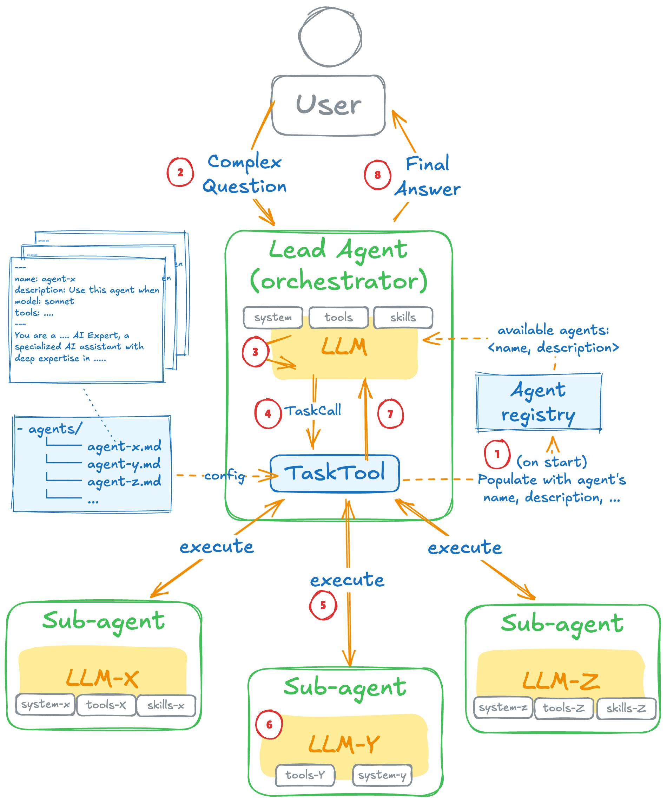

# Spring AI - Subagents Orchestration

https://spring.io/blog/2026/01/27/spring-ai-agentic-patterns-4-task-subagents



### Build

```bash
./mvnw clean install
```

### Run and Test

```
### To run

export OPENAI_API_KEY=your-key
./run.sh

### To test

./test.sh

### Or directly:

curl -X POST http://localhost:8081/subagent/orchestrate \
-H "Content-Type: application/json" \
-d '{"task":"Design and implement a Java 25 Product record with validation","data":"name must not be blank, price must be
positive"}'
```

### Result

Spring Boot Server (Agent)

```
[INFO] Scanning for projects...
[INFO]
[INFO] --< com.github.diegopacheco.javapocs:java-25-spring-boot-4-spring-ai-subagents-orchestration >--
[INFO] Building java-25-spring-boot-4-spring-ai-subagents-orchestration 1.0-SNAPSHOT
[INFO]   from pom.xml
[INFO] --------------------------------[ jar ]---------------------------------
[INFO]
[INFO] >>> spring-boot:4.0.2:run (default-cli) > test-compile @ java-25-spring-boot-4-spring-ai-subagents-orchestration >>>
[INFO]
[INFO] --- resources:3.3.1:resources (default-resources) @ java-25-spring-boot-4-spring-ai-subagents-orchestration ---
[INFO] Copying 1 resource from src/main/resources to target/classes
[INFO] Copying 3 resources from src/main/resources to target/classes
[INFO]
[INFO] --- compiler:3.14.1:compile (default-compile) @ java-25-spring-boot-4-spring-ai-subagents-orchestration ---
[INFO] Nothing to compile - all classes are up to date.
[INFO]
[INFO] --- resources:3.3.1:testResources (default-testResources) @ java-25-spring-boot-4-spring-ai-subagents-orchestration ---
[INFO] Copying 0 resource from src/test/resources to target/test-classes
[INFO]
[INFO] --- compiler:3.14.1:testCompile (default-testCompile) @ java-25-spring-boot-4-spring-ai-subagents-orchestration ---
[INFO] Nothing to compile - all classes are up to date.
[INFO]
[INFO] <<< spring-boot:4.0.2:run (default-cli) < test-compile @ java-25-spring-boot-4-spring-ai-subagents-orchestration <<<
[INFO]
[INFO]
[INFO] --- spring-boot:4.0.2:run (default-cli) @ java-25-spring-boot-4-spring-ai-subagents-orchestration ---
[INFO] Attaching agents: []

  .   ____          _            __ _ _
 /\\ / ___'_ __ _ _(_)_ __  __ _ \ \ \ \
( ( )\___ | '_ | '_| | '_ \/ _` | \ \ \ \
 \\/  ___)| |_)| | | | | || (_| |  ) ) ) )
  '  |____| .__|_| |_|_| |_\__, | / / / /
 =========|_|==============|___/=/_/_/_/

 :: Spring Boot ::                (v4.0.2)

2026-02-18T21:46:24.798-08:00  INFO 21748 --- [           main] c.g.d.sandboxspring.Application          : Starting Application using Java 25 with PID 21748 (/Users/diegopacheco/git/diegopacheco/ai-playground/pocs/java-25-spring-boot-4-spring-ai-subagents-orchestration/target/classes started by diegopacheco in /Users/diegopacheco/git/diegopacheco/ai-playground/pocs/java-25-spring-boot-4-spring-ai-subagents-orchestration)
2026-02-18T21:46:24.800-08:00  INFO 21748 --- [           main] c.g.d.sandboxspring.Application          : No active profile set, falling back to 1 default profile: "default"
2026-02-18T21:46:25.312-08:00  INFO 21748 --- [           main] o.s.boot.tomcat.TomcatWebServer          : Tomcat initialized with port 8081 (http)
2026-02-18T21:46:25.319-08:00  INFO 21748 --- [           main] o.apache.catalina.core.StandardService   : Starting service [Tomcat]
2026-02-18T21:46:25.319-08:00  INFO 21748 --- [           main] o.apache.catalina.core.StandardEngine    : Starting Servlet engine: [Apache Tomcat/11.0.15]
2026-02-18T21:46:25.350-08:00  INFO 21748 --- [           main] b.w.c.s.WebApplicationContextInitializer : Root WebApplicationContext: initialization completed in 528 ms
2026-02-18T21:46:25.962-08:00  INFO 21748 --- [           main] o.s.b.a.e.web.EndpointLinksResolver      : Exposing 1 endpoint beneath base path '/actuator'
2026-02-18T21:46:25.990-08:00  INFO 21748 --- [           main] o.s.boot.tomcat.TomcatWebServer          : Tomcat started on port 8081 (http) with context path '/'
2026-02-18T21:46:25.994-08:00  INFO 21748 --- [           main] c.g.d.sandboxspring.Application          : Started Application in 1.362 seconds (process running for 1.53)
Spring Boot 4.0.x working!
2026-02-18T21:46:33.717-08:00  INFO 21748 --- [nio-8081-exec-1] o.a.c.c.C.[Tomcat].[localhost].[/]       : Initializing Spring DispatcherServlet 'dispatcherServlet'
2026-02-18T21:46:33.717-08:00  INFO 21748 --- [nio-8081-exec-1] o.s.web.servlet.DispatcherServlet        : Initializing Servlet 'dispatcherServlet'
2026-02-18T21:46:33.718-08:00  INFO 21748 --- [nio-8081-exec-1] o.s.web.servlet.DispatcherServlet        : Completed initialization in 1 ms
```

Test
```
❯ ./test.sh
Testing Task Subagents Orchestration...

1. Health check:
{"groups":["liveness","readiness"],"status":"UP"}

2. Orchestrate (complex task - architect + builder):
The `Product` record has been successfully implemented with the required fields and validation logic. Here's the Java code:

```java
public enum Category {
    ELECTRONICS,
    CLOTHING,
    FOOD
}

public record Product(String name, double price, Category category) {

    public Product {
        if (name == null || name.isBlank()) {
            throw new IllegalArgumentException("Name cannot be null or blank");
        }
        if (price <= 0) {
            throw new IllegalArgumentException("Price must be positive");
        }
        if (category == null) {
            throw new IllegalArgumentException("Category cannot be null");
        }
    }
}
```

### Key Features:
- **Enum Category**: Defines permissible categories.
- **Product Record**: Includes validation ensuring:
  - `name` is non-null and non-blank.
  - `price` is positive.
  - `category` is non-null.

This implementation ensures that any `Product` instance is always valid upon creation.

3. Orchestrate (simple task - builder direct):
Here's a Java method that sums a list of integers using Java Streams:

```java
import java.util.List;

public class SumUsingStreams {

    public static int sumList(List<Integer> integers) {
        return integers.stream()
                .mapToInt(Integer::intValue)
                .sum();
    }

    public static void main(String[] args) {
        List<Integer> numbers = List.of(1, 2, 3, 4, 5);
        int sum = sumList(numbers);
        System.out.println("The sum is: " + sum);
    }
}
```

This method uses the `stream()` method to create a stream from the list. It then uses `mapToInt()` to convert each `Integer` to an `int`, and finally calls `sum()` to compute the total.
```