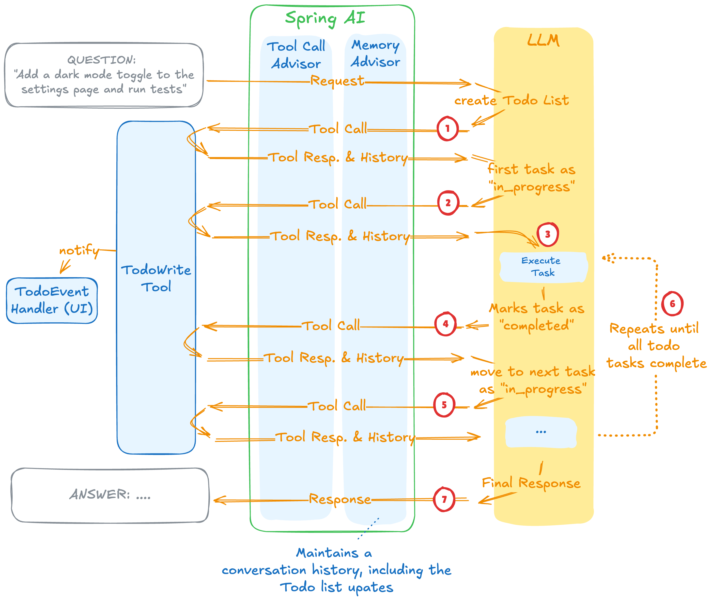

# Spring AI - TODO Write Tool

https://spring.io/blog/2026/01/20/spring-ai-agentic-patterns-3-todowrite



## Result

Server:
```
[INFO] --- spring-boot:4.0.2:run (default-cli) @ java-25-spring-boot-4-spring-ai-todo-write-tool ---
[INFO] Attaching agents: []

  .   ____          _            __ _ _
 /\\ / ___'_ __ _ _(_)_ __  __ _ \ \ \ \
( ( )\___ | '_ | '_| | '_ \/ _` | \ \ \ \
 \\/  ___)| |_)| | | | | || (_| |  ) ) ) )
  '  |____| .__|_| |_|_| |_\__, | / / / /
 =========|_|==============|___/=/_/_/_/

 :: Spring Boot ::                (v4.0.2)

2026-02-19T22:48:21.983-08:00  INFO 27155 --- [           main] c.g.d.sandboxspring.Application          : Starting Application using Java 25 with PID 27155 (/Users/diegopacheco/git/diegopacheco/ai-playground/pocs/java-25-spring-boot-4-spring-ai-todo-write-tool/target/classes started by diegopacheco in /Users/diegopacheco/git/diegopacheco/ai-playground/pocs/java-25-spring-boot-4-spring-ai-todo-write-tool)
2026-02-19T22:48:21.985-08:00  INFO 27155 --- [           main] c.g.d.sandboxspring.Application          : No active profile set, falling back to 1 default profile: "default"
2026-02-19T22:48:22.513-08:00  INFO 27155 --- [           main] o.s.boot.tomcat.TomcatWebServer          : Tomcat initialized with port 8081 (http)
2026-02-19T22:48:22.519-08:00  INFO 27155 --- [           main] o.apache.catalina.core.StandardService   : Starting service [Tomcat]
2026-02-19T22:48:22.519-08:00  INFO 27155 --- [           main] o.apache.catalina.core.StandardEngine    : Starting Servlet engine: [Apache Tomcat/11.0.15]
2026-02-19T22:48:22.544-08:00  INFO 27155 --- [           main] b.w.c.s.WebApplicationContextInitializer : Root WebApplicationContext: initialization completed in 534 ms
2026-02-19T22:48:23.041-08:00  INFO 27155 --- [           main] o.s.b.a.e.web.EndpointLinksResolver      : Exposing 1 endpoint beneath base path '/actuator'
2026-02-19T22:48:23.070-08:00  INFO 27155 --- [           main] o.s.boot.tomcat.TomcatWebServer          : Tomcat started on port 8081 (http) with context path '/'
2026-02-19T22:48:23.075-08:00  INFO 27155 --- [           main] c.g.d.sandboxspring.Application          : Started Application in 1.264 seconds (process running for 1.435)
2026-02-19T22:48:27.844-08:00  INFO 27155 --- [nio-8081-exec-1] o.a.c.c.C.[Tomcat].[localhost].[/]       : Initializing Spring DispatcherServlet 'dispatcherServlet'
2026-02-19T22:48:27.844-08:00  INFO 27155 --- [nio-8081-exec-1] o.s.web.servlet.DispatcherServlet        : Initializing Servlet 'dispatcherServlet'
2026-02-19T22:48:27.845-08:00  INFO 27155 --- [nio-8081-exec-1] o.s.web.servlet.DispatcherServlet        : Completed initialization in 1 ms
WARNING: A restricted method in java.lang.System has been called
WARNING: java.lang.System::loadLibrary has been called by io.netty.util.internal.NativeLibraryUtil in an unnamed module (file:/Users/diegopacheco/.m2/repository/io/netty/netty-common/4.2.9.Final/netty-common-4.2.9.Final.jar)
WARNING: Use --enable-native-access=ALL-UNNAMED to avoid a warning for callers in this module
WARNING: Restricted methods will be blocked in a future release unless native access is enabled

2026-02-19T22:48:28.460-08:00 ERROR 27155 --- [nio-8081-exec-2] i.n.r.d.DnsServerAddressStreamProviders  : Unable to load io.netty.resolver.dns.macos.MacOSDnsServerAddressStreamProvider, fallback to system defaults. This may result in incorrect DNS resolutions on MacOS. Check whether you have a dependency on 'io.netty:netty-resolver-dns-native-macos'. Use DEBUG level to see the full stack: java.lang.UnsatisfiedLinkError: failed to load the required native library

Progress: 0/4 tasks completed (0%)
  [ ] List the top 3 Spring Boot features
  [ ] Explain each of the top 3 Spring Boot features
  [ ] Provide a code snippet for each feature
  [ ] Write a summary of the top 3 Spring Boot features

Progress: 0/4 tasks completed (0%)
  [→] List the top 3 Spring Boot features
  [ ] Explain each of the top 3 Spring Boot features
  [ ] Provide a code snippet for each feature
  [ ] Write a summary of the top 3 Spring Boot features

Progress: 1/4 tasks completed (25%)
  [✓] List the top 3 Spring Boot features
  [→] Explain each of the top 3 Spring Boot features
  [ ] Provide a code snippet for each feature
  [ ] Write a summary of the top 3 Spring Boot features

Progress: 2/4 tasks completed (50%)
  [✓] List the top 3 Spring Boot features
  [✓] Explain each of the top 3 Spring Boot features
  [→] Provide a code snippet for each feature
  [ ] Write a summary of the top 3 Spring Boot features

Progress: 3/4 tasks completed (75%)
  [✓] List the top 3 Spring Boot features
  [✓] Explain each of the top 3 Spring Boot features
  [✓] Provide a code snippet for each feature
  [→] Write a summary of the top 3 Spring Boot features

Progress: 0/4 tasks completed (0%)
  [ ] Identify the top 5 Java design patterns
  [ ] Describe each design pattern briefly
  [ ] Provide a real-world use case for each design pattern
  [ ] Write a summary of the top 5 Java design patterns

Progress: 0/4 tasks completed (0%)
  [→] Identify the top 5 Java design patterns
  [ ] Describe each design pattern briefly
  [ ] Provide a real-world use case for each design pattern
  [ ] Write a summary of the top 5 Java design patterns

Progress: 1/4 tasks completed (25%)
  [✓] Identify the top 5 Java design patterns
  [→] Describe each design pattern briefly
  [ ] Provide a real-world use case for each design pattern
  [ ] Write a summary of the top 5 Java design patterns

Progress: 2/4 tasks completed (50%)
  [✓] Identify the top 5 Java design patterns
  [✓] Describe each design pattern briefly
  [→] Provide a real-world use case for each design pattern
  [ ] Write a summary of the top 5 Java design patterns

Progress: 3/4 tasks completed (75%)
  [✓] Identify the top 5 Java design patterns
  [✓] Describe each design pattern briefly
  [✓] Provide a real-world use case for each design pattern
  [→] Write a summary of the top 5 Java design patterns
```

Test client
```
❯ ./test.sh
=== Testing root endpoint ===
Greetings from Spring Boot with TodoWrite Tool!

=== Testing TodoWrite with complex multi-step task ===
### Summary of Spring Boot Features

Spring Boot simplifies the process of developing and deploying Java applications. Its key features include:

1. **Auto Configuration**: This feature reduces the need for manual configuration by automatically setting up applications based on the dependencies present in the classpath. This allows developers to focus more on writing business logic rather than configuration.

2. **Spring Boot Starter Dependencies**: Starters are a convenient way to include a set of dependencies for a specific functionality. By adding a single starter dependency, developers can quickly integrate complex functionalities like web services, security, or database access, without having to manage individual dependencies.

3. **Spring Boot Actuator**: Actuator provides essential insights into running applications, offering various endpoints to monitor and manage application health and metrics. This is especially useful for operations teams to maintain application performance and reliability in production environments.

These features collectively make Spring Boot a powerful framework for building robust, scalable, and maintainable applications efficiently.

=== Testing endpoint (TodoWrite auto-triggered) ===
### Summary of Java Design Patterns

Java design patterns are essential in building robust and maintainable software. They provide proven solutions to common design problems, enabling developers to create flexible and reusable code. The top 5 design patterns include:

1. **Singleton Pattern**: Ensures a class has only one instance and provides a global point of access to it, commonly used in logging systems.

2. **Factory Pattern**: Defines an interface for creating objects, allowing the subclasses to decide which class to instantiate. It's widely used in systems requiring object creation like vehicle manufacturing.

3. **Observer Pattern**: Establishes a one-to-many dependency between objects, ensuring that when one object changes state, all its dependents are notified. This pattern is often employed in event-driven systems like news agencies.

4. **Decorator Pattern**: Allows adding new functionality to an object without altering its structure. It's useful in scenarios like adding features to a base coffee class in a coffee shop application.

5. **Strategy Pattern**: Enables selecting an algorithm's behavior at runtime, facilitating interchangeable use of various strategies such as payment methods in a payment processing system.

These patterns enhance code readability and flexibility, making them indispensable tools for designing complex software systems.

All tasks related to this request have been completed. If you have any further questions or need additional assistance, feel free to ask!
```