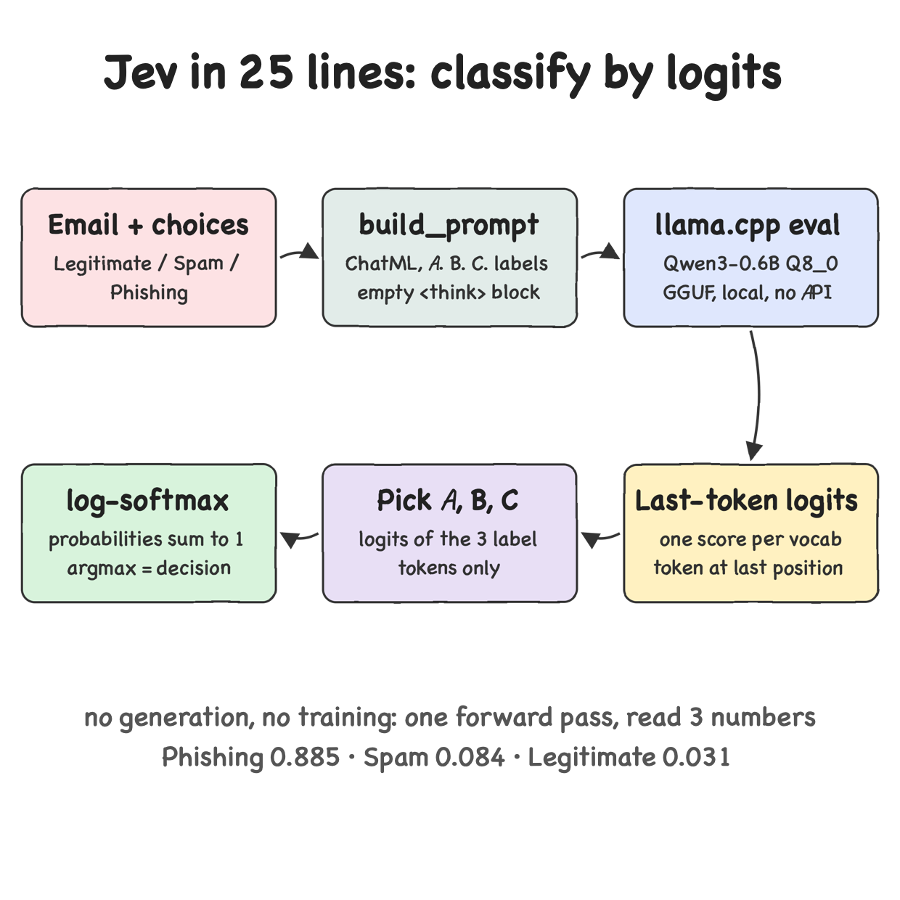

# Jev in 25 lines of Python 3.14

A local text classifier that returns a calibrated-looking probability for every choice, with no API,
no training and no generated text. It is the NobodyWho parody post
[Jev in 25 lines of Python](https://www.nobodywho.ai/posts/jev-in-25-lines/) running on Python 3.14.7:
a small Qwen3 GGUF model reads an email and a list of labeled options, and the logits of the label
tokens become the answer.

## How it Works

1. The choices get single-letter labels: `A. Legitimate`, `B. Spam`, `C. Phishing`.
2. A ChatML prompt puts the email and the options in the user turn and opens the assistant turn with an empty `<think></think>` block, so the next token is the answer letter.
3. llama.cpp runs one forward pass of `Qwen3-0.6B-Q8_0.gguf` with `logits_all=True`.
4. The logits of the last position are read, and only the ids of the tokens `A`, `B`, `C` are kept.
5. A log-softmax over those 3 numbers (`logaddexp.reduce`) gives log probabilities, `exp` gives probabilities.
6. The highest probability is the decision.

## Architecture



## Features

* **Classify by logits** - one forward pass, no sampling, so the result is deterministic and fast.
* **Probabilities, not just a label** - you get logits, log probabilities and probabilities per choice.
* **Fully local** - the model is downloaded once from Hugging Face and cached, the text never leaves the machine.
* **Any choices** - `classify(model, text, choices)` takes up to 8 choices labeled `A` to `H`.
* **CLI input** - pass your own emails as arguments, or run with no arguments for three built-in ones.
* **Model state reset per call** - `model.reset()` before each eval, so one classification never leaks into the next.

## Stack

* **Python 3.14.7** - in a per-project `.venv`, so it really runs on 3.14.
* **llama-cpp-python 0.3.35** - runs GGUF models locally and exposes raw logits via `model.scores`.
* **Qwen3-0.6B Q8_0 GGUF** - small enough to load in seconds, good enough to reproduce the post.
* **huggingface-hub** - downloads and caches the model file.
* **numpy** - the log-softmax math.
* **unittest** - stdlib tests, no test framework dependency.

## Contracts / API

`src/jev.py`

| Function | Contract |
|---|---|
| `load_model()` | Downloads (once) and loads `Qwen/Qwen3-0.6B-GGUF` / `Qwen3-0.6B-Q8_0.gguf` with `n_ctx=512`, `logits_all=True` |
| `build_prompt(text, choices)` | Returns the ChatML prompt ending right before the answer token |
| `to_probabilities(choice_logits)` | Returns `(logprobs, probabilities)` for a numpy array of logits |
| `classify(model, text, choices)` | Returns `{"Logits", "Log probabilities", "Probabilities"}`, each a numpy array in the order of `choices` |

CLI:

```bash
./run.sh "Reset your bank PIN here: http://bank-secure-login.xyz"
```

## Key design decisions

* **Letters instead of words** - `Legitimate`, `Spam`, `Phishing` are several tokens each, while `A`, `B`, `C` are one token each, so one logit per choice is enough.
* **Empty think block** - Qwen3 would start reasoning; closing the `<think>` block in the prompt forces the very next token to be the answer.
* **Softmax only over the choices** - every other vocabulary token is ignored, so the probabilities always sum to 1 across the choices.
* **Split into `jev.py` and `main.py`** - the 25-line core stays importable and testable, printing lives in `main.py`.

## How to run

```bash
./scripts/setup.sh
./scripts/run.sh
./scripts/test-all.sh
```

`setup.sh` creates `.venv` with `python3.14`, builds llama-cpp-python with Metal, and downloads the model.
`install-deps.sh` and `run.sh` at the root call the same scripts.

## Result

The first email is the one from the post and reproduces its numbers exactly.

```
Email: Payroll asks for your password on a non-company sign-in page.
  Logits: {'Legitimate': 26.254, 'Spam': 27.262, 'Phishing': 29.614}
  Log probabilities: {'Legitimate': -3.482, 'Spam': -2.474, 'Phishing': -0.122}
  Probabilities: {'Legitimate': 0.031, 'Spam': 0.084, 'Phishing': 0.885}
  Decision: Phishing

Email: Congratulations! You won a free cruise, click here to claim your prize now!!!
  Logits: {'Legitimate': 26.918, 'Spam': 28.188, 'Phishing': 25.445}
  Log probabilities: {'Legitimate': -1.567, 'Spam': -0.296, 'Phishing': -3.04}
  Probabilities: {'Legitimate': 0.209, 'Spam': 0.743, 'Phishing': 0.048}
  Decision: Spam

Email: Hi team, the sprint retro moved to Thursday 3pm in room 4B. Agenda attached.
  Logits: {'Legitimate': 27.933, 'Spam': 26.312, 'Phishing': 24.46}
  Log probabilities: {'Legitimate': -0.206, 'Spam': -1.827, 'Phishing': -3.68}
  Probabilities: {'Legitimate': 0.814, 'Spam': 0.161, 'Phishing': 0.025}
  Decision: Legitimate
```

## Tests

10 tests: 6 unit tests on the probability math and the prompt shape, 4 integration tests against the real model
(post numbers reproduced, spam, legitimate, and state reset between calls).

```
Ran 10 tests in 3.564s

OK
```

## Scripts

All scripts live in `scripts/` and run from any directory of the repository.
This is a CLI with no services and no ports, so there is no `start-all.sh`, `stop-all.sh`, `status.sh`, `ui.sh` or `ports.env`.

| Script | What it does |
|---|---|
| `./scripts/setup.sh` | Creates the Python 3.14 venv, installs dependencies and caches the model |
| `./scripts/run.sh` | Classifies the built-in emails, or the emails passed as arguments |
| `./scripts/test-all.sh` | Runs every test suite |

```bash
./scripts/setup.sh
./scripts/run.sh
./scripts/test-all.sh
```
