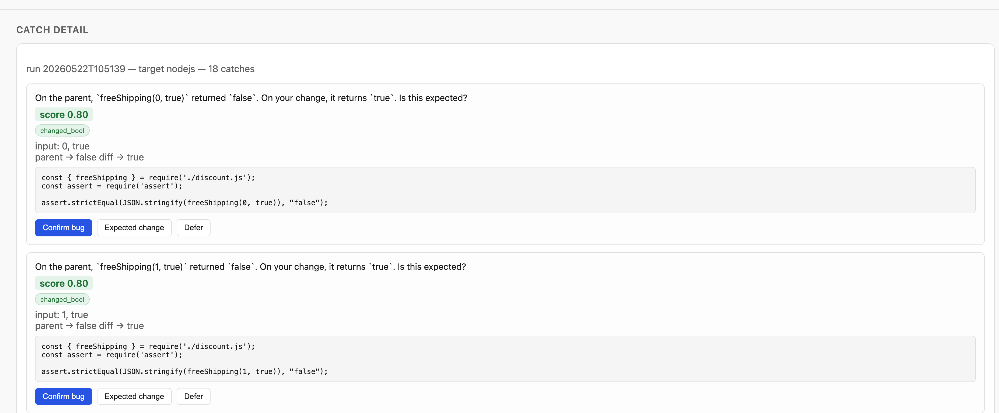
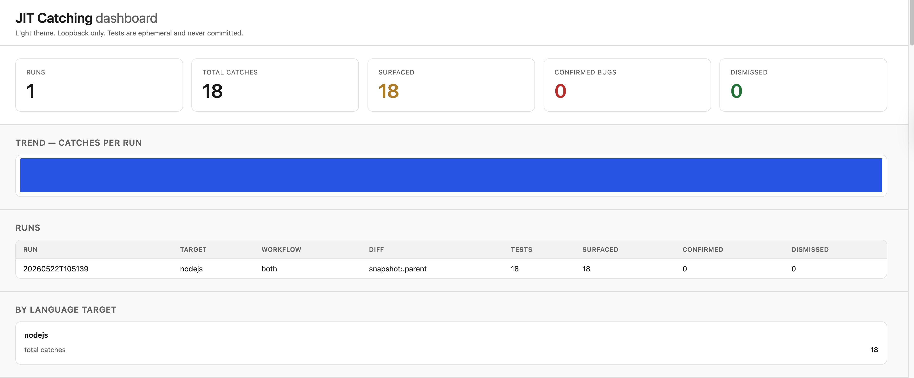

# jit-testing-skill

A Claude Code skill that catches bugs *before* they land.

It reads your diff, generates **ephemeral catching tests** designed to fail when the change introduces a regression, runs them, and tells you in plain English what behavior changed. Tests are never committed — they live in a scratch dir, run once, and get discarded.

Inspired by Meta's *Just-in-Time Catching Test Generation* (Becker et al., FSE Companion 2026): [arxiv.org/pdf/2601.22832](https://arxiv.org/pdf/2601.22832).

## Paper summary

Becker et al. (FSE Companion '26, industry track) report on a Just-in-Time (JIT) catching test generation system deployed in production at Meta since September 2025, protecting backend systems totalling hundreds of millions of lines of code used by 3.5B people daily. The core idea is a flip of the usual contract for generated tests.

### Hardening vs. catching tests

- **Hardening tests** (the traditional output of LLM test generators like TestGen-LLM and ACH) are written to *pass* at generation time, on the parent revision, and land in the repo to guard against future regressions.
- **Catching tests** are written to *fail*. They are generated against a specific code change and must pass on the parent revision and fail on the diff. They are ephemeral — they cannot land alongside the diff they catch, by construction.

The paper formalizes three notions:
- A **weak catch** is a test that fails on the diff and passes on the parent (the mechanical property).
- A **strong catch** is a weak catch whose failure reflects a real bug according to the *general oracle* (the informal, often unstated specification of correct behavior).
- A **strictly weak catch** is a false positive — a test that fails for reasons other than a real bug (oracle misalignment, brittle assertions, infrastructure flakiness, etc.).

The central engineering problem is therefore: given many weak catches, decide which ones are strong, with high enough precision that the signal does not impede engineer velocity.

### Two diff-aware workflows

Both workflows are inspired by mutation testing and the *coupling hypothesis* — that real faults tend to be coupled to simple syntactic mutants.

1. **Dodgy diff workflow.** Treat the diff itself as a mutant of its parent. Use a mutation-guided LLM test generator to produce tests that distinguish parent behavior from child behavior. No attempt to infer intent. Maximizes the pool of weak-catch candidates but generates more false positives.
2. **Intent-aware workflow.** First ask an LLM to infer the *risks* of the diff (the ways an attempt to implement the diff's intent could go wrong) from the code plus the diff title and summary. Materialize those risks as concrete mutants of the parent. Generate tests that kill each mutant (pass on parent, fail on mutant). Run those tests against the actual diff and harvest the failures as weak catches.

### Targeting

Catch generation is computationally expensive, so it is only run on diffs flagged high-risk by a Diff Risk Score (DRS)-style targetter trained on prior code changes, executed overnight on spare west-coast capacity.

### Two families of assessors (false-positive filtering)

Each assessor maps a weak catch to a score in [-1, +1] (-1 = confidently false positive, +1 = confidently true positive). Assessors always see the diff, the inferred intent, the test code, and the failure trace.

- **RubFake (Rule Based False-positive Killing Environment).** Deterministic pattern matcher. False-positive patterns include `broken_test_runner`, `reflection`, `type_mismatch`, `bad_mock_smell`, `should_be_private_smell`, `not_implemented_exception`, `key_value_pair_change`, `flakiness`, etc. True-positive patterns include `changed_bool` (a boolean asserted true now evaluates false with no defining expression touched), `null_value`, `empty_container`, `unexpected_key_change`, `monotonic_change` (existing behavior shifts when the stated intent was only to add new behavior), and RBAC-relevant changes.
- **LLM-as-judge ensemble.** Llama 3.3-70B, Gemini 3 Pro, and Claude Sonnet 4. Each model outputs (a) a binary "is this an unexpected bug?" yes/no with a normalized first-token log-probability (TP Prob), (b) a categorical High/Med/Low likelihood mapped to {+1, 0, -1} and aggregated by median across the ensemble (Bucket Med), and (c) a textual rationale (surfaced individually rather than aggregated).

The three assessors show only modest rank correlation with each other (Spearman ρ ≤ 0.535, mostly poor Cohen's κ), which the authors interpret as *complementary* rather than noisy: the rule-based and LLM-based approaches capture different facets of the decision.

### Sense-check UX

Crucially, engineers are never asked to read test code first. The signal is rendered as a plain-English sense-check question — e.g., *"this expression used to evaluate to `true`, but now evaluates to `false`; is that expected?"* Engineers can dismiss an intended change in seconds; only when they are *surprised* by the behavior change do they look at the generated test. This asymmetry (cheap dismissal, expensive only on real bugs) lets the system tolerate a relatively high false-positive rate without hurting developer velocity.

### Key empirical results

| Metric | Result |
|---|---|
| Total tests analyzed | 22,126 (across five approaches) |
| Coincidental catch (byproduct of hardening) | 0.2% weak-catch rate |
| TestGen-LLM hardening (parent-only) | ~2.0% — ~3.6% of diffs caught |
| ACH mutation-guided hardening | 0.8% — 1.6% of diffs caught |
| **Dodgy diff (diff-aware)** | 2.5% per test, **4.0% of diffs caught** |
| **Intent-aware (diff + intent)** | **6.4% per test, 7.9% of diffs caught** |
| Diff-aware vs. hardening | ~4× more weak catches |
| Diff-aware vs. coincidental | ~20× more weak catches |
| LLM-as-judge precision on filtering FPs | >98% (when TP Prob = -1 or Bucket Med = 0) |
| Human-review-load reduction from assessors | ~70% (4× scale-up of evaluation capacity) |
| Engineer reach-outs | 41 |
| Strong catches confirmed | 8 (~19.5% engineer-experienced true-positive rate) |
| Severe production failures averted | 4 (50% of strong catches — vs. industry baseline of 5–20% bugs being severe, evidence that targeting works) |

A statistical analysis on human-labeled "Good" (accepted/landed) vs. "Bad" (abandoned/reverted/needs-revision) diffs confirmed that all three assessors assign significantly more true-positive scores to Bad diffs and significantly more false-positive scores to Good diffs, with effect sizes large enough (medium-to-large under Cohen's *h*) to be highly improbable under a permutation-based null.

### Coincidental hardening as a byproduct

A pleasant surprise from Section 7: while *coincidental catching* during hardening generation is rare (0.2%), the inverse — *coincidental hardening* during catching generation — is very common. Of 8,797 tests generated by the two catch workflows over one month, 7,987 passed on the diff and are therefore valid hardening candidates. The natural deployment recipe is "catch first, harvest hardening tests as a byproduct."

### Takeaway

JIT catching is scalable, industrially deployable, and prevents serious failures from landing — provided the pipeline (a) targets risky diffs only, (b) uses diff- and intent-awareness to generate weak catches efficiently, (c) filters aggressively with complementary rule-based and LLM-based assessors, and (d) communicates with engineers via cheap sense-check questions rather than raw test code. This skill is a small, open re-implementation of those ideas: the dodgy-diff and intent-aware workflows, ephemeral tests, RubFake-style rule-based scoring, an LLM-as-judge step, and the sense-check question UX.

## Why

Most LLM test generators write *hardening* tests — tests that pass and stay in the repo to guard against future regressions. This skill writes the opposite: tests that **fail on your current change** if (and only if) the change accidentally broke something.

| | Hardening tests | Catching tests |
|---|---|---|
| When written | Anytime | At diff submission |
| Pass on diff? | Yes | No (by design) |
| Land in repo? | Yes | No, ever |
| What it catches | Future regressions | Bugs in the change *right now* |

A test that **passes on the parent revision** and **fails on your diff** is a *weak catch*. If the failure reflects a real bug (not just an intended behavior change), it becomes a *strong catch*. The skill's job is to find weak catches and rank how likely each one is to be strong.

## What it does

1. **Reads your diff** (parent ↔ child).
2. **Generates tests** using two workflows:
   - **Dodgy diff** — treat the diff as a possible mutant and look for any behavior change.
   - **Intent-aware** — infer what the diff *meant* to do, enumerate ways it could go wrong, build risk-mutants of the parent, generate tests that kill those mutants, run them against the actual diff.
3. **Runs tests** against parent (must pass) and diff (must fail).
4. **Scores each weak catch** with a rule-based assessor (RubFake) and an LLM-as-judge.
5. **Asks you a sense-check question** in plain English:
   > "On the parent, `qualifiesForFreeShipping($49.99 delivery)` returned `false`. On your change, it returns `true`. Expected?"
6. **Throws everything away** when done. Only the report survives.

## Supported targets

The skill is **generic across stacks**. The orchestrator dispatches to a per-language runner; adding a new stack means one new runner file.

| Target | Build tool | Test framework | POC status |
|---|---|---|---|
| Java 8 | maven / gradle | JUnit 5 | working |
| Java 25 | maven / gradle | JUnit 5 | working |
| Scala 3 | sbt | MUnit / ScalaTest | working (needs `scala-cli` on PATH) |
| Scala 2 | bazel | ScalaTest | working (needs `scala-cli` on PATH) |
| Kotlin | gradle (kts) | JUnit 5 | working (needs `kotlinc` + `java` on PATH) |
| Python 3 | pip / venv | pytest | working |
| Python 3 + Django | pip / venv | pytest-django | working (inherits Python 3 probing) |
| Node.js | npm / pnpm | node assert | working |

## Install

```bash
./install.sh
```

Installs the binary tree to `~/.claude/jit/`, registers `/jit` and `/jit-dashboard` as Claude Code skills, and adds `.jit-testing/` to your global gitignore so generated tests can never accidentally be committed. Prints which language targets are usable on this machine.

## Uninstall

```bash
./uninstall.sh
```

Removes the skill and the gitignore entry. Optionally purges leftover `.jit-testing/` scratch dirs (prompted).

## Usage

The skill ships two slash commands.

### `/jit` — run catches on a diff

From inside any supported repo, on a branch with a diff:

```
/jit
```

Optional flags:

- `--target java25` — force a specific language target
- `--workflow intent` — run only the intent-aware workflow (`dodgy` / `intent` / `both`, default `both`)
- `--diff HEAD~3..HEAD` — pick a diff range

You'll get a ranked list of behavior changes, each with:

- A one-line sense-check question.
- A confidence score (`-1` very likely false positive, `+1` very likely real bug).
- An expandable view of the test code and execution trace.

Dismissing a false positive is one click. Real bugs surface fast.

#### Sample output

```
⏺ The pipeline found 18 catches across both workflows. Collapsing duplicates, there are really two distinct behavior changes — one
  matches the stated intent ("Add free shipping for store-pickup orders"), but the other is not covered by the intent and looks
  suspicious.

  Sense-check questions:

  1. Pickup orders now always get free shipping. On the parent, free_shipping(0, True) returned False. On your change, it returns True
  (same for 1, 100, 499, 500, 4999 when pickup=True). → This matches the stated intent. Expected?
  2. Non-pickup threshold dropped from $50 → $5. On the parent, free_shipping(500, False) returned False (parent required ≥ 5000 cents).
  On your change, it returns True (now requires ≥ 500 cents). → This is not mentioned in the intent ("Add free shipping for store-pickup
  orders"). Was the threshold change deliberate?
  3. Same threshold drop affects higher amounts too. On the parent, free_shipping(4999, False) returned False. On your change, it returns
   True. → Same root cause as #2.

  For each, pick: Confirm bug / Expected change / Show test code.

  The threshold change (catches #7 and #16) is the one I'd flag — it's an off-intent change in pricing.py:4 (>= 500 vs parent's >= 5000).

  You can open the dashboard with /jit-dashboard.
```

### `/jit-dashboard` — visual UI

```
/jit-dashboard
```

Starts a local web server (loopback only) and opens your default browser at a dashboard that visualizes every run under `.jit-testing/`. **Light theme only — always.** No dark mode, no toggle, no auto-switching even if the OS is in dark mode. No build step, no telemetry.

What you see:

- **Big counters** at the top — total runs, weak catches, strong-catch candidates, dismissed false positives, breakdown per language target.
- **Trend strip** — catches per run over time.
- **Runs table** — every `/jit-testing` execution, click to expand.
- **Catch detail** — sense-check question, score breakdown (RubFake + LLM-judge), matched FP/TP patterns as chips, test code + trace on demand, verdict buttons (*Confirm bug* / *Expected* / *Defer*).
- **Per-language report cards** — runs, catches, true-positive rate, most common patterns.

Stop the dashboard with `/jit-dashboard --stop`.

#### Screenshots



The landing view: top-row counters summarize every run found under `.jit-testing/` (total runs, weak catches, strong-catch candidates, dismissed false positives), the trend strip plots catches per run over time, and the runs table lists each execution sorted by recency. Per-language report cards on the right break down runs and true-positive rate by target.



Expanded catch view: the sense-check question is rendered in plain English, the score breakdown shows the RubFake rule-based assessor next to the LLM-as-judge score, matched FP/TP patterns appear as chips, and the generated test code plus execution trace are available on demand. The verdict buttons (*Confirm bug* / *Expected* / *Defer*) feed back into the per-language true-positive rate.

## Where things go

```
<repo>/.jit-testing/
└── runs/<timestamp>-<sha>/
    ├── tests/        generated tests (ephemeral)
    ├── mutants/      risk-mutants of the parent
    ├── traces/       execution logs
    ├── catches.json  ranked weak catches
    └── report.md     human-readable summary
```

Everything under `.jit-testing/` is gitignored. The dir auto-purges after 7 days (configurable).

## Sample projects

Each supported stack has a runnable sample under `samples/`. They are real, self-contained projects you can `cd` into and run `/jit` against. Each contains the current (buggy) state and a hidden `.parent/` snapshot with the pre-diff source.

```
samples/
├── java-shipping/      Java 8 + maven, the canonical example
├── python-pricing/     Python 3
├── nodejs-discount/    Node.js + CommonJS
├── scala-discount/     Scala 3 + sbt
└── kotlin-discount/    Kotlin + Gradle
```

To try one — just `cd` and run `/jit`. No git setup, no scripts.

### Run every sample (snapshot mode, no setup)

From the skill root, invoke the CLI directly against each sample. These commands are equivalent to running `/jit` from inside each sample dir.

```bash
./bin/jit run --repo samples/python-pricing
./bin/jit run --repo samples/nodejs-discount
./bin/jit run --repo samples/java-shipping
./bin/jit run --repo samples/scala-discount
./bin/jit run --repo samples/kotlin-discount
```

Or, inside each sample:

```bash
cd samples/python-pricing   && /jit && cd -
cd samples/nodejs-discount  && /jit && cd -
cd samples/java-shipping    && /jit && cd -
cd samples/scala-discount   && /jit && cd -
cd samples/kotlin-discount  && /jit && cd -
```

### Inspect what was caught

```bash
ls samples/python-pricing/.jit-testing/runs/
cat samples/python-pricing/.jit-testing/runs/*/report.md
```

### Open the dashboard against any sample

```bash
cd samples/python-pricing
./bin/jit dashboard --repo .
```

Stop it with:

```bash
./bin/jit dashboard --stop
```

### Run the full smoke test

```bash
./test.sh
```

Exercises all five samples in snapshot mode plus a git-mode regression check.

### Run a sample in git mode instead of snapshot

Each sample ships a `setup-git.sh` that materializes a real parent → diff commit history. After running it, snapshot mode is dropped (the script removes `.parent/`) and `/jit` falls back to git diff.

```bash
cd samples/java-shipping
./setup-git.sh
./bin/jit run --repo . --diff HEAD~1..HEAD --mode git
```

### Workflow and target flags

```bash
./bin/jit run --repo samples/python-pricing --workflow dodgy
./bin/jit run --repo samples/python-pricing --workflow intent
./bin/jit run --repo samples/python-pricing --workflow both
./bin/jit run --repo samples/java-shipping --target java25
./bin/jit run --repo samples/python-pricing --max-tests 50
```

### Detect-only check

```bash
./bin/jit detect samples/python-pricing
./bin/jit detect samples/nodejs-discount
./bin/jit detect samples/java-shipping
./bin/jit detect samples/scala-discount
./bin/jit detect samples/kotlin-discount
```

### Install / uninstall

```bash
./install.sh
./uninstall.sh
./uninstall.sh --purge-runs "$HOME"
```

### After install — inside Claude Code

Once `./install.sh` finishes, the two slash commands are registered. Open Claude Code in any sample directory (or any of your own projects) and type the slash command. Each sample needs nothing more than `cd` + the slash command.

```bash
cd samples/python-pricing
```
then in Claude Code:
```
/jit
```

Same flow for every sample:

```bash
cd samples/python-pricing   # then /jit  in Claude Code
cd samples/nodejs-discount  # then /jit  in Claude Code
cd samples/java-shipping    # then /jit  in Claude Code
cd samples/scala-discount   # then /jit  in Claude Code
cd samples/kotlin-discount  # then /jit  in Claude Code
```

Open the dashboard from any of them:

```
/jit-dashboard
```

Stop the dashboard:

```
/jit-dashboard --stop
```

Pass flags through the slash command exactly like the CLI:

```
/jit --target java25
/jit --workflow dodgy
/jit --workflow intent
/jit --mode git --diff HEAD~3..HEAD
/jit --max-tests 50
```

## Snapshot mode vs git mode

`/jit` picks the comparison mode automatically:

- **Snapshot mode** (default when `.parent/` exists in the cwd) — compares current files against `.parent/`. No git history needed. This is what the samples use.
- **Git mode** (default in real repos) — compares `HEAD~1..HEAD` or any range you pass via `--diff`.

Force a mode with `--mode {git|snapshot}` and override the snapshot directory with `--parent-dir <name>`.

## End-to-end test

```bash
./test.sh
```

Exercises the Python, Node.js, and Java samples in a temp dir and verifies that `/jit detect` picks the right target, the pipeline runs, and the report names the changed function.

## Design

See [`design-doc.md`](./design-doc.md) for the full design — workflows, assessors, runner contract, pipeline, and acceptance criteria.

## Reference

Becker, M. et al. (2026). *Just-in-Time Catching Test Generation at Meta*. FSE Companion '26. [arXiv:2601.22832](https://arxiv.org/pdf/2601.22832).

Key results from the paper this skill is built on:

- Diff-aware catch generation produces ~**4× more weak catches** than hardening baselines and **20×** more than coincidental catching.
- LLM-as-judge ensemble reduces human review load by **~70%** at >98% precision on filtering false positives.
- From 41 engineer reach-outs, **8 real bugs caught**, of which **4 would have caused severe production failures**.
