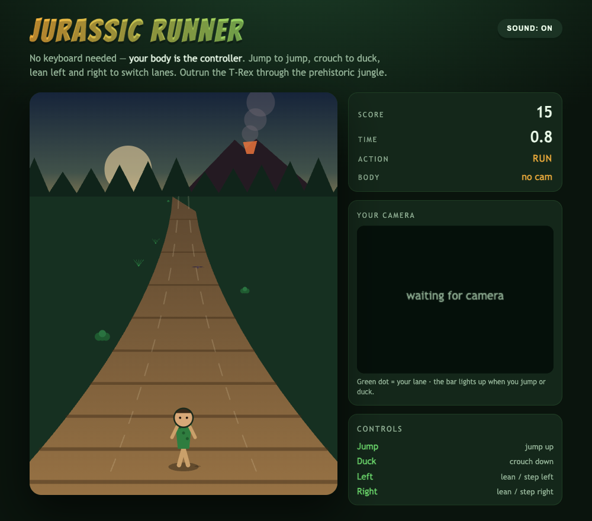

# Jurassic Runner

An endless runner set in an old jungle of the Jurassic age — but there is no keyboard.
**Your body is the controller.** Jump to jump, crouch to duck, lean left and right to switch
lanes, and outrun the T-Rex.

The webcam lives in the browser, and **Python + OpenCV + MediaPipe Pose** is the perception
brain: live frames become a lane / jump / duck signal in a fast loop. At the start it snaps your
face onto the runner, your live camera sits on the right, and if the T-Rex catches you the run
restarts after 3 seconds.

## What it looks like

**Title screen** — allow the camera, stand back so your whole body is in frame, and enter the jungle.


**The trail** — a pseudo-3D jungle path with a smoking volcano, three lanes, score, and a live timer.



**Running** — dodge boulders, pterodactyls and trees. Here the camera panel is pixelated for
privacy; on your machine it shows your sharp live feed with the green lane dot.


**Caught!** — miss one and the T-Rex lunges in. The run auto-restarts after 3 seconds.


## How perception drives the runner


1. The browser grabs the webcam with `getUserMedia` and draws each frame to a hidden canvas.
2. That frame is JPEG-encoded and pushed to Python over a **WebSocket**.
3. Python decodes it with **OpenCV** and runs **MediaPipe PoseLandmarker** (33 body points).
4. It derives a tiny JSON packet — `x` (lane), `y` (jump/duck), and a `face` box — and sends it back.
5. The game canvas turns that into movement and renders at 60 fps.

Control is **pure computer vision** — fast enough to react every frame. There is no LLM on the
per-frame path (it would add hundreds of milliseconds and make the game unplayable).

See [`design-doc.md`](design-doc.md) for the full design.

## Controls

| Action | Body gesture |
| --- | --- |
| Switch lane left / right | Lean or step left / right in front of the camera |
| Jump | Jump up (clears boulders) |
| Duck | Crouch down (clears pterodactyls) |
| Switch lane | The only way past a tree — it is too tall to jump |
| Restart | Automatic 3s after a crash, or press `R` |

When a run starts there is a 3-second countdown: it captures a neutral pose as your baseline and
snaps your face onto the runner. Jump and duck are measured relative to that baseline, so the
game adapts to your height and camera.

**Keyboard fallback** (no camera, or for testing): `←` `→` to switch lane, `Space`/`↑` to jump,
`↓` to duck. Body control resumes the instant you stop pressing keys.

## Sound

A procedural Jurassic-jungle soundtrack plays in the background — a low drone, tribal drums, and
a pentatonic flute riff, with a T-Rex roar on game over. It is synthesized live with the Web
Audio API (no audio files, no libraries) and starts on your first click. Toggle it with the
`SOUND: ON/OFF` button.

## Run it

You need a machine with a webcam and a Chromium-based browser or Safari. `localhost` is a secure
context, so the browser will grant camera access.

```bash
./start.sh
```

First run creates a virtualenv, installs the dependencies, downloads the MediaPipe pose model
(~5.8 MB), and starts the server. Then open:

```
http://localhost:8000
```

Stop it:

```bash
./stop.sh
```

## Tests

`test.sh` boots the server and drives the full pipeline end to end — it confirms the page is
served and feeds a real frame through OpenCV + MediaPipe Pose over the WebSocket:

```
http page ok
GL version: 2.1 (2.1 Metal - 90.5), renderer: Apple M4 Max
INFO: Created TensorFlow Lite XNNPACK delegate for CPU.
websocket pipeline ok -> {'present': False}
ALL TESTS PASSED
```

(`present: False` is correct: the test sends a blank frame with no body in it.)

```bash
./test.sh
```

## Stack

| Piece | Choice |
| --- | --- |
| Body tracking | MediaPipe `PoseLandmarker` (lite, float16) |
| Frame decode | OpenCV (`opencv-python`) |
| Transport | `websockets` |
| Static server | Python stdlib `http.server` |
| Game | plain HTML canvas + vanilla JS |
| Music | Web Audio API, procedural |
| Python | 3.9 |

No game engine, no frontend framework, no build step, no audio assets.

## Files

```
pose_server.py       WebSocket pose-tracking + static file server
web/index.html       layout
web/style.css        jungle theme
web/game.js          canvas game loop, camera capture, pose → control, face snapshot
web/audio.js         procedural jungle soundtrack (Web Audio API)
test_client.py       sends one frame through the pipeline
requirements.txt     mediapipe, opencv-python, websockets, numpy
start.sh stop.sh test.sh
diagram.html         source of the hand-drawn architecture image
design-doc.md        design document
```

## Notes

- The webcam never leaves your machine: frames go browser → local Python over `ws://localhost`.
- Because the browser owns the camera, the Python side never opens a camera device — no OS
  camera permission prompt for the server.
- The pose model and the virtualenv are git-ignored; `start.sh` recreates them.
