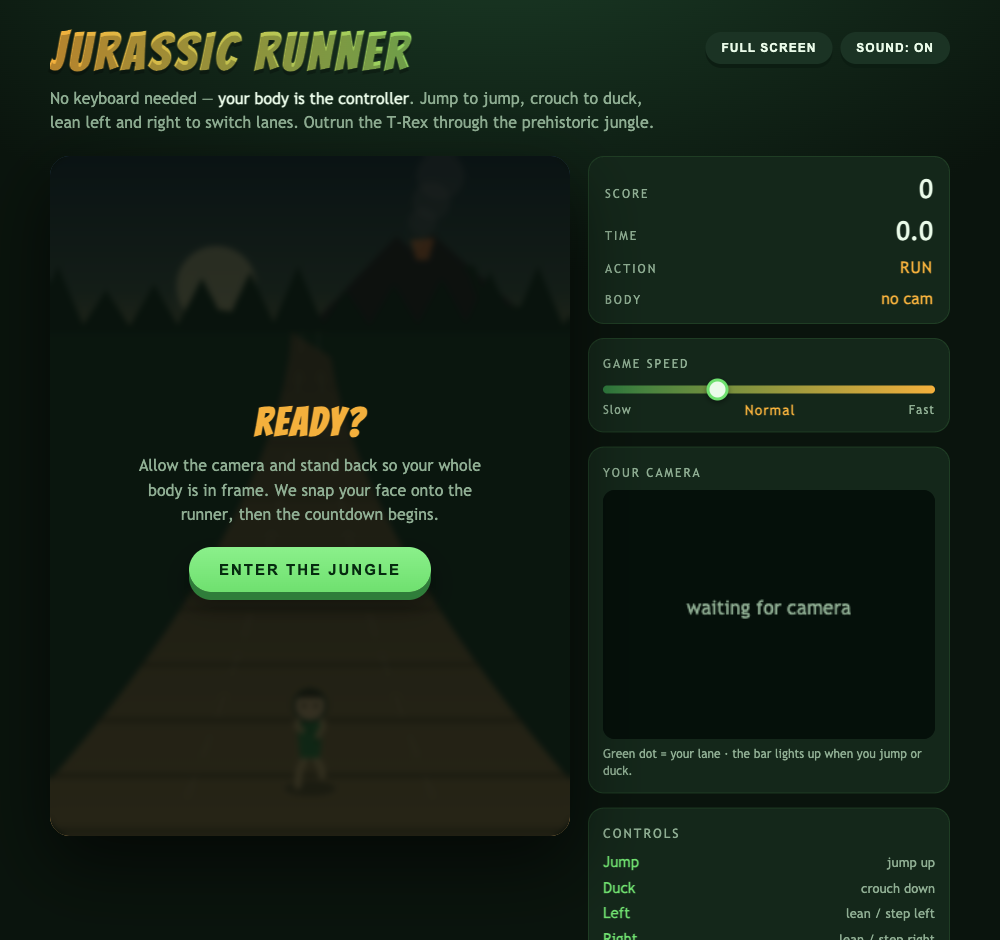
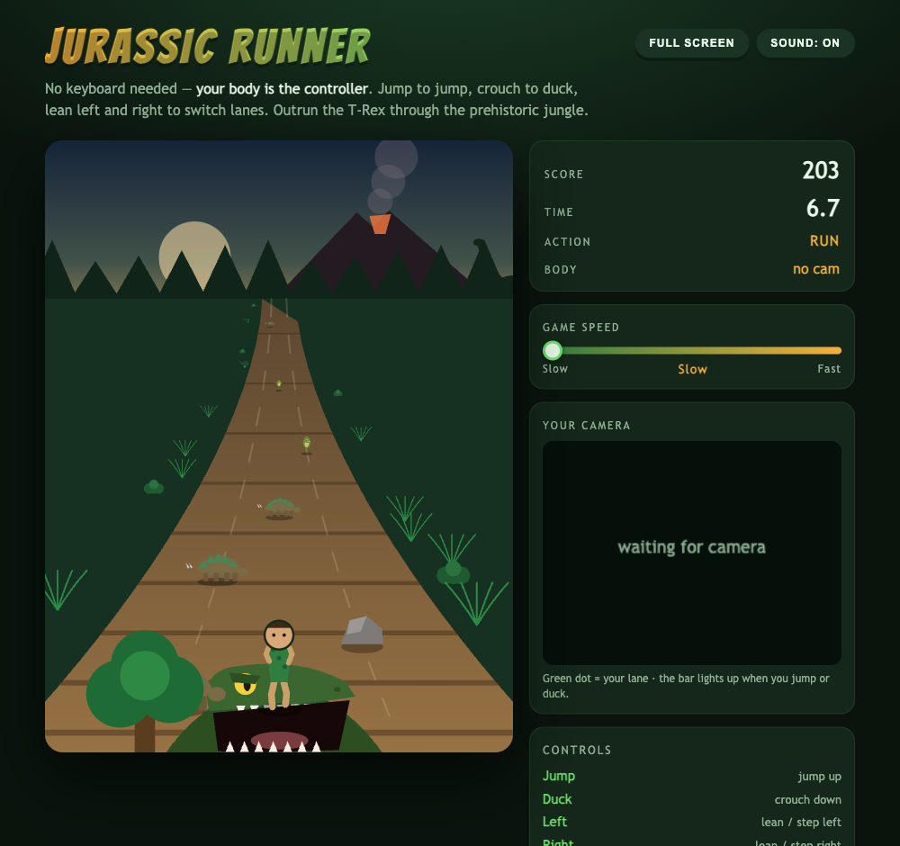
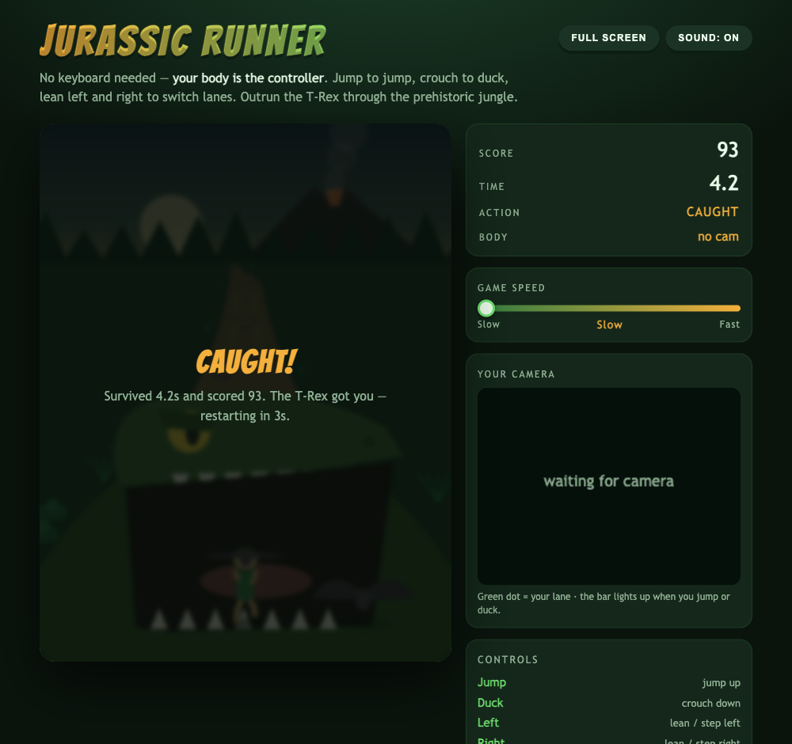
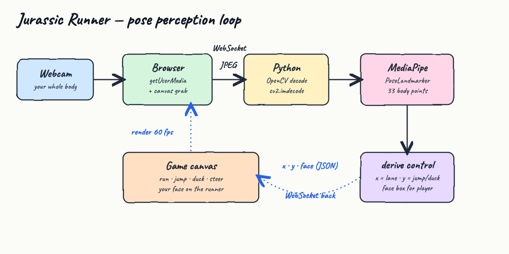

# Jurassic Runner

An endless runner set in an old jungle of the Jurassic age — but there is no keyboard.
**Your body is the controller.** Jump to jump, crouch to duck, lean left and right to switch
lanes, and outrun the T-Rex.

The webcam lives in the browser, and **Python + OpenCV + MediaPipe Pose** is the perception
brain: live frames become a lane / jump / duck signal in a fast loop. At the start it snaps your
face onto the runner, your live camera sits on the right, a T-Rex chases you the whole way, and
if it catches you the run restarts after 3 seconds.

## What it looks like

**Title screen** — allow the camera, pick a speed, and enter the jungle. Long-necked sauropods
roam the skyline.



**Running** — dodge boulders, raptors, pterodactyls and stegosaurs while the T-Rex lunges at
your heels. (Captured with the camera off, so the runner uses the caveman fallback head.)



**Caught!** — miss one and the T-Rex fills the screen. The run auto-restarts after 3 seconds.



## How perception drives the runner



1. The browser grabs the webcam with `getUserMedia` and draws each frame to a hidden canvas.
2. That frame is JPEG-encoded and pushed to Python over a **WebSocket**.
3. Python decodes it with **OpenCV** and runs **MediaPipe PoseLandmarker** (33 body points).
4. It derives a tiny JSON packet — `x` (lane), `y` (jump/duck), and a `face` box — and sends it back.
5. The game canvas turns that into movement and renders at 60 fps.

Control is **pure computer vision** — fast enough to react every frame. There is no LLM on the
per-frame path (it would add hundreds of milliseconds and make the game unplayable).

See [`design-doc.md`](design-doc.md) for the full design.

## Controls

| Action | Body gesture | Funny sound |
| --- | --- | --- |
| Switch lane left / right | Lean or step left / right | — |
| Jump | Jump up (clears boulders & raptors) | cartoon **boing** |
| Duck | Crouch down (clears pterodactyls) | descending **whoop** |
| Switch lane | The only way past a stegosaurus or tree | — |
| Restart | Automatic 3s after a crash, or press `R` | T-Rex **roar** |

When a run starts there is a 3-second countdown: it captures a neutral pose as your baseline and
snaps your face onto the runner. Jump and duck are measured relative to that baseline, so the
game adapts to your height and camera.

**Keyboard fallback** (no camera, or for testing): `←` `→` to switch lane, `Space`/`↑` to jump,
`↓` to duck. Body control resumes the instant you stop pressing keys.

## The dinosaurs

| On the track | Avoid by |
| --- | --- |
| Boulder | jump |
| Raptor | jump |
| Pterodactyl | duck |
| Stegosaurus | switch lane |
| Tree | switch lane |

A **T-Rex** looms at the bottom the whole run, lunging toward you for tension — but it is
theatrical and never ends the run by itself; only the on-track obstacles can. On game over it
lunges up and eats the runner. Sauropods graze along the horizon as scenery.

## Options

- **GAME SPEED** slider — four levels, **Slow / Normal / Fast / Insane** (default Normal).
- **FULL SCREEN** button — play the board full-screen.
- **SOUND: ON/OFF** button — toggle the procedural soundtrack and effects.

## Sound

A procedural Jurassic-jungle soundtrack plays in the background — a low drone, tribal drums, and
a pentatonic flute riff — with a boing on jump, a whoop on duck, and a T-Rex roar on game over.
It is synthesized live with the Web Audio API (no audio files, no libraries) and starts on your
first click.

## Run it

You need a machine with a webcam and a Chromium-based browser or Safari. `localhost` is a secure
context, so the browser will grant camera access.

```bash
./start.sh
```

First run creates a virtualenv, installs the dependencies, downloads the MediaPipe pose model
(~5.8 MB), and starts the server. `start.sh` also stops any previous instance first, so you can
re-run it freely. Then open:

```
http://localhost:8000
```

Stop it:

```bash
./stop.sh
```

## Tests

`test.sh` boots the server and drives the full pipeline end to end — it confirms the page is
served and feeds a real frame through OpenCV + MediaPipe Pose over the WebSocket:

```
http page ok
GL version: 2.1 (2.1 Metal - 90.5), renderer: Apple M4 Max
INFO: Created TensorFlow Lite XNNPACK delegate for CPU.
websocket pipeline ok -> {'present': False}
ALL TESTS PASSED
```

(`present: False` is correct: the test sends a blank frame with no body in it.)

```bash
./test.sh
```

## Stack

| Piece | Choice |
| --- | --- |
| Body tracking | MediaPipe `PoseLandmarker` (lite, float16) |
| Frame decode | OpenCV (`opencv-python`) |
| Transport | `websockets` |
| Static server | Python stdlib `http.server` (no-store headers) |
| Game | plain HTML canvas + vanilla JS |
| Music & SFX | Web Audio API, procedural |
| Python | 3.9 |

No game engine, no frontend framework, no build step, no audio assets.

## Files

```
pose_server.py       WebSocket pose-tracking + static file server
web/index.html       layout
web/style.css        jungle theme
web/game.js          canvas game loop, camera capture, pose → control, face snapshot, dinos, T-Rex
web/audio.js         procedural jungle soundtrack + jump/duck/roar effects (Web Audio API)
test_client.py       sends one frame through the pipeline
requirements.txt     mediapipe, opencv-python, websockets, numpy
start.sh stop.sh test.sh
diagram.html         source of the hand-drawn architecture image
design-doc.md        design document
```

## Notes

- The webcam never leaves your machine: frames go browser → local Python over `ws://localhost`.
- Because the browser owns the camera, the Python side never opens a camera device — no OS
  camera permission prompt for the server.
- The pose model and the virtualenv are git-ignored; `start.sh` recreates them.
- The README screenshots were captured with the camera disabled, so no real face appears.
