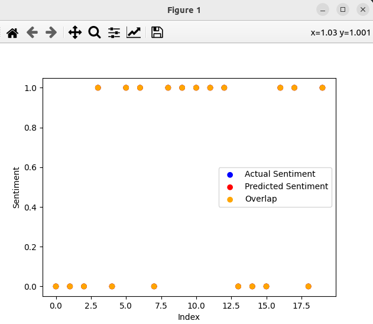

### Result
* Keras
* Neural Network
* Perceptron
* Perceptron is a single layer neural network and a multi-layer perceptron is called Neural Networks.
* Sentiment Analysis

Result:
```
Epoch 1/10
3/3 [==============================] - 1s 76ms/step - loss: 0.6720 - accuracy: 0.7750 - val_loss: 0.6555 - val_accuracy: 0.7500
Epoch 2/10
3/3 [==============================] - 0s 11ms/step - loss: 0.6594 - accuracy: 0.7750 - val_loss: 0.6443 - val_accuracy: 0.7500
Epoch 3/10
3/3 [==============================] - 0s 12ms/step - loss: 0.6475 - accuracy: 0.7750 - val_loss: 0.6326 - val_accuracy: 0.7500
Epoch 4/10
3/3 [==============================] - 0s 12ms/step - loss: 0.6358 - accuracy: 0.7750 - val_loss: 0.6214 - val_accuracy: 0.7500
Epoch 5/10
3/3 [==============================] - 0s 12ms/step - loss: 0.6244 - accuracy: 0.7750 - val_loss: 0.6100 - val_accuracy: 0.7500
Epoch 6/10
3/3 [==============================] - 0s 12ms/step - loss: 0.6132 - accuracy: 0.7750 - val_loss: 0.5990 - val_accuracy: 0.7500
Epoch 7/10
3/3 [==============================] - 0s 14ms/step - loss: 0.6024 - accuracy: 0.9625 - val_loss: 0.5885 - val_accuracy: 1.0000
Epoch 8/10
3/3 [==============================] - 0s 12ms/step - loss: 0.5917 - accuracy: 1.0000 - val_loss: 0.5784 - val_accuracy: 1.0000
Epoch 9/10
3/3 [==============================] - 0s 13ms/step - loss: 0.5812 - accuracy: 1.0000 - val_loss: 0.5682 - val_accuracy: 1.0000
Epoch 10/10
3/3 [==============================] - 0s 13ms/step - loss: 0.5707 - accuracy: 1.0000 - val_loss: 0.5580 - val_accuracy: 1.0000
1/1 [==============================] - 0s 89ms/step
[[0.5945904]]
1/1 [==============================] - 0s 21ms/step

```



