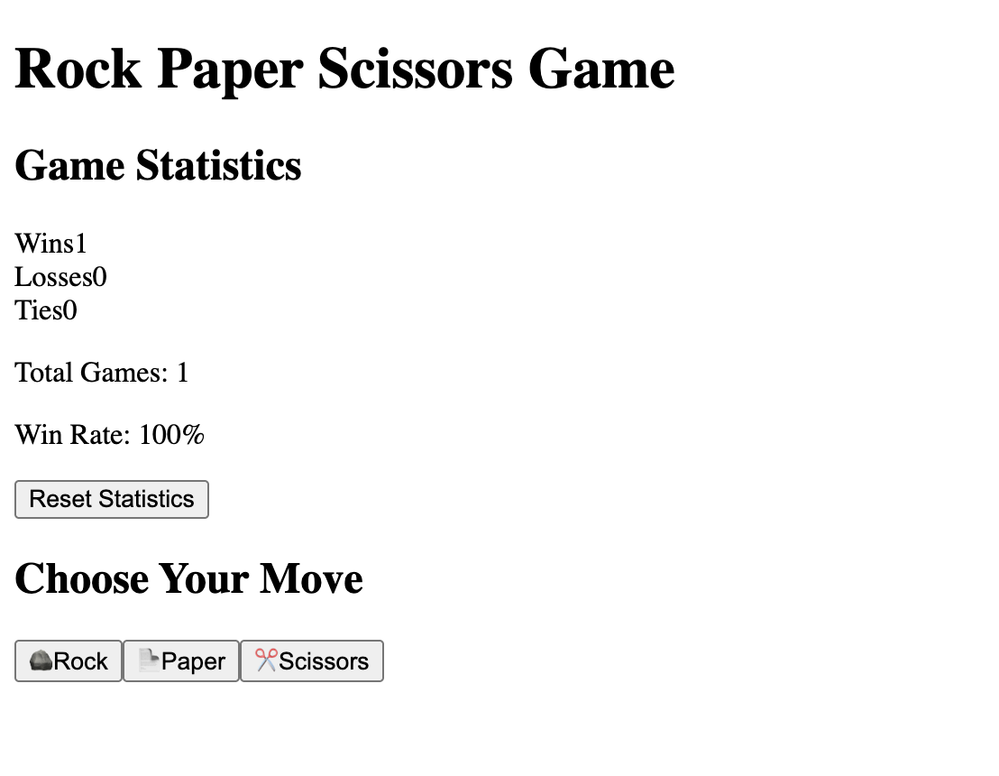

# Kiro Experience 2025/DEZ

Using Opus 4.5

0. I'm trying to get a rock, paper scizors game in React (no backend).
1. Took hours (3+ hours) to get something so simple done.
2. Kiro Did not respect my request to not gave comments
3. Kiro Crashed a bunch of times
4. Kiro Got me: "Context limit exceeded unexpectedly. Please start a new session to continue".
5. Tests failling all the time
6. The execution of the agent is very slow.
7. But hey I have requirements, I have designs and I have tests - SDD gave me paper work - great! 
8. Again: "An unexpected error occurred, please retry."
9. The only good thing is that there was 72 tests after 3.5 hours. Great to have the tests but this took a insame ammount of time.

## Results 

