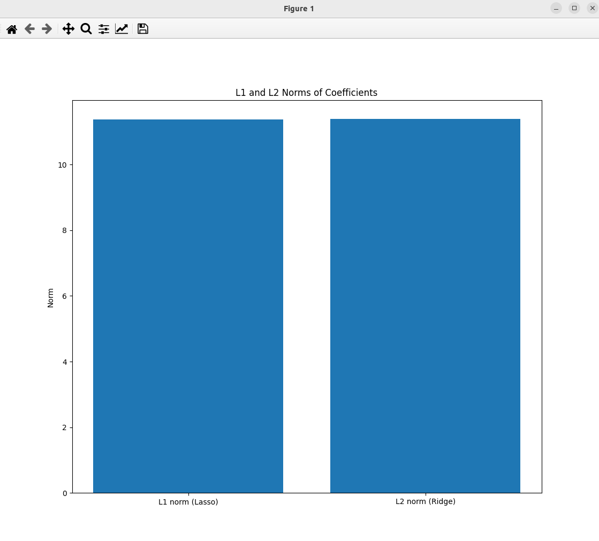

### Result
* Regularization
* L1 and L2 Norm Regularization
* L1 uses Lasso 
* L2 uses Ridge
* L1 and L2 regularization works by adding a penalty to the loss function (Error = Regression Error + Regularization (L1 or L2)).
* Lasso (Least Absolute Shrinkage and Selection Operator) is a regression analysis method that performs both variable selection and regularization. It aims to enhance the prediction accuracy and interpretability of the statistical model it produces.
* Ridge regression is a method used in machine learning to prevent overfitting and to deal with the problem of multicollinearity (high correlation among predictor variables) in data. It does this by adding a degree of bias to the regression estimates, which reduces the standard errors.

