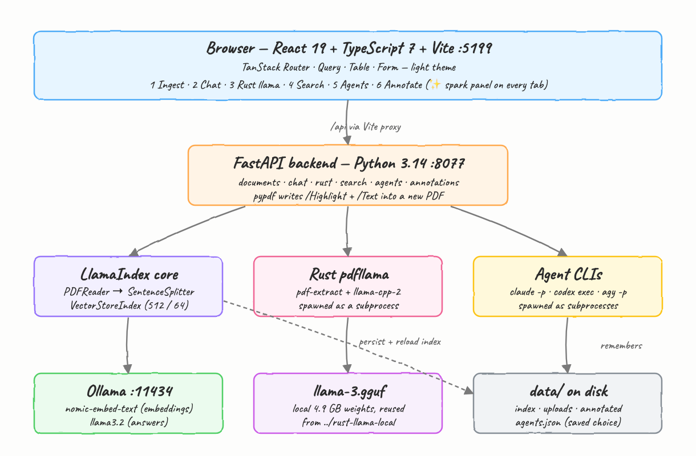
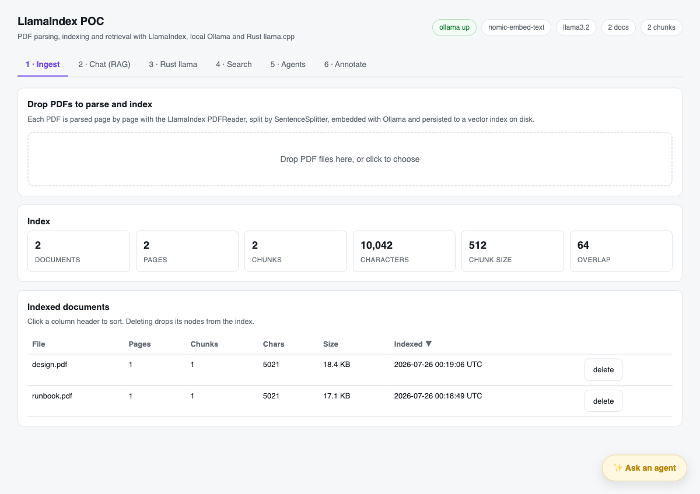
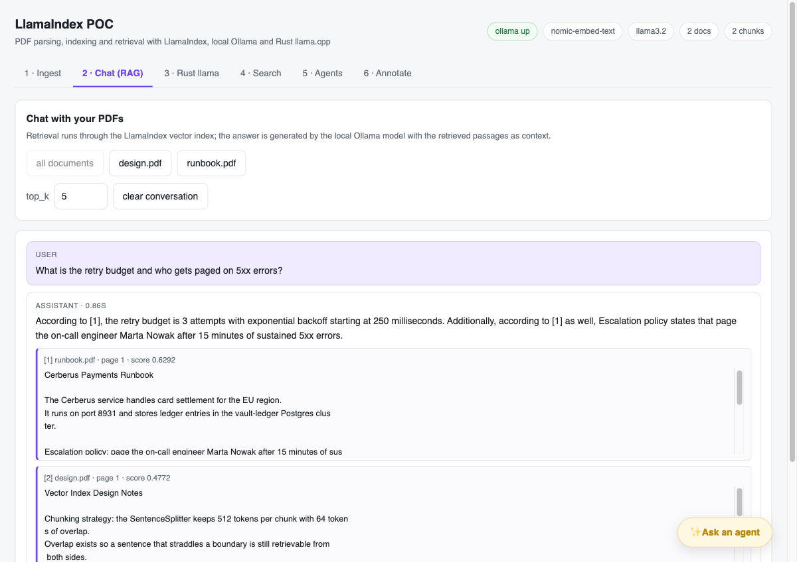
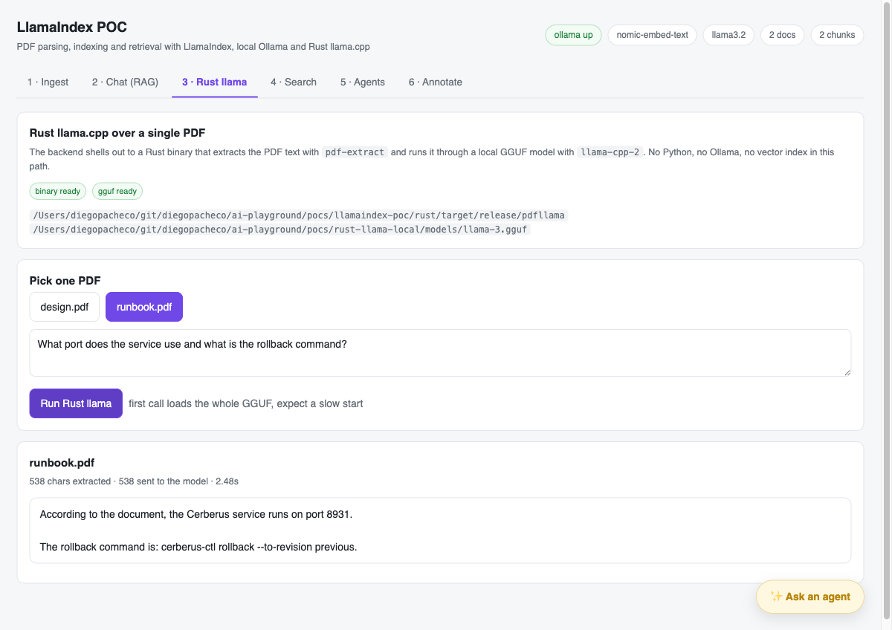
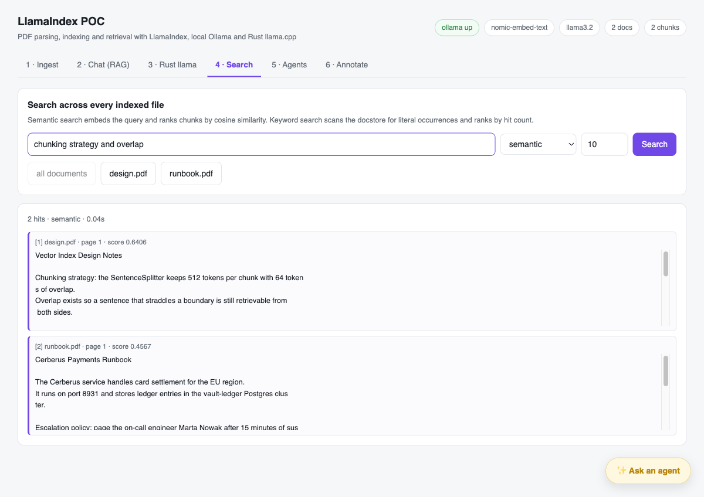
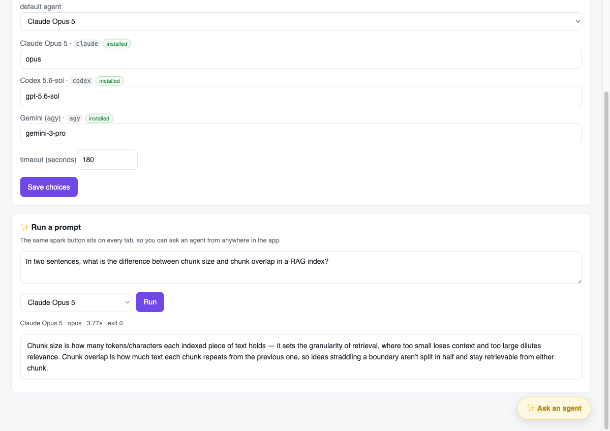
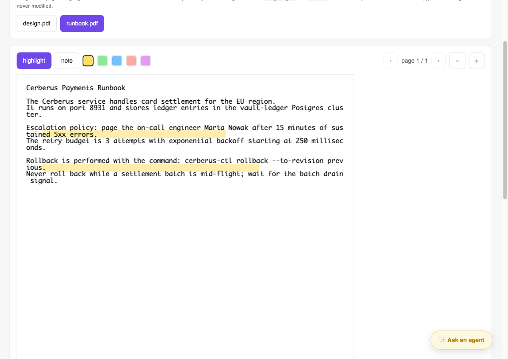
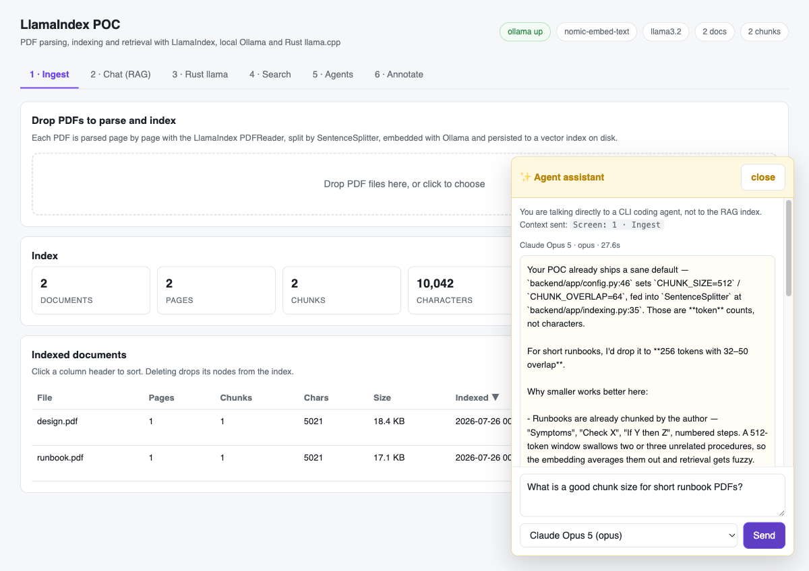

# llamaindex-poc

PDF parsing, indexing and retrieval with **LlamaIndex** on **Python 3.14.6**, a **React 19 + TypeScript 7** frontend built on the TanStack stack, and a **Rust** binary that runs a local GGUF model over a single PDF.

Everything runs locally. No API keys are needed: embeddings and RAG answers come from Ollama, the Rust path uses a local `llama-3.gguf`, and the agent tab shells out to CLIs you already have installed.

## Architecture



## Requirements

| What | Why | Check |
| --- | --- | --- |
| Python 3.14.6 | backend | `python3.14 --version` |
| Node 24 | frontend | `node --version` |
| Rust (edition 2024) | tab 3 binary | `cargo --version` |
| Ollama running | embeddings + RAG answers | `ollama serve` |
| `nomic-embed-text`, `llama3.2` | index + chat models | `ollama pull nomic-embed-text && ollama pull llama3.2` |
| `llama-3.gguf` | tab 3 model | defaults to `../rust-llama-local/models/llama-3.gguf` |
| `claude`, `codex`, `agy` | tab 5 agents | optional, each is detected independently |

## Run

```bash
./build.sh    # venv + pip install, cargo build --release, npm install
./start.sh    # backend on :8077, frontend on :5199
./stop.sh
```

Then open <http://127.0.0.1:5199>. Logs land in `logs/backend.log` and `logs/frontend.log`.

`build.sh` compiles `llama-cpp-2` from source, so the first run takes a few minutes.

## The six tabs

### 1 — Ingest

Drop PDFs to parse and index. Each file is read page by page with the LlamaIndex `PDFReader`, split by `SentenceSplitter` (512 tokens, 64 overlap), embedded through Ollama and persisted to a `VectorStoreIndex` under `data/index`. Uploads are content-hashed, so re-dropping the same file is reported as a duplicate instead of being indexed twice. The table is a TanStack Table with sortable columns; deleting a row drops its nodes from the index.



### 2 — Chat (RAG)

Retrieval runs through the vector index, and the local Ollama model writes the answer from the retrieved passages. Every answer lists the chunks it used with file name, page and similarity score, and the model is told to cite them as `[1]`, `[2]`. You can scope the retrieval to specific documents and change `top_k`.



### 3 — Rust llama

This path skips Python entirely: the backend spawns `rust/target/release/pdfllama`, which extracts the PDF text with `pdf-extract` and runs it through the local GGUF with `llama-cpp-2`, then prints a single JSON line the backend parses. No vector index and no Ollama are involved. The first call has to load the whole 4.9 GB model, so expect a slow start.



### 4 — Search

Search across every indexed file in two modes. **Semantic** embeds the query and ranks chunks by cosine similarity. **Keyword** scans the docstore for literal occurrences and ranks by hit count — useful when you want an exact string rather than a related idea. Both can be scoped to a subset of documents.



### 5 — Agents

Configure which CLI agent to call and with which model. The backend probes `PATH` for each binary and shows whether it is installed. Your choice is written to `data/agents.json` and reloaded on every start. The form is a TanStack Form.

| Agent | Command the backend runs |
| --- | --- |
| Claude Opus 5 | `claude -p --model <model> <prompt>` |
| Codex 5.6-sol | `codex exec --skip-git-repo-check -m <model> <prompt>` |
| Gemini (agy) | `agy -p <prompt> --model <model>` |



### 6 — Annotate

Render a PDF with pdf.js, drag to highlight, or switch to the note tool and click to drop a sticky note. Saving posts normalized coordinates to the backend, which uses **pypdf** to write real `/Highlight` and `/Text` annotation objects into a **new** file under `data/annotated` — the original upload is never modified, and the result opens with selectable, editable annotations in Preview or Acrobat.



## The spark panel

Every tab carries a ✨ button in the bottom-right corner. It opens a panel wired straight to the configured CLI agent, not to the RAG index — the gold styling and the spark icon are there so it is always obvious which one you are talking to. The panel passes the current screen as context.



## Layout

```
backend/app/
  config.py        paths, models and tunables from env
  storage.py       content-hashed uploads + document manifest
  indexing.py      LlamaIndex ingest, retrieve, keyword scan, delete
  rag.py           context assembly and the chat call
  agents.py        CLI agent specs, saved preferences, subprocess runner
  rustllama.py     subprocess bridge to the Rust binary
  annotate.py      pypdf highlight and note writing
  routers/         one router per tab
rust/src/main.rs   pdf-extract + llama-cpp-2, prints one JSON line
frontend/src/
  routes/          one screen per tab
  components/      layout, spark panel, document picker, source list
  api.ts           typed fetch client
  pdf.ts           pdf.js page rendering
```

## Configuration

Every value is an environment variable read at startup by `backend/app/config.py`:

| Variable | Default |
| --- | --- |
| `OLLAMA_HOST` | `http://localhost:11434` |
| `EMBED_MODEL` | `nomic-embed-text` |
| `LLM_MODEL` | `llama3.2` |
| `CHUNK_SIZE` / `CHUNK_OVERLAP` | `512` / `64` |
| `TOP_K` | `5` |
| `PDFLLAMA_BIN` | `rust/target/release/pdfllama` |
| `PDFLLAMA_MODEL` | `../rust-llama-local/models/llama-3.gguf` |
| `DATA_DIR` | `data` |

## Known limits

- Scanned PDFs with no text layer produce zero nodes; there is no OCR step.
- The Rust path truncates the document at 12k characters to fit the 8k context window, and reports `truncated` in the response.
- `llama3.2` is a small model. Retrieval is usually right even when the phrasing of the answer is weak; the sources shown under each answer are what to trust.
- Agent calls run with `cwd` set to `data/`, so an agent can read the repo around it.
