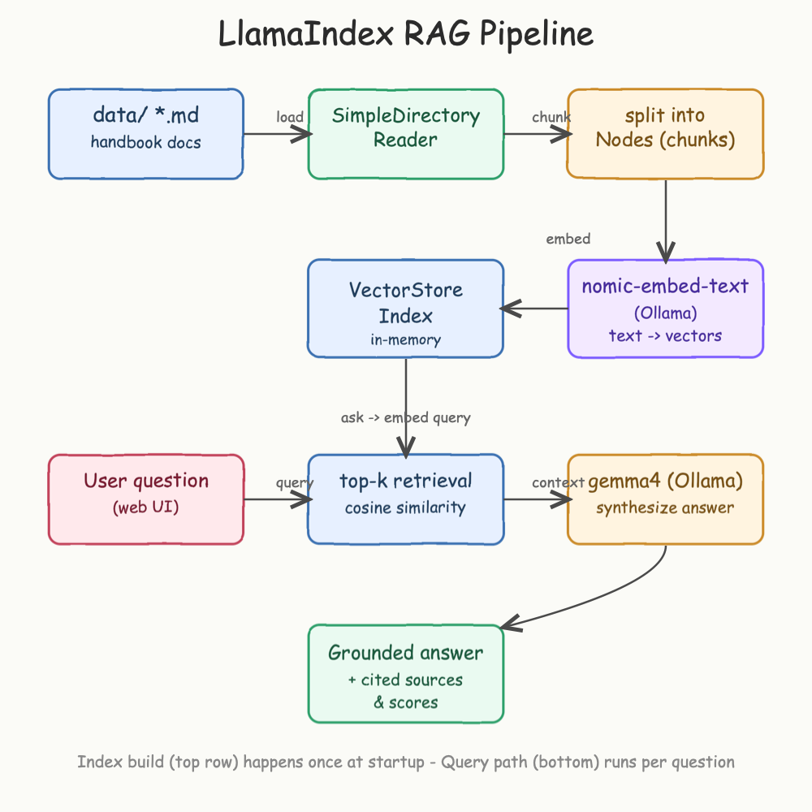
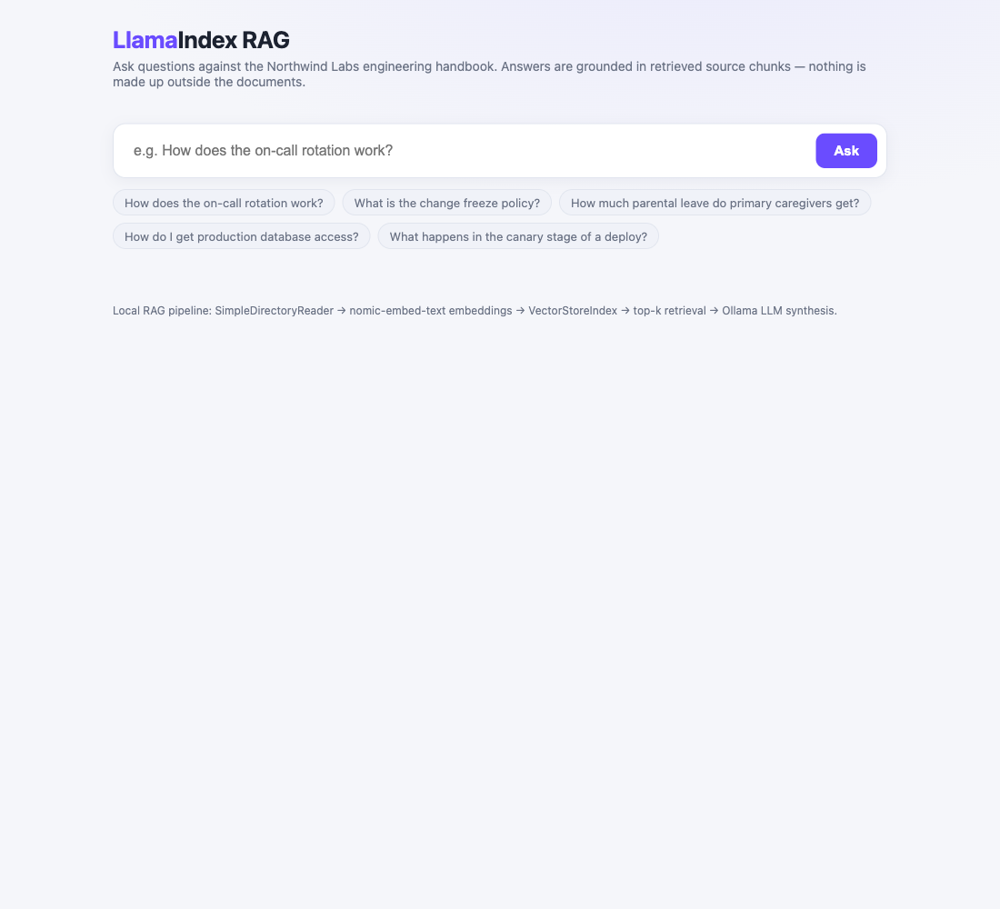
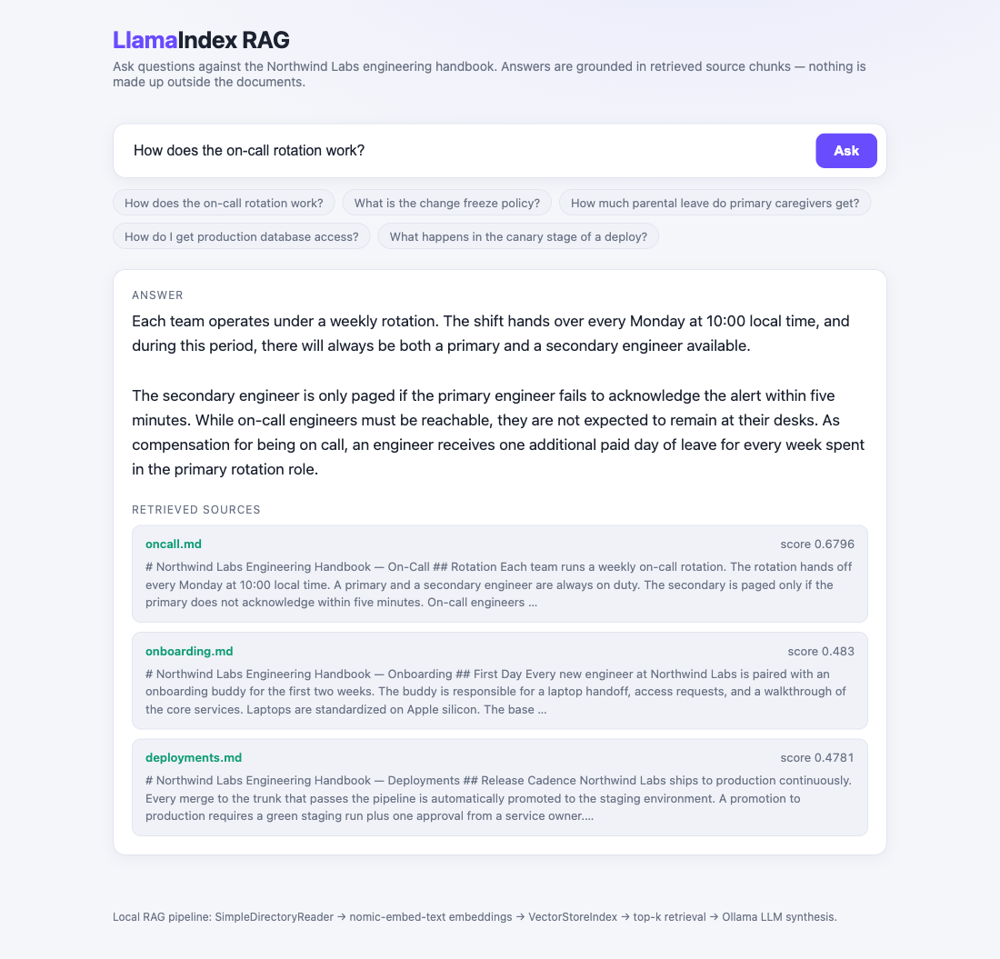

# LlamaIndex Python 3 POC — Local RAG over a private handbook

A fully local Retrieval-Augmented Generation (RAG) POC built with
[LlamaIndex](https://www.llamaindex.ai/) and Python 3.13. It indexes a small
engineering handbook and answers natural-language questions about it through a web
UI. Every answer is grounded in the retrieved document chunks and shows which
files were used and how relevant each one was.

No API keys and no cloud calls: the LLM and the embedding model both run on your
machine via [Ollama](https://ollama.com/).

## What is LlamaIndex?

LlamaIndex is a data framework that connects large language models to your own
data. An LLM only knows what was in its training set; it does not know your
handbook, your tickets, or your codebase. LlamaIndex closes that gap with the RAG
pattern:

1. **Ingest** — read your documents (files, PDFs, databases, APIs).
2. **Chunk** — split each document into smaller passages called *Nodes*.
3. **Embed** — turn every Node into a vector (a list of numbers) that captures its
   meaning, and store those vectors in an index.
4. **Retrieve** — when a question arrives, embed the question the same way and pull
   back the top-k Nodes whose vectors are closest to it (cosine similarity).
5. **Synthesize** — hand the question plus those retrieved Nodes to the LLM as
   context and ask it to answer using only that context.

The result is an answer that is grounded in your data instead of the model's
memory, which sharply reduces hallucination and lets you cite exactly where the
answer came from.

### The three LlamaIndex pieces used here

| Concept | Class | Role in this POC |
| --- | --- | --- |
| Reader | `SimpleDirectoryReader` | Loads every file under `data/` into Documents |
| Index | `VectorStoreIndex` | Chunks, embeds, and stores the Documents in memory |
| Query engine | `index.as_query_engine()` | Retrieves top-k chunks and calls the LLM |

`Settings.llm` and `Settings.embed_model` point LlamaIndex at Ollama, so the same
Ollama instance provides both the embeddings (`nomic-embed-text`) and the answer
model (`gemma4`).

## How it works



The top row runs **once at startup**: documents are loaded, split into Nodes,
embedded, and stored in an in-memory `VectorStoreIndex`. The bottom row runs **per
question**: the question is embedded, the closest chunks are retrieved, and the LLM
synthesizes a grounded answer that is returned with its source chunks and their
similarity scores.

## The knowledge base

`data/` holds a fictional "Northwind Labs" engineering handbook split across five
Markdown files: `onboarding.md`, `deployments.md`, `oncall.md`, `timeoff.md`, and
`security.md`. None of this is in any model's training data, so a correct answer
can only come from retrieval — which is exactly what makes it a fair test of RAG.

## The UI

The single-page UI lets you type a question or click one of the sample chips.



After you ask, the page shows two things:

- **Answer** — the LLM's response, synthesized only from the retrieved context.
- **Retrieved sources** — the actual chunks LlamaIndex pulled back, each labelled
  with its source file and a similarity score (higher = more relevant). This is the
  "show your work" panel that proves the answer is grounded.



In the screenshot above, the question *"How does the on-call rotation work?"*
retrieves `oncall.md` with the highest score (0.68), and the answer — weekly
handoff every Monday, primary plus secondary, five-minute escalation, one extra
paid day off — is drawn straight from that chunk. The two lower-scored chunks
(`onboarding.md`, `deployments.md`) were also retrieved but contributed little,
which is exactly what the scores tell you.

## Requirements

- Python 3.13 (the scripts fall back to `python3` if `python3.13` is absent)
- [Ollama](https://ollama.com/) running locally (`ollama serve`)
- The `gemma4:latest` chat model (`ollama pull gemma4`) — override with `LLM_MODEL`
- `nomic-embed-text` embeddings — `start.sh` pulls this automatically

## Run it

```bash
./start.sh      # create venv, install deps, verify Ollama, launch on :8000
```

Then open <http://localhost:8000> and ask a question.

```bash
./test.sh       # health check + a real query + input validation
./demo.sh       # start the server and fire four questions through the API
./stop.sh       # stop the server
```

### Configuration

All settings are environment variables with sensible defaults:

| Variable | Default | Meaning |
| --- | --- | --- |
| `PORT` | `8000` | HTTP port |
| `LLM_MODEL` | `gemma4:latest` | Ollama chat model used for synthesis |
| `EMBED_MODEL` | `nomic-embed-text` | Ollama embedding model |
| `TOP_K` | `3` | Number of chunks retrieved per query |
| `OLLAMA_URL` | `http://localhost:11434` | Ollama endpoint |

## HTTP API

The server is plain Python `http.server` — no web framework.

```bash
curl -s -X POST http://localhost:8000/query \
  -H "Content-Type: application/json" \
  -d '{"question":"What is the change freeze policy?"}'
```

```json
{
  "answer": "There is a company-wide change freeze from December 20 to January 2 ...",
  "sources": [
    { "file": "deployments.md", "score": 0.71, "text": "..." }
  ]
}
```

- `GET /` — the web UI
- `GET /health` — `{"status":"ok","model":"gemma4:latest"}`
- `POST /query` — `{"question": "..."}` → `{answer, sources[]}`

## Project layout

```
app.py             LlamaIndex RAG + stdlib HTTP server
data/              the handbook documents that get indexed
static/index.html  the web UI
requirements.txt   the four llama-index packages
start.sh stop.sh test.sh demo.sh
printscreens/      UI screenshots and the architecture diagram
```

## Test output

```
1. Health check
{"status": "ok", "model": "gemma4:latest"}

2. Query: How does the on-call rotation work?
{
    "answer": "Each team participates in a weekly on-call rotation that hands off
               every Monday at 10:00 local time ... The secondary engineer will
               only be paged if the primary engineer does not acknowledge within
               five minutes ... Compensation ... is one additional day of paid
               leave for every week they serve in that role.",
    "sources": [
        { "file": "oncall.md",      "score": 0.6796, "text": "..." },
        { "file": "onboarding.md",  "score": 0.483,  "text": "..." },
        { "file": "deployments.md", "score": 0.4781, "text": "..." }
    ]
}

3. Query with empty question (should 400)
HTTP 400
```
