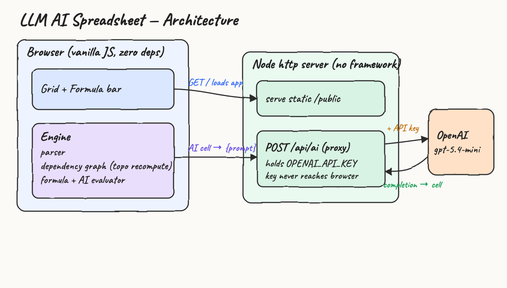
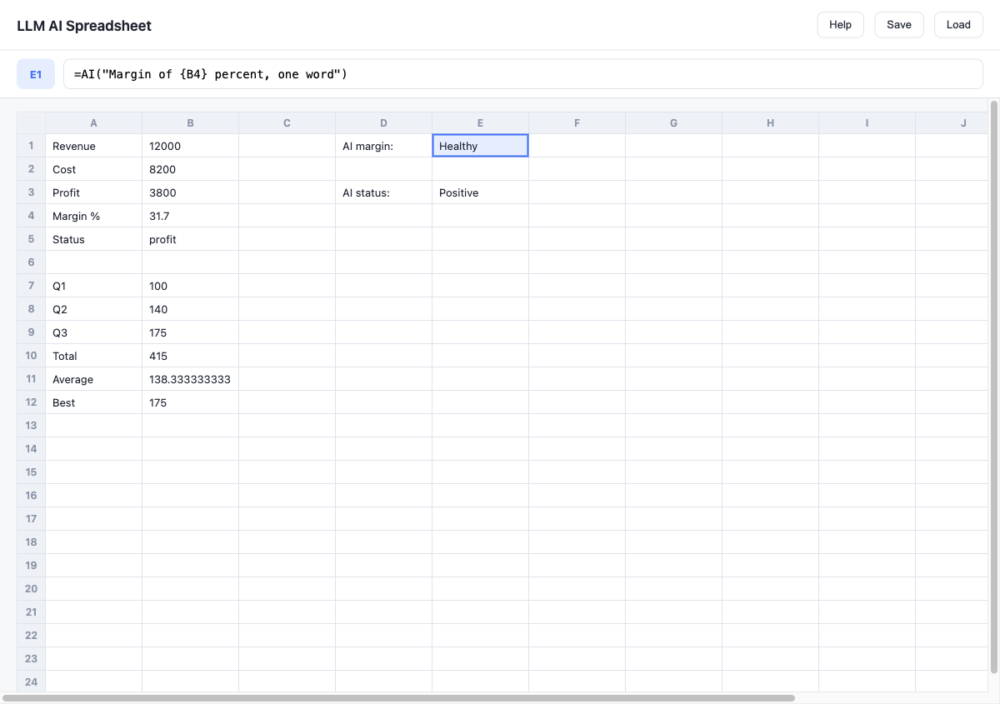
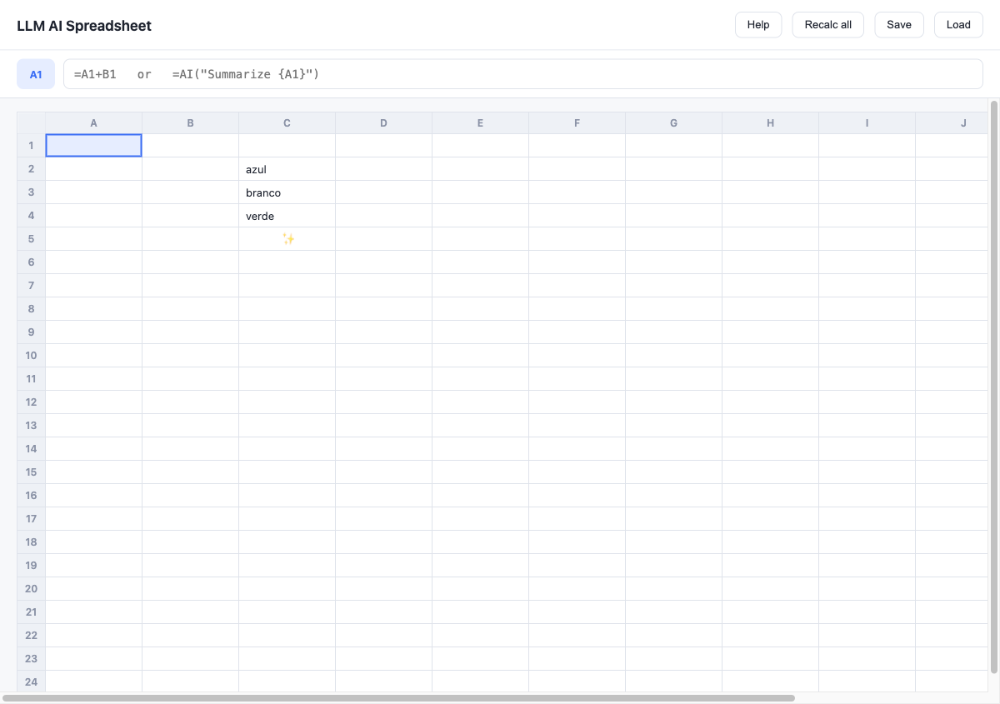
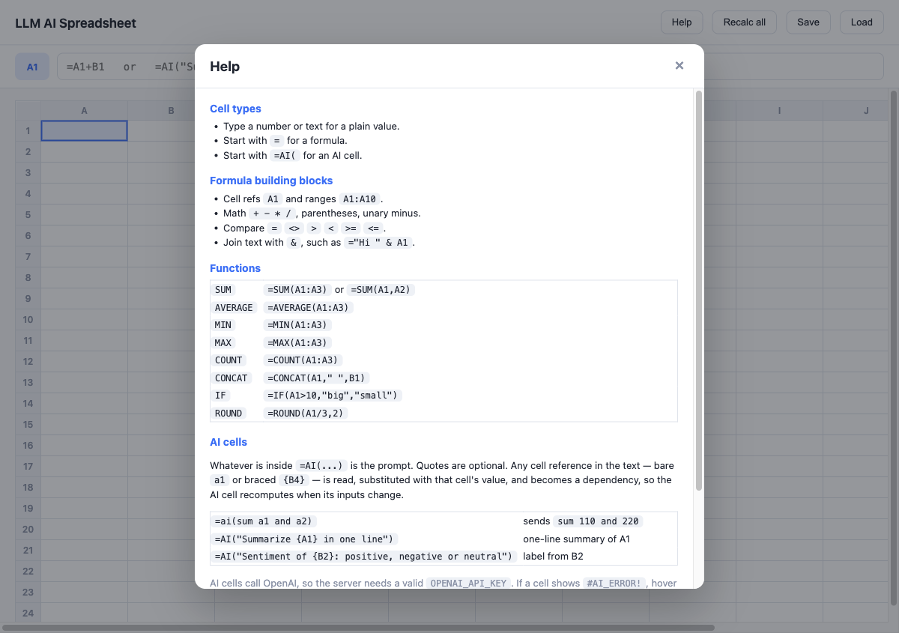

# LLM AI Spreadsheet

An online spreadsheet where the sheet **is** the program. A cell can hold a normal
formula **or** an LLM prompt that references other cells. When an input changes, the
dependency graph recomputes in topological order — formulas re-evaluate and AI cells
re-call OpenAI `gpt-5.4-mini`, exactly like a classic recalc except some nodes are
model calls instead of arithmetic.

Zero runtime dependencies: vanilla JS in the browser, a tiny Node `http` server as a
key-holding OpenAI proxy.

## Architecture



The formula engine and dependency graph run entirely in the browser. The backend has
two jobs only: serve the static files and proxy `POST /api/ai` to OpenAI so the API
key stays on the server and never reaches the browser.

## What it looks like



A worksheet mixing formulas and AI cells. Column B uses formulas
(`B3 =B1-B2`, `B4 =ROUND(B3/B1*100,1)`, `B10 =SUM(B7:B9)`); column E holds AI cells
(`E1 =AI("In 6 words, comment on a {A4} of {B4} percent")`) whose results flow from
the cells they reference. The formula bar shows the selected AI cell's prompt.

> The AI outputs in this screenshot were captured through a local OpenAI-compatible
> stub so the full cell → proxy → response path could be shown without a billable
> call. With a real `OPENAI_API_KEY` the same path returns live `gpt-5.4-mini` text.

While an AI cell is waiting on the model it shows a sparkle that disappears once the
answer lands:



The **Help** button opens a reference of every supported formula and how to write AI
cells:



## How it works

Each cell is a node in a dependency graph. Its content decides its kind:

| Content | Kind | Recompute |
| --- | --- | --- |
| `42`, `hello` | literal | none |
| `=A1+B2`, `=SUM(A1:A3)` | formula | evaluated in the browser |
| `=AI("... {A1} ...")` | AI cell | prompt built, `POST /api/ai`, await text |

On edit, the changed cell plus every downstream dependent is marked dirty, sorted
topologically (Kahn's algorithm), and recomputed in order. Independent cells in the
same wave recompute in parallel; AI cells are awaited. A cycle marks its cells
`#CYCLE!`. A cell shows `…` while its AI call is in flight.

## Formulas

- Numbers, quoted strings, cell refs (`A1`), ranges (`A1:A10`).
- Operators `+ - * /`, parentheses, unary minus, comparisons `= <> > < >= <=`.
- String concatenation with `&`.
- Functions: `SUM`, `AVERAGE`, `MIN`, `MAX`, `COUNT`, `CONCAT`, `IF`, `ROUND`.

Anything unparseable becomes `#ERROR!`; reading an errored cell propagates the error.

## AI cells

```
=ai(sum a1 and a2)
=AI("In 6 words, comment on a margin of {B4} percent")
```

Whatever is inside `=AI(...)` is the prompt. Quotes are optional. Any cell reference
in the text — a bare `a1` or a braced `{B4}` — becomes a dependency edge: the engine
waits for that cell, substitutes its computed value, and sends the result to
`gpt-5.4-mini`. The model's reply becomes the cell value. So `=ai(sum a1 and a2)`
with `a1=110`, `a2=220` sends `sum 110 and 220`.

Recompute runs on input change — never on a timer — so the sheet does not silently
drift. Answers are constrained to a single word so they fit the cell; temperature is
sent low and is configurable.

## Setup

Copy `env.sample` to `.env` and set your key:

```
OPENAI_API_KEY=sk-...
OPENAI_MODEL=gpt-5.4-mini
OPENAI_BASE_URL=https://api.openai.com/v1
OPENAI_TEMPERATURE=0.2
PORT=3000
```

## Run

```
./start.sh
./stop.sh
./test.sh
```

`start.sh` loads `.env`, fails loudly if the key is missing, launches the server, and
waits until the port answers. `stop.sh` kills it. `test.sh` runs the engine unit
tests, checks static serving, and confirms the `/api/ai` route is wired.

Then open `http://localhost:3000`.

## Errors

| Sentinel | Meaning |
| --- | --- |
| `#ERROR!` | formula parse/eval failure |
| `#CYCLE!` | cell is part of a dependency cycle |
| `#AI_ERROR!` | `/api/ai` failed (network, auth, model error) |

A failing cell does not abort the recompute; the rest still compute.

## Layout

```
server.js            node http: static + /api/ai (+ save/load)
public/index.html
public/styles.css
public/app.js         grid, formula bar, sheet model, render
public/engine.js      parser, dependency graph, evaluator, recompute
engine.test.mjs       engine unit tests
start.sh stop.sh test.sh
env.sample
design-doc.md
```

## Notes

- A sheet auto-saves to `localStorage`; **Save** / **Load** persist it to
  `sheet.json` on the server.
- Cell contents sent to the model are untrusted input; prompt injection is a known,
  unmitigated POC limitation.
