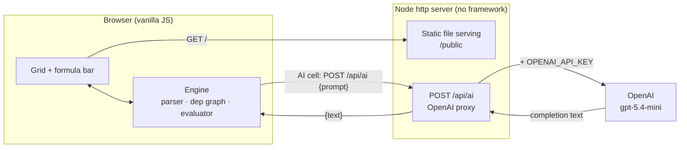
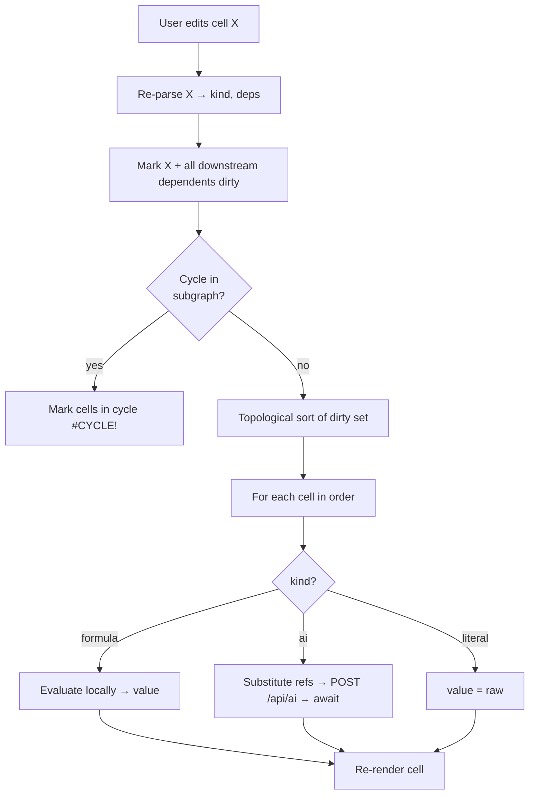

# Design Doc — LLM AI Spreadsheet (Spreadsheet-as-Runtime)

## 1. Goal

An online spreadsheet where a cell can hold either a normal formula **or** an
LLM prompt that references other cells. The sheet is the program: when an input
cell changes, the dependency graph recomputes — formulas re-evaluate and AI cells
re-call the model — exactly like a classic spreadsheet recalc, except some nodes
are `gpt-5.4-mini` calls instead of arithmetic.

Backing model: OpenAI `gpt-5.4-mini` (model id configurable via env).

## 2. Scope

In scope:
- Web UI with an editable grid (rows/columns, A1-style addressing).
- Formula support: arithmetic, cell refs, ranges, a small function set.
- AI cells: `=AI("... {A1} ...")` that interpolate other cells and call the model.
- Live dependency graph with topological recompute and cycle detection.
- Async recompute (AI cells resolve over the network; cells show a pending state).
- `start.sh` / `stop.sh` to run and stop the local server.

Out of scope (POC):
- Multi-user collaboration / real-time sync.
- Authentication, accounts, sharing.
- Server-side persistence beyond a single save/load file (see §11).
- Charts, pivot tables, styling/formatting beyond the minimum.

## 3. Core Concept

A cell is a node in a directed acyclic graph. Its content determines its kind:

| Content starts with | Kind | Recompute action |
| --- | --- | --- |
| plain number/text | Literal | none (it is the value) |
| `=` + expression | Formula | evaluate locally in the browser |
| `=AI(` | AI cell | build prompt, call backend, await text |

References inside a formula or AI prompt are edges in the graph. Editing a cell
invalidates it and everything downstream, then the engine recomputes the affected
subgraph in topological order.

## 4. Architecture

The formula engine and dependency graph live entirely in the browser (pure JS,
synchronous for formulas). The backend exists only to hold the OpenAI API key and
proxy AI calls — the key never reaches the browser.



Rationale for the split:
- Formulas are pure and instant; doing them client-side keeps the server tiny and
  needs zero dependencies.
- AI calls must hide the API key, so they must pass through a server.
- Result: the backend is two responsibilities only — serve files, proxy `/api/ai`.

## 5. Cell Model

Each cell holds:

- `raw` — the text the user typed (`42`, `=A1+B2`, `=AI("...")`).
- `kind` — `literal` | `formula` | `ai`, derived from `raw`.
- `value` — the computed result shown in the grid.
- `state` — `idle` | `computing` | `error`.
- `error` — sentinel when `state === error` (see §13).
- `deps` — set of cell addresses this cell reads (parsed from `raw`).

Addressing is A1-style: columns `A..Z` (extendable to `AA..`), rows `1..N`. Grid
size is fixed at startup (e.g. 26 × 50) to keep the POC simple.

## 6. Formula Language

Minimal expression grammar, evaluated client-side:

- Literals: numbers, quoted strings.
- Cell references: `A1`, `B12`.
- Ranges: `A1:A10` (used by range functions).
- Operators: `+ - * /`, parentheses, unary minus.
- String concat: `&` (`="Hi " & A1`).
- Functions (initial set): `SUM`, `AVERAGE`, `MIN`, `MAX`, `COUNT`, `CONCAT`,
  `IF`, `ROUND`.

Anything beyond this resolves to `#ERROR!` rather than guessing. The parser is a
small recursive-descent / shunting-yard evaluator — no parser library.

## 7. AI Cells

### Syntax

```
=AI("instruction text with {A1} and {B2} placeholders")
```

- The string is the prompt sent to `gpt-5.4-mini`.
- `{REF}` tokens are the dependency edges: the engine extracts them, waits for
  those cells to be computed, substitutes their values, and sends the result.
- The model's text response becomes the cell `value`.

Sample cells (conceptual, not built yet):
- `=AI("Summarize in one line: {A1}")`
- `=AI("Sentiment (positive/negative/neutral) of: {B2}")`
- `=AI("Given revenue {C1} and cost {C2}, write a one-sentence take")`

### Execution

1. Engine resolves all `{REF}` cells first (they may themselves be AI cells →
   the graph ordering guarantees inputs are ready).
2. Substitutes values into the prompt string.
3. Sets the cell `state = computing`.
4. `POST /api/ai` with `{ prompt }`.
5. On response: `value = text`, `state = idle`. On failure: `state = error`,
   `error = #AI_ERROR!`.

Independent AI cells recompute in parallel; dependent ones are awaited in
topological order.

### Determinism note

AI cells are non-deterministic by nature. Recompute is triggered only by an input
change or an explicit "recalc" — never on a timer — so the sheet does not silently
drift. `temperature` is sent low (configurable) to reduce variance.

## 8. Dependency Graph & Recompute



- **Graph build:** every cell's `deps` give incoming edges. A reverse index
  (dependents map) lets an edit find everything downstream fast.
- **Dirty set:** edited cell + transitive dependents.
- **Topological sort:** Kahn's algorithm over the dirty subgraph; the order is the
  recompute order. AI cells `await` inside the loop.
- **Cycle detection:** if topo sort cannot consume all nodes, the remaining nodes
  are in a cycle → each gets `#CYCLE!` and is skipped.

## 9. Backend API

Tiny Node `http` server, native `fetch`, no framework, no OpenAI SDK.

| Method | Path | Body | Returns |
| --- | --- | --- | --- |
| GET | `/` and `/public/*` | — | static frontend files |
| POST | `/api/ai` | `{ "prompt": "..." }` | `{ "text": "..." }` |
| POST | `/api/save` (optional, §11) | `{ "sheet": {...} }` | `{ "ok": true }` |
| GET | `/api/load` (optional, §11) | — | `{ "sheet": {...} }` |

`/api/ai` server-side call (chat completions, the most stable shape):

```
POST https://api.openai.com/v1/chat/completions
Authorization: Bearer $OPENAI_API_KEY
{
  "model": "gpt-5.4-mini",
  "messages": [{ "role": "user", "content": <prompt> }],
  "temperature": 0.2
}
```

Endpoint base URL, model id, and temperature are read from env so the same proxy
can target a different model without code changes.

## 10. Frontend UI

- A scrollable grid (HTML table or CSS grid) with column headers `A..Z` and row
  numbers.
- A **formula bar** showing/editing the selected cell's `raw`.
- Cell display rules:
  - shows `value` normally;
  - shows a spinner / "…" while `state === computing` (AI in flight);
  - shows the error sentinel in red while `state === error`.
- A **Recalc** button to force a full recompute (re-runs AI cells on demand).
- No component framework — direct DOM. Plain CSS, light theme.

## 11. Data & Persistence

- Source of truth is the in-memory sheet model in the browser.
- v1 persistence: `localStorage` (auto), plus optional **Save/Load to a JSON file**
  on the server (`/api/save`, `/api/load`) so a sheet survives a browser wipe.
- A sheet serializes as `{ "A1": { raw }, "B2": { raw }, ... }` — only `raw` is
  stored; values recompute on load.

## 12. Security

- `OPENAI_API_KEY` lives only in the server process env; it is never sent to the
  browser and never written into any served file.
- `env.sample` documents the variable; the real `.env` is gitignored.
- The proxy only forwards a `prompt` string; it does not echo the key or accept a
  model/endpoint override from the client.
- **Prompt-injection caveat:** AI cells send cell contents to the model. Cell text
  is untrusted input from whoever fills the sheet — documented as a known POC
  limitation, not mitigated in v1.

## 13. Error Model

Sentinel values shown in-cell, never thrown to the console silently:

| Sentinel | Meaning |
| --- | --- |
| `#ERROR!` | formula parse/eval failure |
| `#REF!` | reference to an invalid/empty-required cell |
| `#CYCLE!` | cell is part of a dependency cycle |
| `#AI_ERROR!` | `/api/ai` failed (network, auth, model error) |

A failing cell does not abort the whole recompute; siblings still compute.

## 14. Project Structure

```
llm-ai-spreadsheet/
  design-doc.md
  README.md
  env.sample            OPENAI_API_KEY, OPENAI_MODEL, PORT, OPENAI_BASE_URL
  start.sh
  stop.sh
  test.sh               proves AI proxy + a formula recompute work
  server.js             node http: static + /api/ai (+ save/load)
  public/
    index.html
    styles.css
    app.js              grid, formula bar, sheet model, render
    engine.js           parser, dependency graph, evaluator, recompute
```

No `package.json` build step required (Node built-ins only). A minimal
`package.json` with `"type": "module"` may be added solely for ESM imports.

## 15. start.sh / stop.sh

- `start.sh`: loads `.env`, fails loudly if `OPENAI_API_KEY` is unset, launches
  `node server.js` on `$PORT`, writes the PID to `server.pid`, then loops (sleep 1)
  until the port answers before printing the URL.
- `stop.sh`: reads `server.pid`, kills the process, removes the pid file.
- `test.sh`: starts the server, POSTs a sample prompt to `/api/ai`, asserts a
  non-empty `text`, and exercises one formula recompute path, then stops.

(Per project bash conventions: no comments, no emojis, no sleep > 1, readiness via
a poll loop.)

## 16. Tech Stack & Dependencies

| Layer | Choice | Why |
| --- | --- | --- |
| Frontend | Vanilla HTML/CSS/JS | no framework, zero install |
| Engine | Hand-written parser + graph | no parser/graph library |
| Backend | Node `http` + native `fetch` | no Express, no OpenAI SDK |
| Model | OpenAI `gpt-5.4-mini` | as specified; configurable via env |

Total third-party runtime dependencies: **zero**. This is the deliberate
consequence of the "fewest libraries" rule and is the main design decision open to
revision.

## 17. Build Plan (Milestones)

1. **Grid + literals** — render an editable grid, store `raw`, echo values.
2. **Formula engine** — parser, refs, ranges, function set, sync recompute.
3. **Dependency graph** — dependents index, dirty propagation, topo recompute,
   cycle detection.
4. **Backend proxy** — `server.js`, `/api/ai`, env-based key, static serving.
5. **AI cells** — `=AI("…{ref}…")` parsing, async recompute, pending/error states.
6. **Scripts + persistence** — `start.sh`/`stop.sh`/`test.sh`, localStorage,
   optional save/load.
7. **README** — hand-drawn (Excalidraw-style) architecture diagram + screenshots.

## 18. Open Questions

- Grid size fixed vs. growable? (POC: fixed 26×50.) - fixed.
- Streaming AI responses into the cell, or wait for the full text? (POC: full text.) - result only.
- Should a Recalc re-run *all* AI cells or only dirty ones? (POC: only dirty;
  full recalc is an explicit button.) - only dirty.
- Chat Completions vs. Responses API endpoint shape — kept as Chat Completions for
  stability; switchable via `OPENAI_BASE_URL` if needed. - both.
```