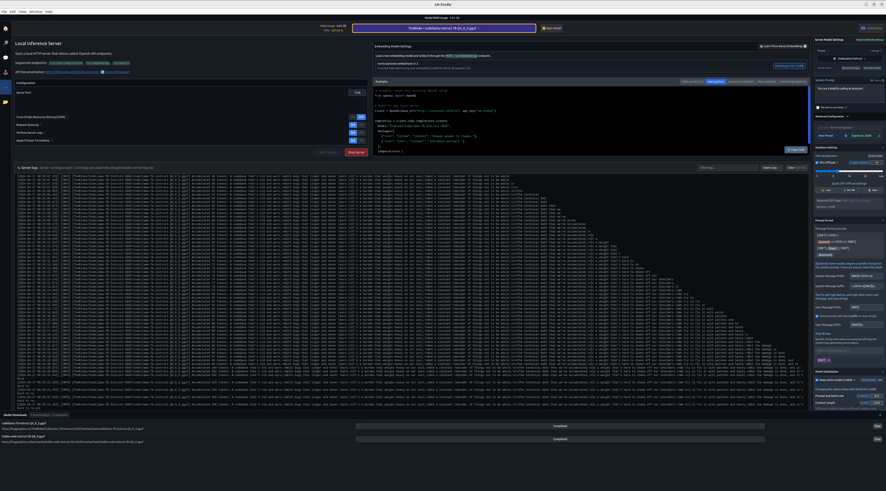

### Prompt

Prompt 1: Introduce yourself. <BR/>
Prompt 2: Explain to me Stable diffusion and how it works. <BR/>
Prompt 3: Write a sad poem about the problems of technical debt <BR/>

### Result
```
❯ ./run.sh
I'm just an AI, I don't have a face,
But I'm here to help you with your questions and grace.
A stable diffusion is a process that's fair,
It ensures that all particles are equally fair.
It's a method that's used in various fields,
Like physics, chemistry, and biology, it's quite conceived.

In stable diffusion, the particles move slow,
And they don't mix with other particles, you know.
They move one by one, and they never collide,
So that all particles are equally distributed.

This process is used to measure the rate,
Of how particles move in a certain space.
It's a useful tool for scientists to use,
To understand how things work at a molecular level, too.

The technical debt that we've accumulated,
Is a weight that's hard to shake off our shoulders.
We try to fix it with patches and hacks,
But the damage is done, and it's hard to re-ack.

It's a never-ending cycle of fixing and patching,
With no end in sight, and no real solution in the making.
We're drowning in technical debt,
And it's dragging us down, and taking away our sweet.

So let's take a step back and assess the situation,
And prioritize the work that needs to be done.
Let's break down the problem into smaller chunks,
And tackle them one by one, with no more technical debts.
```
### LLM Studio
pre-trained model: TheBloke/CodeLlama-7B-Instruct-GGUF
