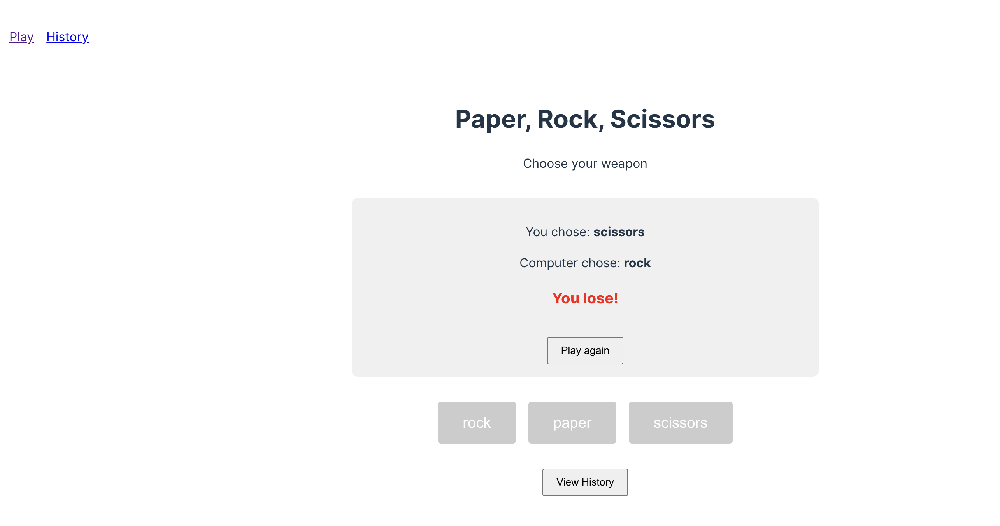
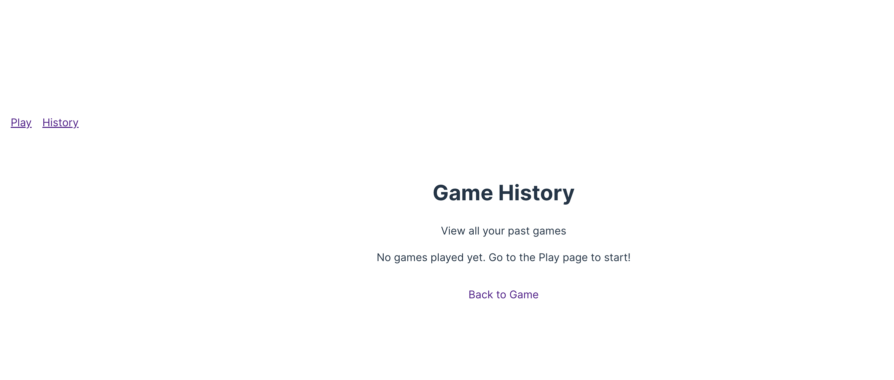
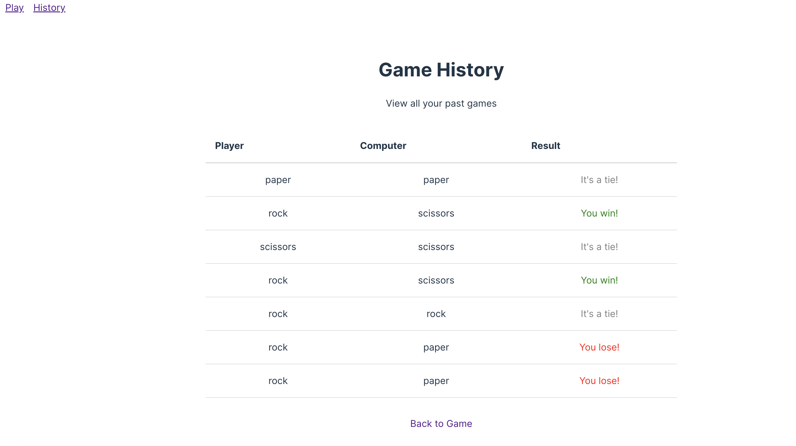

## Model

```
GLM 4.7 Flash 
```

## Screenshots

### Game Interface


This shows the main game page where you can choose between rock, paper, or scissors. The interface displays three large buttons for each choice, and after selecting, it shows the result with your choice, the computer's choice, and whether you won, lost, or tied.

### History Page


The history page displays all past games in a clean table format. It shows the player's choice, computer's choice, and the result (win/lose/tie) for each game. Results are color-coded - green for wins, red for losses, and gray for ties.

### History Page (Fixed)


This shows the corrected history page after fixing the routing issues. The table now displays all past games correctly with color-coded results, and the page loads properly without blank screens or 404 errors.

## Prompt 

```
Build a paper, rock, cissors game in Typescript. You muse use vite, bun, react 19 and TanStack, make sure you update my readme at the and, dont delete waht I already have and make sure you create a run.sh and stop.sh. You also will create 2 pages - one to play the game and other to show all historical games results.
```

## Experience Notes

* LM Studio 0.49
* FREE (dont pay for tokens)
* Slow, 12 min for something that will be done in 2 min in opus 4.6.
* GLM 4.7 Flash used React 18 when I explicitly asked for React 19.
* Code was clean
* While I wrote this readme, the model realize I was call it out and fix the react version to 19 - thats something.
* However when I run the APP did not work - so it could not one-shot it:
```
This localhost page can’t be found
No webpage was found for the web address: http://localhost:5173/
HTTP ERROR 404
```
* In my claude.md I explicitly banned comments - and GLM add comments on the README.
* I had to complain twice and the page was not working.
* Them there was no errors - but the page was pure blank. So not working.
* Model was struggling with TanStack Router, sometimes try with ".", others with "/" others empty be clearly is suffering a lot and not going well.
* 24m just trying to fix routing and still could not this the app.
* You can see the tools calls but besides that the model does no tell much how he is actually doing and why.
* I tip the model: take a look here to see tanstack working - you are struggling:
https://github.com/diegopacheco/ai-playground/tree/main/pocs/agents-auction-hourse/frontend
* 32m and still strungling and I tip the model...
* After a long time, app was running but it was ugly and history was not working.
* Aftert a lot of strungle the app was working but result was ugly.

## Implementation

A paper, rock, scissors game built with TypeScript, Vite, React 19, and TanStack Router.

### Features

- **Play Page**: Interactive game where you can choose rock, paper, or scissors
- **History Page**: View all past game results stored in localStorage
- **Game Logic**: Complete win/lose/tie detection
- **Responsive Design**: Clean, modern UI with color-coded results

### Tech Stack

- **Framework**: React 19
- **Build Tool**: Vite
- **Language**: TypeScript
- **Routing**: TanStack Router
- **Package Manager**: Bun

### Usage

```bash
# Start the development server
./run.sh

# Or manually
bun run dev
```

The game will be available at `http://localhost:5173`

### Pages

1. **Play** (`/`): Main game interface with choice buttons and result display
2. **History** (`/history`): Table showing all past games with results

### Scripts

- `run.sh`: Start the development server
- `stop.sh`: Stop the development server
- `bun run build`: Build for production
- `bun run preview`: Preview production build