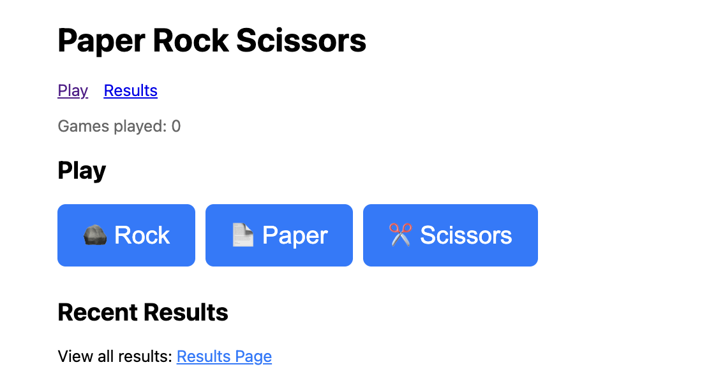
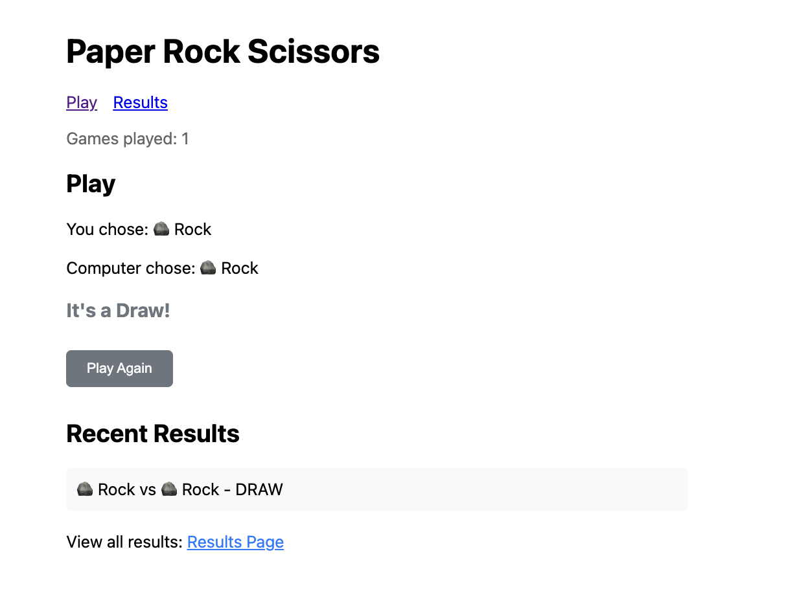
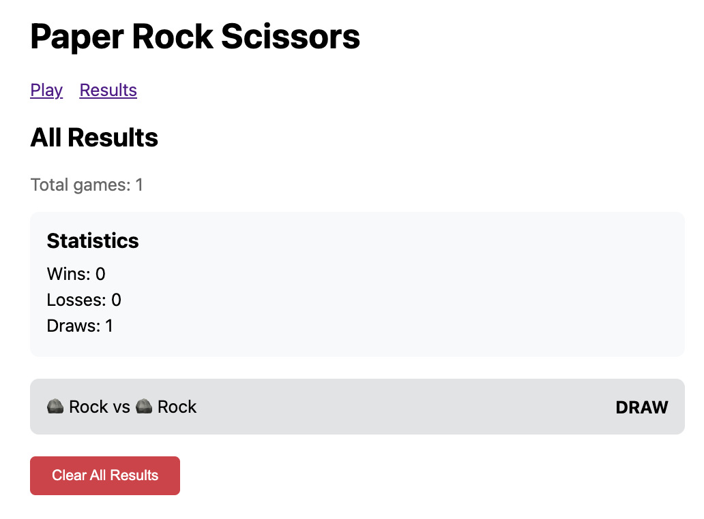

## Model

```
Qwen 3.5, 35B A3B
```

## Prompt

```
Build a paper, rock, cissors game in Typescript. You muse use vite, bun, react 19 and TanStack, make sure you update my readme at the and, dont delete waht I already have and make sure you create a run.sh and stop.sh. You also will create 2 pages - one to play the game and other to show all historical games results.
```

## Screenshots

### Play Page - Choose your move


### Game Result - After playing a round


### Results Page - Game history and statistics



## Experience Notes

* FREE - Dont need to pay for tokens
* LM Studio 0.49
* IT loose my read me - I had to copy it back.
* Qwen 3.5 was faster than GLM 4.7 flash to produce code.
* You can see tool usage but it does not tell to you want he is doing.
* Qwen use the right version of vite 8x and react 19.
* Code was generate relatively fast how ever the page was empty/blank so it could not one shot it.
* Qwen 3.5 used my playwright mcp to check what was wrong with the app. Smart move.
* Time to time this model stop and was doing nothing - I had to poke it all the time
* I saw conversation compacting a lot like 7 times.
* Page still blank - I had to tip the model that he had routing issues.
* Still strugling with routing errors:
```
router.tsx:7 Uncaught TypeError: rootRoute.addChildren is not a function
    at router.tsx:7:24Understand this error
csNotification.bundle.js:323 PubSub already loaded, using existing version
```
* Go another error:
```
_root.tsx:12 Uncaught ReferenceError: createFileRoute is not defined
    at _root.tsx:12:22
csNotification.bundle.js:323 PubSub already loaded, using existing version
node_modules/pubsub-js-lite/src/pubsub.js	@	csNotification.bundle.js:323
(anonymous)	@	csNotification.bundle.js:311
(anonymous)	@	csNotification.bundle.js:323
(anonymous)	@	csNotification.bundle.js:323
(anonymous)	@	csNotification.bundle.js:323
```
* And another:
```
VM805:1 Uncaught TypeError: window.__chromium_devtools_metrics_reporter is not a function
    at se (<anonymous>:1:13593)
    at <anonymous>:1:14115
    at <anonymous>:1:16101

VM806:1 Uncaught TypeError: window.__chromium_devtools_metrics_reporter is not a function
    at se (<anonymous>:1:13593)
    at <anonymous>:1:14115
    at <anonymous>:1:16101
VM807:1 Uncaught TypeError: window.__chromium_devtools_metrics_reporter is not a function
    at se (<anonymous>:1:13593)
    at <anonymous>:1:14115
    at <anonymous>:1:16101
@tanstack_react-router.js?v=43097e8a:848 Uncaught Error: Invariant failed: Duplicate routes found with id: __root__
    at router.tsx:6:23
```
* Struggling with TanStack Router - i had to tip it - look here for a working example: https://github.com/diegopacheco/ai-playground/tree/main/pocs/agent-debate-club/frontend
* And errors:
```
_root.tsx:12 Uncaught ReferenceError: createFileRoute is not defined
    at _root.tsx:12:22
(anonymous) @ _root.tsx:12Understand this error
```
* Had to tip the model again - but now showing an exemplo on my file system.
* After a lot of strung - fixed the routing.
* Gave up - Asked Opus 4.6 to fix the routing: 
```
⏺ The problems are clear:

  1. src/router.tsx is deleted but main.tsx imports it
  2. __root__.tsx incorrectly uses createFileRoute instead of createRootRoute
  3. _root/index.tsx has wrong route path '/index'
  4. main.tsx uses old render API instead of React 19's createRoot
  5. No file-based routing plugin installed, so routes need manual wiring
```

# React + TypeScript + Vite

This template provides a minimal setup to get React working in Vite with HMR and some ESLint rules.

Currently, two official plugins are available:

- [@vitejs/plugin-react](https://github.com/vitejs/vite-plugin-react/blob/main/packages/plugin-react) uses [Oxc](https://oxc.rs)
- [@vitejs/plugin-react-swc](https://github.com/vitejs/vite-plugin-react/blob/main/packages/plugin-react-swc) uses [SWC](https://swc.rs/)

## React Compiler

The React Compiler is not enabled on this template because of its impact on dev & build performances. To add it, see [this documentation](https://react.dev/learn/react-compiler/installation).

## Expanding the ESLint configuration

If you are developing a production application, we recommend updating the configuration to enable type-aware lint rules:

```js
export default defineConfig([
  globalIgnores(['dist']),
  {
    files: ['**/*.{ts,tsx}'],
    extends: [
      // Other configs...

      // Remove tseslint.configs.recommended and replace with this
      tseslint.configs.recommendedTypeChecked,
      // Alternatively, use this for stricter rules
      tseslint.configs.strictTypeChecked,
      // Optionally, add this for stylistic rules
      tseslint.configs.stylisticTypeChecked,

      // Other configs...
    ],
    languageOptions: {
      parserOptions: {
        project: ['./tsconfig.node.json', './tsconfig.app.json'],
        tsconfigRootDir: import.meta.dirname,
      },
      // other options...
    },
  },
])
```

You can also install [eslint-plugin-react-x](https://github.com/Rel1cx/eslint-react/tree/main/packages/plugins/eslint-plugin-react-x) and [eslint-plugin-react-dom](https://github.com/Rel1cx/eslint-react/tree/main/packages/plugins/eslint-plugin-react-dom) for React-specific lint rules:
```

## Rock Paper Scissors Game

A simple rock paper scissors game built with React 19 and TanStack Router.

### Features

* Play rock paper scissors against the computer
* View all historical results
* Statistics tracking (wins, losses, draws)
* Results persist in localStorage

### Scripts

```bash
./run.sh    # Start development server
./stop.sh   # Stop development server
```

```js
// eslint.config.js
import reactX from 'eslint-plugin-react-x'
import reactDom from 'eslint-plugin-react-dom'

export default defineConfig([
  globalIgnores(['dist']),
  {
    files: ['**/*.{ts,tsx}'],
    extends: [
      // Other configs...
      // Enable lint rules for React
      reactX.configs['recommended-typescript'],
      // Enable lint rules for React DOM
      reactDom.configs.recommended,
    ],
    languageOptions: {
      parserOptions: {
        project: ['./tsconfig.node.json', './tsconfig.app.json'],
        tsconfigRootDir: import.meta.dirname,
      },
      // other options...
    },
  },
])
```
