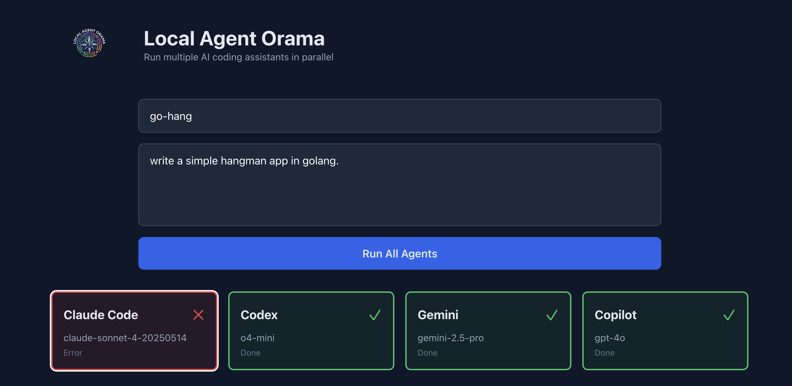
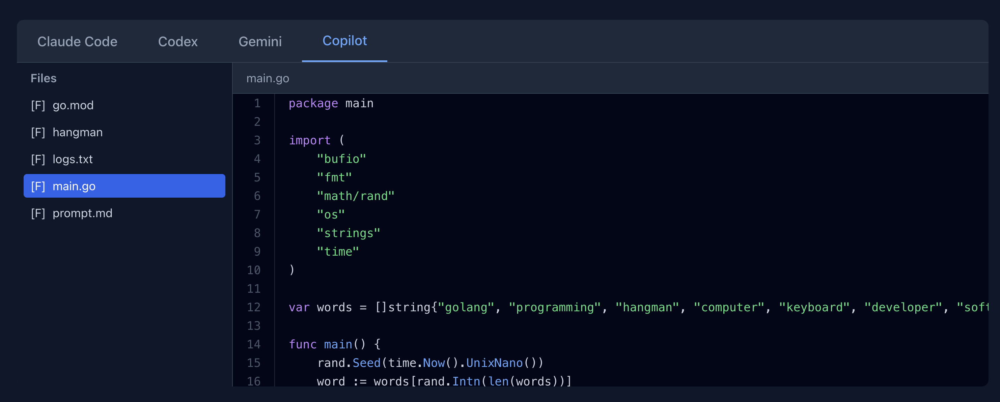

# Local Agent Orama

Local Agent Orama is a simple ai coding agent orchestrator that gets your prompt and run into multiple local coding ageents being:
* Claude Code
* OpenAI Codex
* Google Gemini
* Github Copilot CLI

## Results

