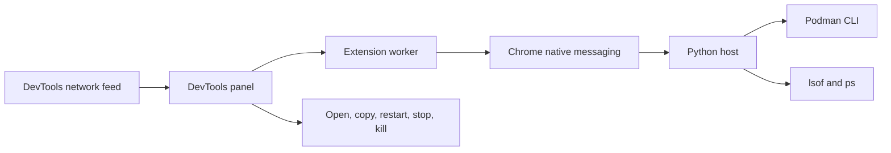

<p align="center">
  
</p>

<p align="center"><strong>Your local development surface, visible inside Chrome DevTools.</strong></p>

<p align="center">By <a href="https://diegopacheco.github.io">Diego Pacheco</a></p>

# Localhost Radar

Localhost Radar is a Chrome DevTools extension for inspecting Podman containers, listening localhost services, and browser traffic from one operations panel.

## Features

### Containers

- Lists running and stopped Podman containers
- Starts a stopped Podman machine and repairs stale running state
- Shows container name, image, state, identifier, and published ports
- Copies a `podman exec` shell command for running containers
- Restarts or stops containers after confirmation
- Summarizes running containers, stopped containers, and unique images

### Services

- Lists TCP services listening on the host
- Shows port, process, process identifier, detected language, and working path
- Opens any service at `http://localhost:<port>`
- Copies a ready-to-run `curl` command
- Terminates eligible processes with `SIGTERM` after confirmation
- Protects core browser, operating-system, and Podman processes

### Traffic

- Captures localhost REST and WebSocket requests visible to Chrome DevTools
- Shows method, status, address, and response time
- Highlights failures and redirects
- Copies a `curl` command for any captured request
- Exports discovered services and traffic as `localhost-api-map.json`

## Stack

- Chrome Manifest V3
- Chrome DevTools, Native Messaging, and Tabs APIs
- Plain JavaScript, HTML, and CSS
- Python 3 standard library native host
- Podman CLI, `lsof`, and `ps`
- Node.js and Python built-in test runners

No runtime libraries are required.

## How it works



Chrome extensions cannot access host processes directly. The extension worker sends a constrained action to the native host. The host validates the action and identifiers before invoking Podman or operating-system tools. One request produces one response, then the native host exits.

## Requirements

- Google Chrome 114 or newer
- macOS or Linux
- Python 3
- `lsof`
- Podman for the Containers tab

The Services and Traffic areas remain useful when Podman is unavailable.

## Install

Run:

```bash
./install.sh
```

The script registers the native messaging host and opens the project folder and Chrome extensions page. Enable Developer mode, select **Load unpacked**, and choose the `localhost-radar` folder.

The extension has a fixed development identifier so the native messaging permission remains stable:

```text
pdokohojfmgoiaogpimmndjfdhgehkhk
```

Restart Chrome after the first installation so it discovers the native host.

## Use

Select Localhost Radar from Chrome's extensions menu or toolbar to open the full interface in a browser tab.

For live browser traffic:

1. Open Chrome DevTools.
2. Select **Localhost Radar** in the DevTools panel list.
3. Use **Containers** to inspect and control Podman workloads.
4. Use **Services** to inspect ports and watch browser traffic.

The DevTools traffic feed begins when the panel is open. Reload the inspected page to capture its complete request trail.

## Container access

The copy button produces:

```bash
podman exec -it <container> sh
```

This opens a shell through Podman and does not require an SSH daemon inside the container.

## Test

Run:

```bash
./test.sh
```

The checks validate command escaping, service addresses, telemetry formatting, port parsing, language detection, container input validation, and both JSON manifests.

## Uninstall

Run:

```bash
./uninstall.sh
```

The script removes the native messaging registration and opens Chrome's extensions page. Select Localhost Radar and choose **Remove**.

## Security

- The native host accepts only four fixed actions
- Container identifiers are restricted to safe characters
- Process termination is limited to processes currently listening on a detected TCP port
- Core system, browser, and Podman processes are protected
- Termination uses `SIGTERM`, allowing the service to shut down cleanly
- Container removal, image removal, arbitrary shell execution, and arbitrary process signals are not supported
- No host data is transmitted outside the machine

## Project layout

```text
assets/
manifest.json
native/
src/
tests/
install.sh
test.sh
uninstall.sh
```
