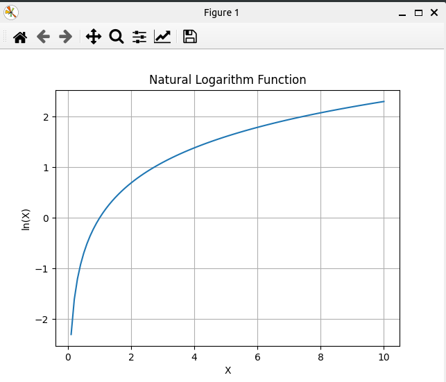

### Result
* Matplotlib
* Log
* Logarithm
Logarithm - Returns the natural logarithm of the input. Use case: Modeling logarithmic relationships.
* Use cases:
  * Information Theory
  * Economics
  * Chemistry
  * Astronomy
  * CS / DS

