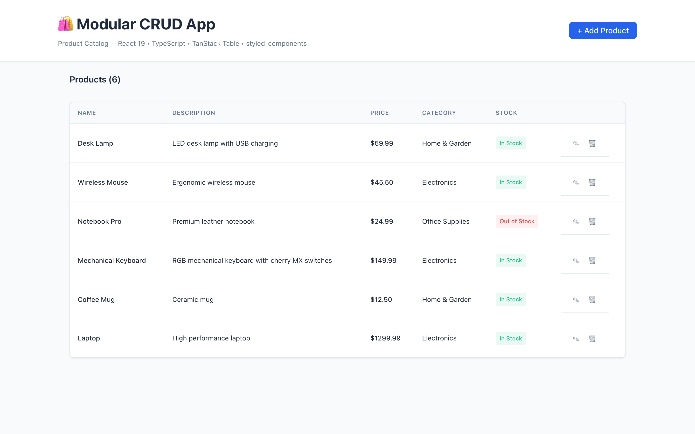
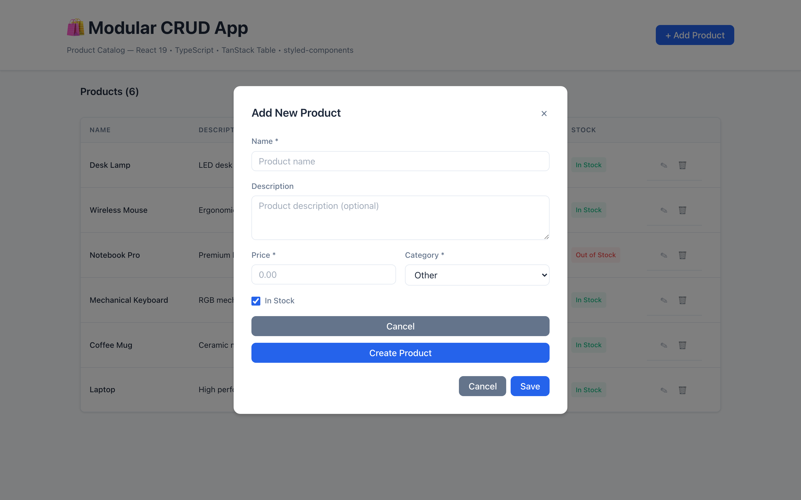
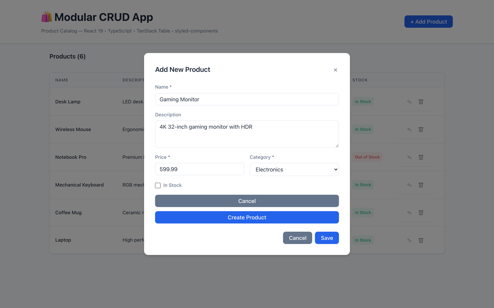
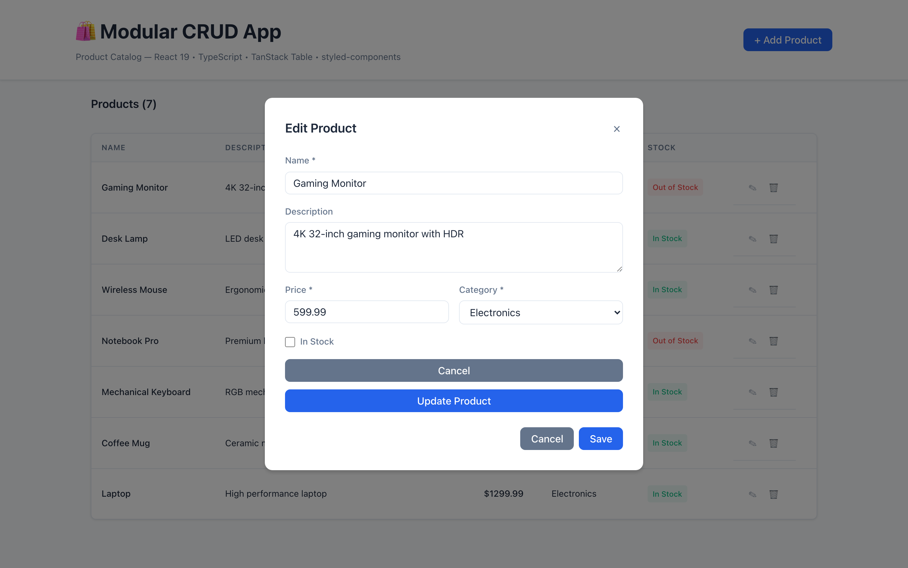
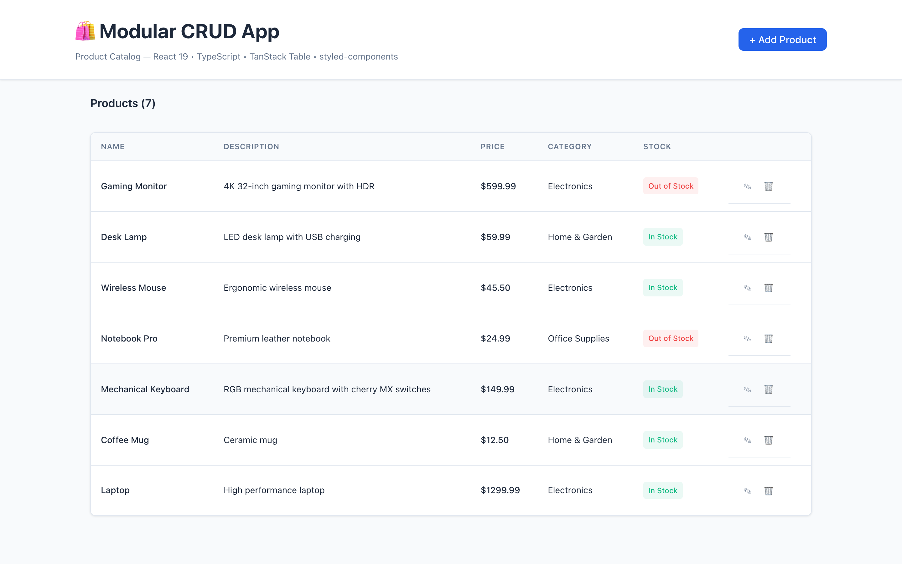

# Modular CRUD App

A fully modular CRUD (Create, Read, Update, Delete) application built with a **TypeScript 7 + React 19 + TanStack Table + styled-components** frontend running on **Bun**, and a **Python 3 + Flask** backend with SQLAlchemy. The app manages a product catalog with a clean, light-themed UI.

## Model

Laguna S 2.1 118B-A8B

## Experience notes

* COST ZERO
* using magnitude cli
* took 48 minutes
* app was not starting there was a issue but after pointing to model it fixed

---

## Screenshots

### Home Page — Product Table

The main view displays all products in a feature-rich TanStack Table with sorting, stock badges, and inline edit/delete actions.



*The product table shows name, description, price, category, and stock status. Each row has edit (✎) and delete (🗑) action buttons. An "Add Product" button opens the creation form.*

---

### Product Form — Create

Clicking "Add Product" opens a modal form for creating a new product with name, description, price, category dropdown, and an in-stock checkbox.



*The form includes client-side validation, a category dropdown with predefined options, and a checkbox toggle for stock status. Fields marked with \* are required.*

---

### Product Form — Filled

The form with all fields populated, demonstrating the filled state before submission.



*All fields are filled: "Gaming Monitor" with a 4K description, $599.99 price, Electronics category, and in-stock checked.*

---

### Product Form — Edit

Clicking the edit (✎) button on an existing product opens the same form pre-filled with the product's current data for editing.



*The edit form is pre-populated with the product's existing values, ready for modification.*

---

### Home Page — After Creating a Product

After successfully creating a new product, the table automatically updates to show the new entry at the top.


*The newly created "Gaming Monitor" product appears at the top of the table, demonstrating the reactive data flow between the frontend and backend.*

---

### Final View

A comprehensive view showing the complete CRUD workflow in action.



*All products are listed with their respective categories, prices, and stock statuses.*

---

## Stack

| Layer | Technology | Version |
|-------|-----------|---------|
| **Frontend Runtime** | Bun | 1.3.2 |
| **Frontend Framework** | React | 19.2.8 |
| **Language** | TypeScript | 7.0.2 |
| **Build Tool** | Vite | 8.2.1 |
| **Styling** | styled-components | 6.5.1 |
| **Table** | @tanstack/react-table (v8) | 8.21.3 |
| **Backend Language** | Python | 3.9+ |
| **Backend Framework** | Flask | 3.0.0 |
| **ORM** | Flask-SQLAlchemy | 3.1.0 |
| **CORS** | Flask-CORS | 6.0.5 |
| **Database** | SQLite | Built-in |

---

## Architecture

### Backend (Flask — Python)

The backend follows a modular architecture with clear separation of concerns:

```
backend/
├── app/
│   ├── __init__.py          # Flask app factory
│   ├── config.py            # Configuration management
│   ├── database.py          # SQLAlchemy setup
│   ├── api/
│   │   ├── __init__.py
│   │   ├── routes.py        # REST API endpoints
│   │   └── schemas.py       # Request/response validation
│   ├── models/
│   │   ├── __init__.py
│   │   └── product.py       # Product data model
│   └── services/
│       ├── __init__.py
│       └── product_service.py  # Business logic
├── tests/
│   ├── __init__.py
│   └── test_products.py
├── scripts/
│   ├── start.sh
│   └── stop.sh
├── requirements.txt
└── run.py
```

**API Endpoints:**

| Method | Endpoint | Description |
|--------|----------|-------------|
| GET | `/api/health` | Health check |
| GET | `/api/products` | List all products |
| GET | `/api/products/:id` | Get a single product |
| POST | `/api/products` | Create a new product |
| PUT | `/api/products/:id` | Update a product |
| DELETE | `/api/products/:id` | Delete a product |

### Frontend (React — TypeScript)

The frontend is built with a component-based modular architecture:

```
frontend/
├── src/
│   ├── components/
│   │   ├── common/
│   │   │   ├── Button/      # Reusable button component
│   │   │   ├── Input/       # Input, Textarea, Select, Checkbox
│   │   │   └── Modal/       # Modal dialog component
│   │   ├── layout/
│   │   │   ├── Header/      # Page header with title
│   │   │   └── Container/   # Layout wrappers
│   │   ├── table/
│   │   │   ├── ProductTable.tsx  # TanStack Table component
│   │   │   └── table.styles.ts
│   │   └── forms/
│   │       ├── ProductForm.tsx   # Product creation/edit form
│   │       └── form.styles.ts
│   ├── hooks/
│   │   ├── useProducts.ts    # Custom hook for CRUD operations
│   │   └── index.ts
│   ├── services/
│   │   ├── api.ts            # HTTP client
│   │   ├── productService.ts # Product API service
│   │   └── index.ts
│   ├── types/
│   │   ├── product.ts        # TypeScript interfaces
│   │   └── index.ts
│   ├── styles/
│   │   ├── theme.ts          # Design tokens
│   │   ├── GlobalStyles.ts   # Global CSS
│   │   └── styled-components.d.ts
│   ├── pages/
│   │   ├── HomePage.tsx      # Main page component
│   │   └── index.ts
│   ├── App.tsx
│   └── main.tsx
├── scripts/
│   ├── start.sh
│   └── stop.sh
├── index.html
├── package.json
├── tsconfig.json
├── vite.config.ts
└── tsconfig.node.json
```

---

## Features

### Backend Features
- **RESTful API** with full CRUD operations for products
- **Modular architecture** — models, services, API routes, and schemas are cleanly separated
- **SQLite database** with automatic schema creation via SQLAlchemy
- **Input validation** — schema-level and service-level validation for all fields
- **CORS support** — allows frontend to communicate with backend
- **Health check endpoint** — `/api/health` for monitoring
- **Error handling** — structured error responses with validation details
- **Configurable** — environment variables for host, port, database URL, and debug mode

### Frontend Features
- **React 19** with modern hooks and component architecture
- **TypeScript 7** with strict type checking and path aliases
- **TanStack Table v8** — feature-rich data table with column definitions
- **styled-components** — CSS-in-JS with a light-themed design system
- **Modular component architecture** — reusable, self-contained components
- **Custom hooks** — `useProducts` for encapsulated CRUD state management
- **Service layer** — clean API client with typed responses
- **Client-side form validation** with real-time error feedback
- **Modal dialogs** — for create and edit operations
- **Responsive design** — adapts to different screen sizes
- **Reactive data flow** — table updates automatically after CRUD operations
- **Light theme** — clean, professional design with consistent spacing and typography
- **Stock badges** — visual indicators for in-stock/out-of-stock products
- **Empty state** — friendly message when no products exist

### Operational Features
- **Start/stop scripts** for both frontend and backend individually
- **All-in-one script** to start/stop both services simultaneously
- **PID file tracking** — prevents duplicate process starts
- **Log file capture** — backend and frontend logs saved for debugging
- **Screenshots** — visual documentation of the UI

---

## How to Run

### Prerequisites

- **Python 3.9+** (tested with 3.9.6)
- **Bun 1.3+** (tested with 1.3.2) — for the frontend
- **pip** — for installing Python dependencies

### Quick Start (All Services)

```bash
# From the project root directory
bash scripts/start-all.sh
```

This starts both the backend (port 8000) and frontend (port 5173).

### Stop All Services

```bash
bash scripts/stop-all.sh
```

### Individual Service Control

#### Backend Only

```bash
# Start
bash backend/scripts/start.sh

# Stop
bash backend/scripts/stop.sh
```

The backend API will be available at `http://localhost:8000/api`.

#### Frontend Only

```bash
# Start
bash frontend/scripts/start.sh

# Stop
bash frontend/scripts/stop.sh
```

The frontend will be available at `http://localhost:5173`.

### Manual Setup

If you prefer to run the services manually:

#### Backend

```bash
cd backend
pip install -r requirements.txt
python3 run.py
```

#### Frontend

```bash
cd frontend
bun install
bun run dev
```

### Environment Variables

#### Backend

| Variable | Default | Description |
|----------|---------|-------------|
| `PORT` | `8000` | Server port |
| `HOST` | `0.0.0.0` | Server host |
| `FLASK_DEBUG` | `1` | Enable debug mode |
| `DATABASE_URL` | `sqlite:///products.db` | Database URL |
| `SECRET_KEY` | `dev-secret-key` | Flask secret key |

#### Frontend

| Variable | Default | Description |
|----------|---------|-------------|
| `VITE_API_URL` | `http://localhost:8000/api` | Backend API URL |

### Running Tests (Backend)

```bash
cd backend
python3 tests/test_products.py
```

### Running TypeScript Check (Frontend)

```bash
cd frontend
npx tsc --noEmit
```

---

## API Examples

### Create a Product

```bash
curl -X POST http://localhost:8000/api/products \
  -H "Content-Type: application/json" \
  -d '{
    "name": "Wireless Headphones",
    "description": "Noise-cancelling wireless headphones",
    "price": 249.99,
    "category": "Electronics",
    "in_stock": true
  }'
```

### List All Products

```bash
curl http://localhost:8000/api/products
```

### Update a Product

```bash
curl -X PUT http://localhost:8000/api/products/1 \
  -H "Content-Type: application/json" \
  -d '{
    "name": "Updated Name",
    "description": "Updated description",
    "price": 199.99,
    "category": "Electronics",
    "in_stock": false
  }'
```

### Delete a Product

```bash
curl -X DELETE http://localhost:8000/api/products/1
```
