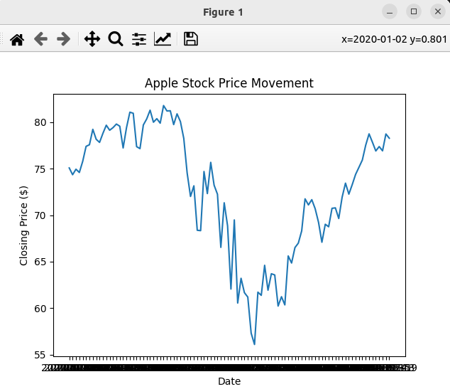

### Result
* Matplotlib animation
* Appple Stock price
* 2020 data

Result (end of annimation):

Video Result:

<video width="320" height="240" controls>
  <source src="apple_stock_price_movement.mp4" type="video/mp4">
</video>

** video does not render in github - look on vscode or the video is also 
commited in github: apple_stock_price_movement.mp4.