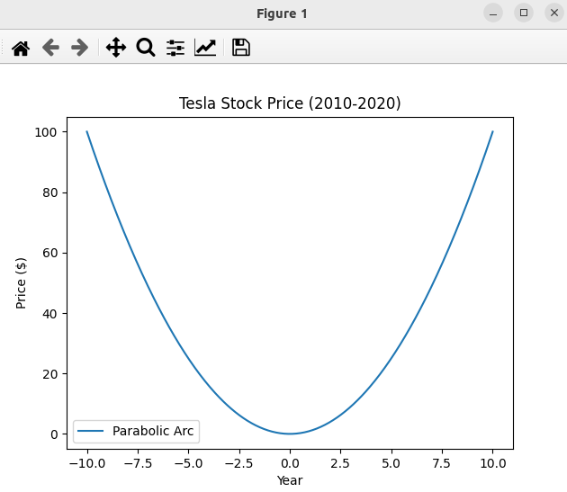
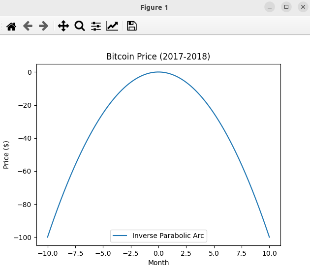
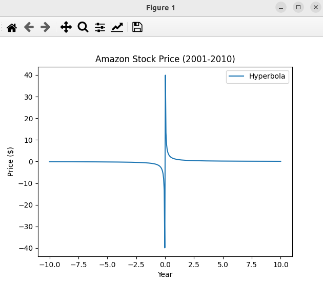
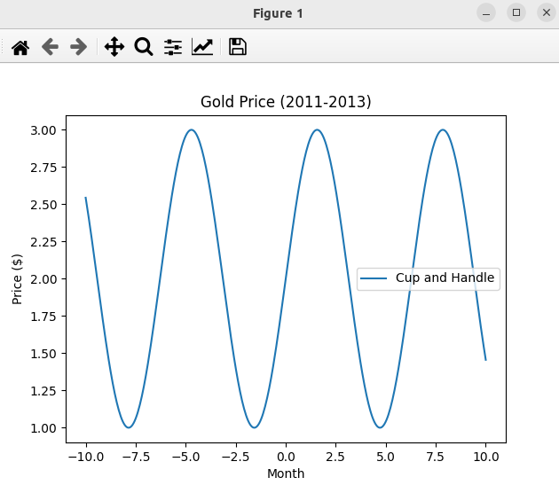
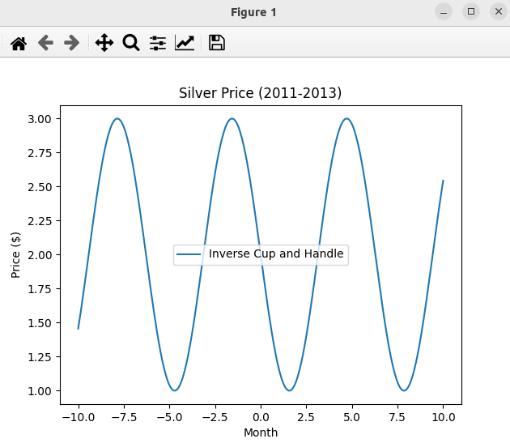
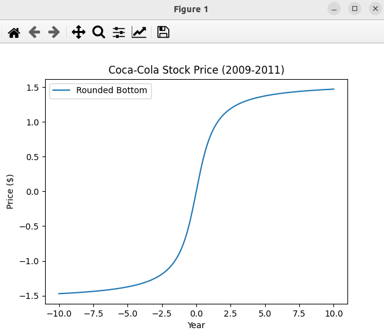
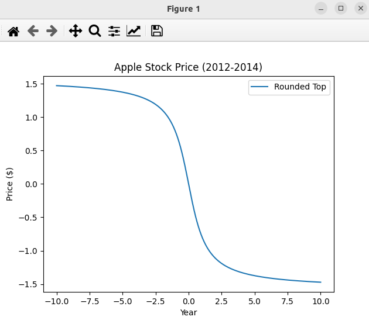
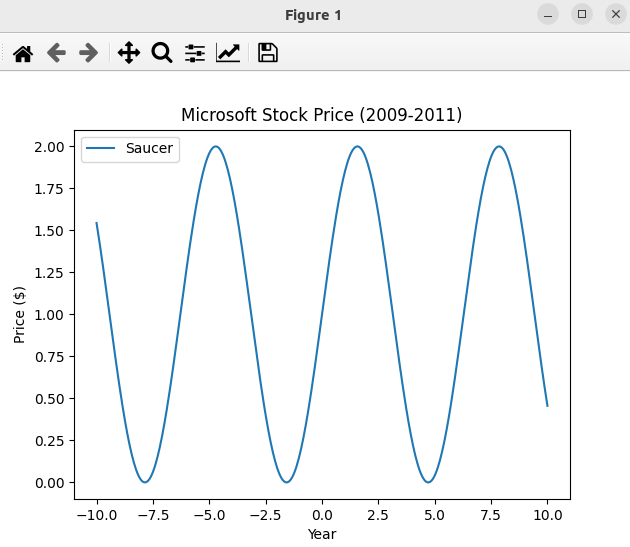
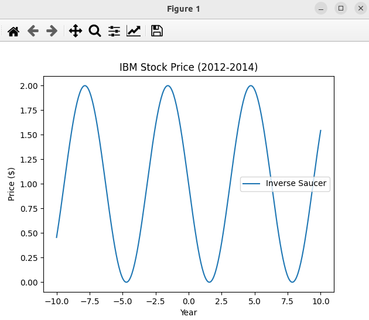
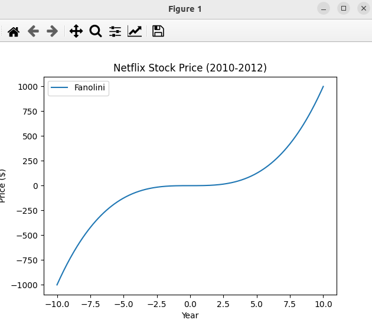

### Result
* matplotlib
* Chart Patterns

#### Chart Patterns - 1 - Parabolic Arc

Parabolic arc is a U-shaped, symmetrical curve that is formed by the intersection of a cone with a plane parallel to an element of the cone.

#### Chart Patterns - 2 - Inverse Parabolic Arc

Inverse parabolic arc is a U-shaped, symmetrical curve that is formed by the intersection of a cone with a plane parallel to an element of the cone.

#### Chart Patterns - 3 - Hyperbola

Hyperbola is a curve that is formed by the intersection of a cone with a plane parallel to an element of the cone.

#### Chart Patterns - 4 - Cup and Handle

Cup and handle is a bullish continuation pattern that is formed by a cup and a handle.

#### Chart Patterns - 5 - Inverse Cup and Handle

Inverse cup and handle is a bearish continuation pattern that is formed by an inverse cup and a handle.

#### Chart Patterns - 6 - Rounded Bottom

Rounded bottom is a bullish reversal pattern that is formed by a rounded bottom.

#### Chart Patterns - 7 - Rounded Top

Rounded top is a bearish reversal pattern that is formed by a rounded top.

#### Chart Patterns - 8 - Saucer

Saucer is a bullish reversal pattern that is formed by a saucer.

#### Chart Patterns - 9 - Inverse Saucer

Inverse saucer is a bearish reversal pattern that is formed by an inverse saucer.

#### Chart Patterns - 10 - Fanolini

Fanolini is a bullish reversal pattern that is formed by a fanolini.

