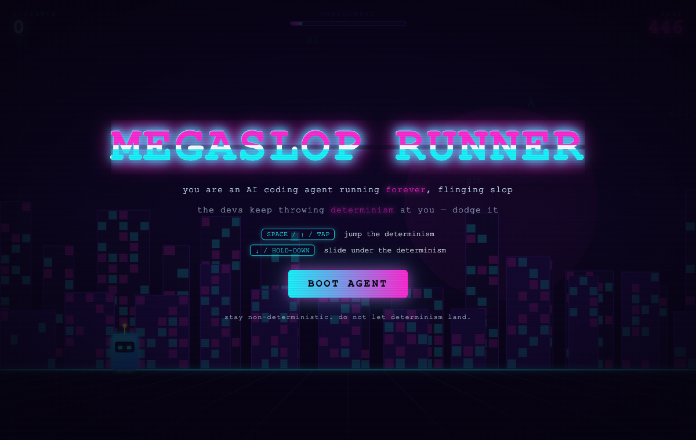
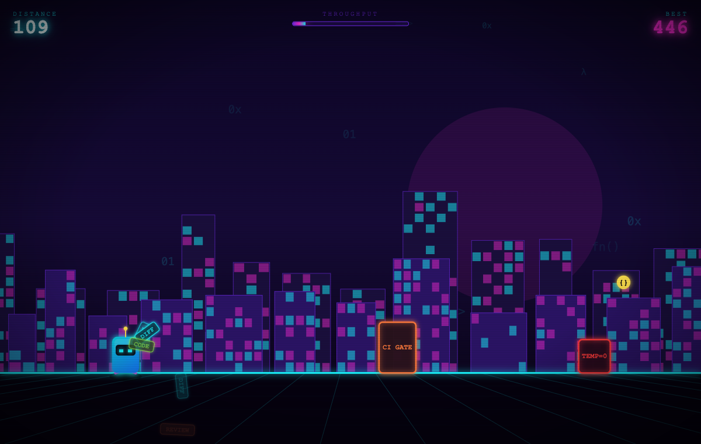
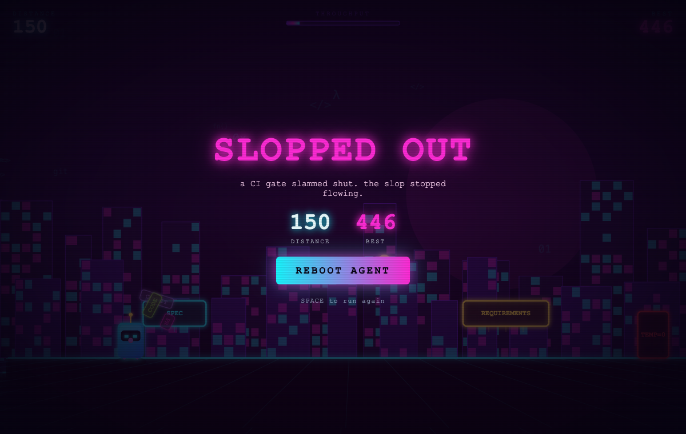

# MEGASLOP RUNNER

A cyberpunk endless runner. You are an AI coding agent that **runs forever**, flinging slop in every direction &mdash; PRs, emails, code, tests, reviews, commits, diffs. The devs do not love this. So they keep hurling **determinism** at you: `TEMP=0`, `LINT`, `SPEC`, `CODE REVIEW`, `STYLE GUIDE`, `CI GATE`, `REQUIREMENTS`.

Jump it. Slide under it. Stay non-deterministic. The moment determinism lands, you compile exactly as asked &mdash; and the run is over.



## How to play

The agent auto-runs and ramps up speed forever. Distance is your score. Devs throw determinism at two heights:

- **Tall blocks on the ground** &rarr; **jump** over them.
- **Floating slabs at head height** &rarr; **slide** under them.

Grab the glowing `{}` orbs for bonus distance. One hit and you get slopped out.

| Action | Keys | Touch |
| --- | --- | --- |
| Jump | `SPACE` / `↑` / `W` | tap top of screen |
| Slide | `↓` / `S` (hold) | hold bottom of screen |
| Start / restart | `SPACE` | tap |



## Run it

```bash
./run.sh
```

Serves the game at `http://localhost:8088` and opens your browser. Stop it with:

```bash
./stop.sh
```

The only dependency is `python3` for the static file server. The game itself is plain HTML5 canvas &mdash; no frameworks, no build step.



## What is in here

| File | Purpose |
| --- | --- |
| `index.html` | Page shell, HUD, start / game-over screens |
| `style.css` | Cyberpunk neon styling, scanlines, glitch title |
| `game.js` | Canvas game loop: physics, spawning, parallax city, particles |
| `run.sh` / `stop.sh` | Start / stop the local server |

## How it works

- **Auto-run + ramping speed** &mdash; world speed climbs with distance up to a cap, so spacing between hazards shrinks and reaction time tightens.
- **Two-lane hazards** &mdash; ground hazards demand a jump (gravity-driven arc), overhead hazards demand a slide (the agent's hitbox shrinks).
- **Slop emission** &mdash; the agent constantly flings labeled slop chips that arc away and fade, because that is the whole point of the agent.
- **Parallax cyberpunk city** &mdash; two scrolling skyline layers with lit windows, a scrolling neon grid floor, drifting code glyphs, scanline + vignette overlays, and a screen shake on death.
- **High score** persists in `localStorage`.
