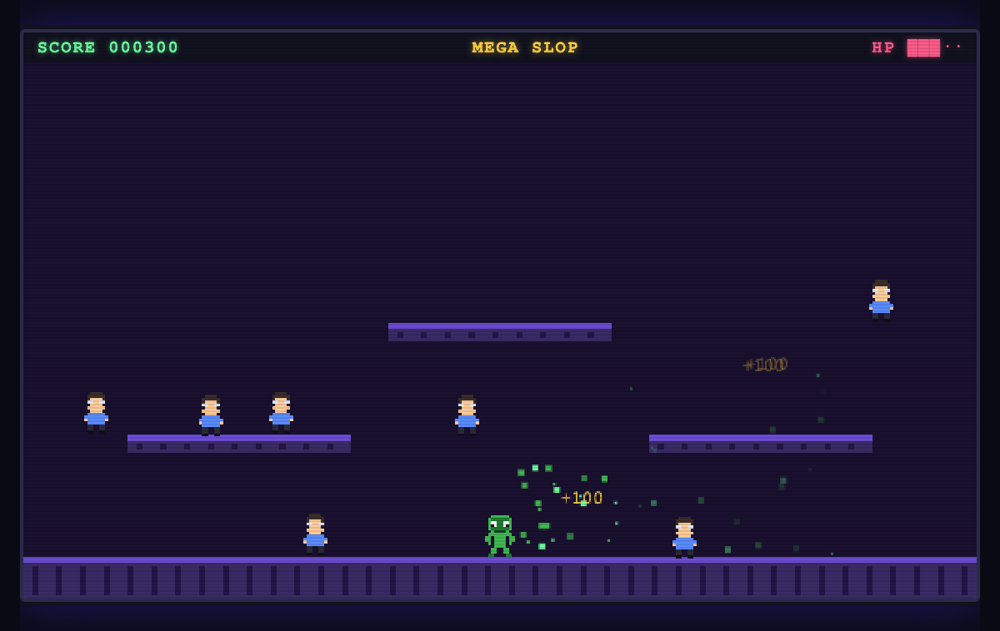

# MEGA SLOP

An 8-bit, CRT-flavored platform shooter. You are a green slop-bot, and your one job
is to sling **AI SLOP** at an endless parade of developers before they walk into you.

Pure vanilla **HTML + CSS + Canvas + JavaScript**. No libraries, no build step, no bundler.



## The Game

Devs march in from both sides of the screen, across the ground and three floating
platforms. Each blob of slop that lands turns a dev into a puddle of green goo and
banks you **+100**. Let one touch you and you lose a heart. Run out of hearts and it's
over. The longer you survive, the faster they come.

- **Jump** between the platforms to dodge and get firing angles.
- **Fire** slop in whichever way you're facing.
- **Score** climbs with every dev you slop; spawn rate ramps up over time.
- **HP** is the five-block bar in the top-right.

## Controls

| Key | Action |
| --- | --- |
| `←` `→` | Move left / right |
| `Z` | Jump |
| `X` | Fire slop |
| `Enter` | Start / restart |

## Run It

```bash
./run.sh
```

Serves the game on a local HTTP server and opens it at **http://localhost:8753**.

```bash
./stop.sh
```

Stops the server.

`run.sh` starts `python3 -m http.server` in the background, waits for it to answer,
records the PID in `.server.pid`, and opens your browser. `stop.sh` reads that PID and
kills it. The only requirement is Python 3.

## How It Works

Everything renders into a single `<canvas>` at a fixed **640×360** internal resolution,
then scales up to fill the page via CSS (`image-rendering: pixelated`) so the pixels stay
crisp and chunky no matter the screen size.

- **`index.html`** — markup, HUD (score / title / HP), and the start/game-over overlay.
- **`style.css`** — neon CRT frame, animated scanline overlay, and the responsive sizing
  that lets the playfield grow to the size of the window.
- **`game.js`** — the whole engine:
  - **Sprites** are drawn from text grids (the hero and the devs are literal ASCII pixel
    maps painted block-by-block with `fillRect`).
  - **Physics**: gravity, a single-jump, ground/platform landing via AABB checks.
  - **Slop**: projectiles fired from the muzzle with a slight downward drift and a
    wobbling goo trail.
  - **Devs**: spawn on a random surface from a random side, bob as they walk, and deal
    contact damage.
  - **Collisions**: slop-vs-dev (kill + particle burst + `+100` popup) and dev-vs-player
    (lose a heart, knockback, brief invulnerability blink).
  - **Game loop**: a single `requestAnimationFrame` driving `update()` and `draw()`.

## Files

```
megaslop/
├── index.html        markup + HUD + overlay
├── style.css         CRT styling + responsive scaling
├── game.js           game engine (no dependencies)
├── run.sh            start the local server
├── stop.sh           stop the local server
└── megaslop-play.png screenshot
```
