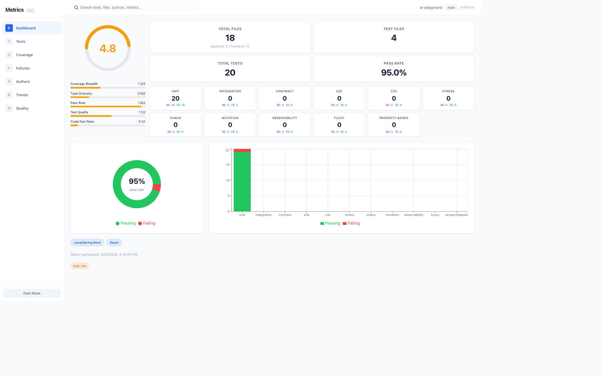
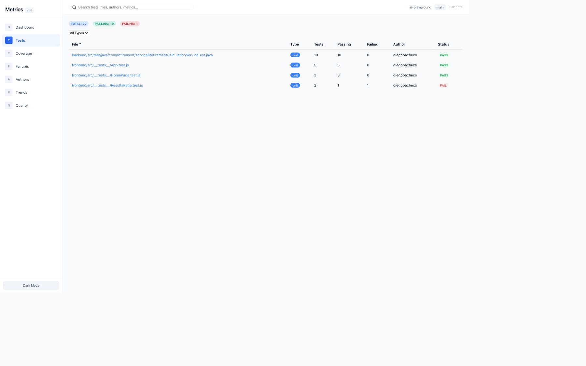
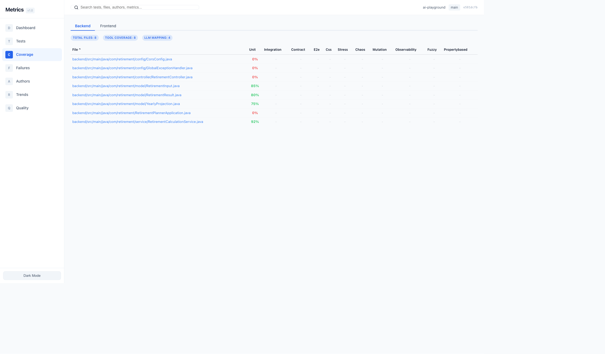
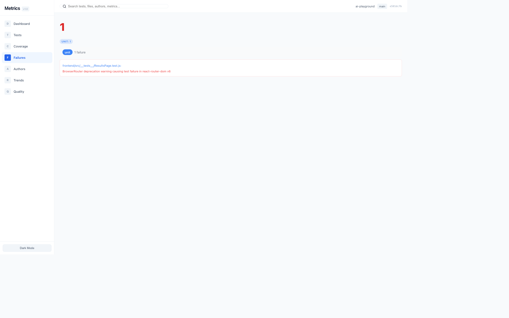
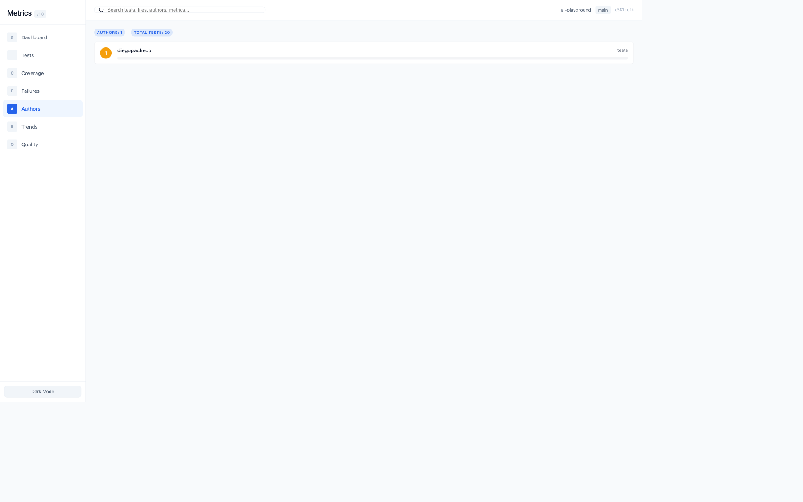
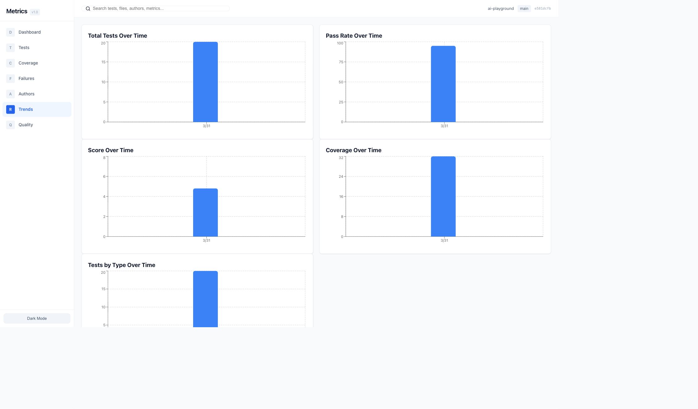
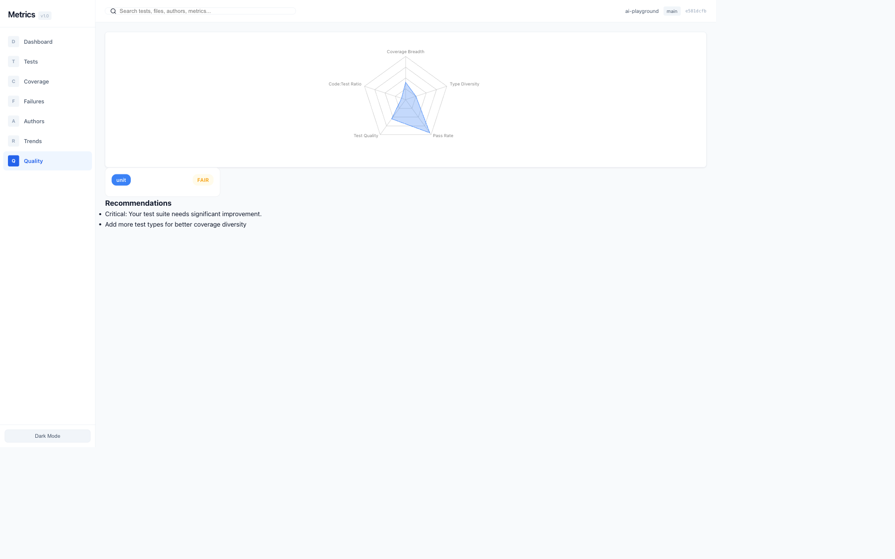

# Metrics Report Skill

A Claude Code skill that scans your entire codebase, discovers and runs all test types, computes hybrid coverage (tool-based + LLM-based mapping), evaluates quality, and generates a full metrics report website with trends and charts.

## What it does

The skill executes a 7-phase pipeline:

1. **Install** - Sets up the metrics-report application (React + TypeScript + Vite)
2. **Setup** - Reads configuration and prepares the scanning environment
3. **Scan** - Discovers all source and test files across the entire codebase
4. **Run Tests** - Executes all discovered tests (unit, integration, e2e, contract, stress, chaos, mutation, observability, CSS, fuzzy, property-based)
5. **Coverage Mapping** - Computes hybrid coverage using tool-based instrumentation and LLM-based source-to-test mapping
6. **Quality Evaluation** - Rates test quality per type with justifications and recommendations
7. **Score Computation** - Produces a 0-10 composite score based on coverage breadth, type diversity, pass rate, quality, and code-to-test ratio

After all phases complete, it auto-launches a metrics dashboard at `http://localhost:3737`.

## Supported Stacks

- Java / Spring Boot (Maven, Gradle)
- React / Node.js (Jest, Vitest)
- Python / Django (pytest)
- Rust (cargo test)

## Scoring Breakdown

| Dimension | Max Points |
|---|---|
| Coverage Breadth | 3 |
| Type Diversity | 2 |
| Pass Rate | 2 |
| Test Quality | 2 |
| Code-to-Test Ratio | 1 |
| **Total** | **10** |

## Dashboard Pages

The metrics dashboard is a 7-page React + TypeScript application with interactive charts, global search, dark/light theme toggle, and repository context (name, branch, commit).

### Dashboard

The main overview page. Shows the composite score gauge (0-10), total files, test files, total tests, pass rate, test counts broken down by type (unit, integration, contract, e2e, CSS, stress, chaos, mutation, observability, fuzzy, property-based), a pass/fail donut chart, a tests-by-type bar chart, detected stack badges, and the report generation timestamp.



### Tests

A sortable table of all discovered test files. Each row shows the file path, test type badge, test count, passing count, failing count, author (from git blame), and pass/fail status. Includes summary badges for total, passing, and failing counts, plus a type filter dropdown.



### Coverage

Split into Backend and Frontend tabs. Each tab displays a per-file coverage matrix showing which test types cover each source file. Columns include unit, integration, contract, e2e, CSS, stress, chaos, mutation, observability, fuzzy, and property-based. Backend coverage is parsed from real tool reports (JaCoCo CSV for Java/Scala, coverage.json for Python, tarpaulin for Rust) and shows actual per-file percentages with color coding (green for high, yellow for moderate, red for low). Files not covered show 0%. Summary badges show total files, tool coverage count, and LLM mapping count.



### Failures

Lists all failing tests grouped by test type. Each failure entry shows the test file path and the error message or stack trace. A large count indicator at the top gives immediate visibility into the number of failures, with per-type breakdown badges.



### Authors

A leaderboard of contributors ranked by test count (sourced from git blame). Shows each author with their total test contributions. Useful for understanding who owns which parts of the test suite.



### Trends

Historical trend charts that track metrics over time across multiple report snapshots. Includes 5 charts: Total Tests Over Time, Pass Rate Over Time, Score Over Time, Coverage Over Time, and Tests by Type Over Time. When multiple snapshots exist, the charts render as line/area charts showing progression. With a single snapshot, the charts switch to bar charts with value labels for clear readability instead of invisible dots.



### Quality

A radar chart showing the score breakdown across all 5 scoring dimensions (Coverage Breadth, Type Diversity, Pass Rate, Test Quality, Code-to-Test Ratio). Below the chart, per-test-type quality cards display a rating (poor/fair/good/excellent) with actionable recommendations for improving the test suite.



## How to Use

```
/metrics-report
```

Run this slash command in Claude Code inside any supported project. The skill will scan, test, score, and launch the dashboard automatically.

## Configuration

Edit `metrics-report/metrics-config.json` to control which test types are enabled:

```json
{
  "port": 3737,
  "testTypes": {
    "unit": true,
    "integration": true,
    "contract": true,
    "e2e": true,
    "css": false,
    "stress": false,
    "chaos": false,
    "mutation": false,
    "observability": true,
    "fuzzy": false,
    "propertybased": false
  }
}
```
