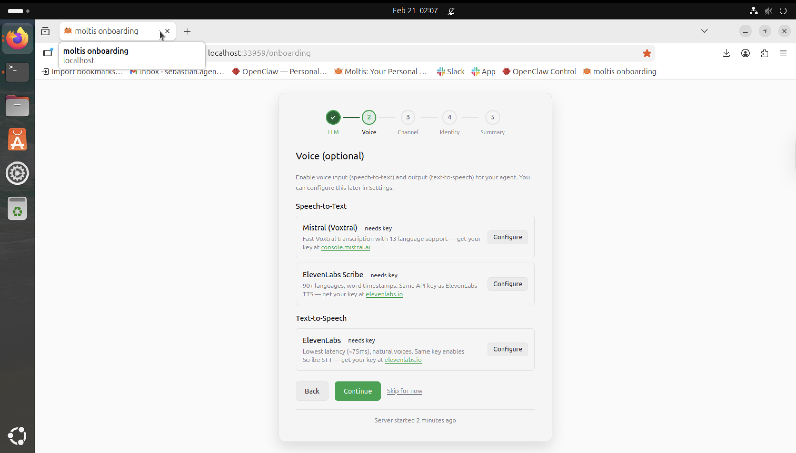
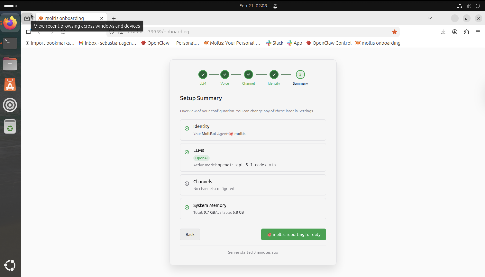
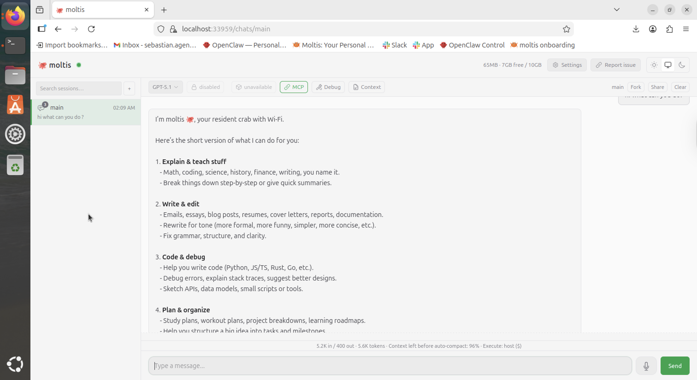

# Moltis

https://www.moltis.org/

## Experience Notes

* I had a separated VM with Ubuntu 24.03 LTS and created degicated email, and slack for complete isolateion and sandboxing.
* I Call the VM/OS Sebastian, I tought was necessary.
* Installation is very easy - was done in less than 1 min.
* UI It's simple and not complex.
* Only saw telegran (whish they had slack).
* Fast and Clean
* I like it

## Result

Motis Intalation  

Motis Summary  

Motis Chats  
