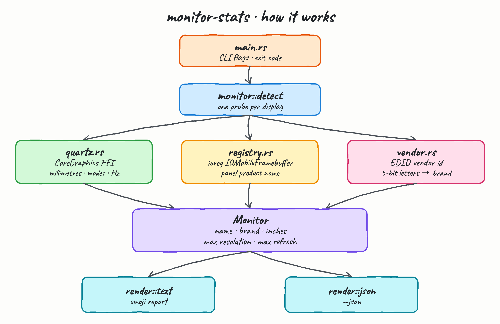
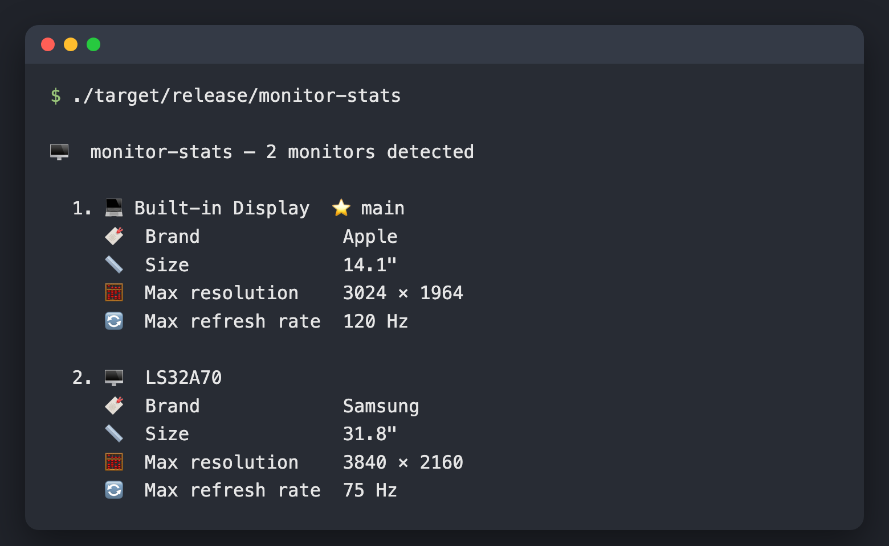
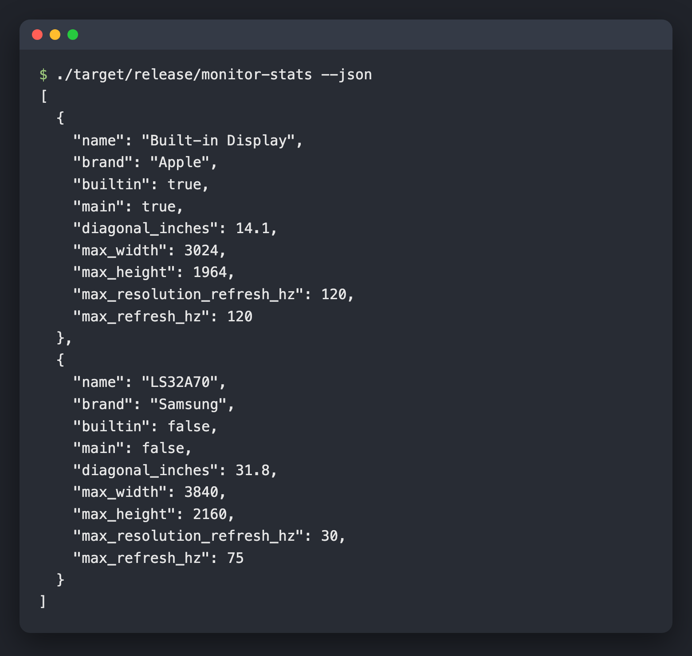
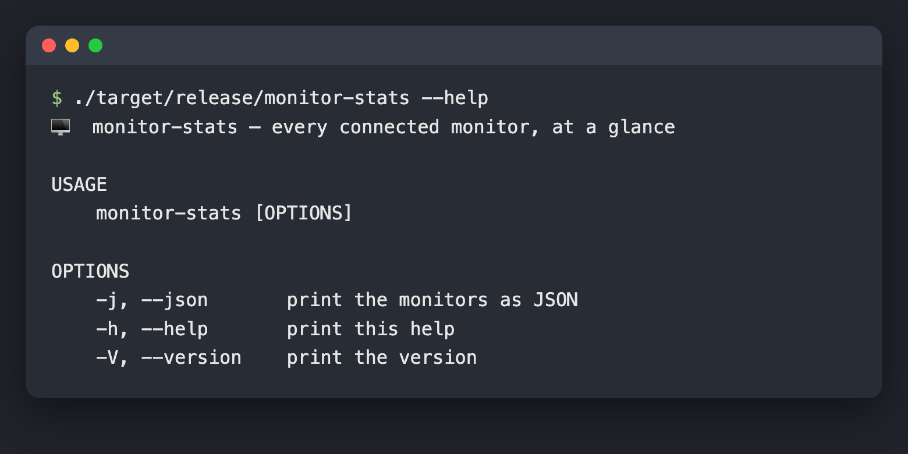

A macOS command line tool that finds every monitor attached to your machine and tells you, for each one:
its **name and brand**, its **physical size in inches**, its **maximum resolution** and its **maximum refresh rate**.

One binary, no runtime, no dependencies — it reads the hardware directly.

## How it Works?

`monitor-stats` never guesses and never scrapes a human readable report. It asks the operating system
three separate questions and joins the answers:

1. **CoreGraphics** (`quartz.rs`) lists the active displays and, per display, returns the panel size in
   millimetres and the full table of display modes. The diagonal in inches is `hypot(width_mm, height_mm) / 25.4`.
2. **Max resolution** is the mode with the most pixels; **max refresh rate** is the fastest mode of any
   resolution — those are usually two different modes, which is why they are reported separately.
3. **The IORegistry** (`registry.rs`) is read once via `ioreg` to recover the panel's marketing name
   (`LS32A70`), matched back to the display on its EDID vendor + product id.
4. **The EDID vendor id** (`vendor.rs`) is three letters packed 5 bits each into a 16 bit word.
   Unpacking `19501` gives `SAM`, which a small table turns into `Samsung`.

If a fact is genuinely unavailable the tool prints `unknown` rather than a plausible zero.

## Architecture



Data flows one way. `main.rs` parses flags, `monitor::detect` runs one probe per display, the three
source modules each answer one narrow question, and `render` turns the resulting `Monitor` values into
either the emoji report or JSON. Nothing calls back upwards, so every module below `detect` is a pure
function of its input and unit testable on its own.

## Features

- **Detects every attached monitor** — built-in and external, in one pass, with the main display marked.
- **Real physical size in inches** — measured from the panel's millimetre dimensions, not inferred from pixels.
- **True max resolution** — the highest pixel mode the panel supports, not the resolution currently set.
- **True max refresh rate** — the fastest mode across all resolutions, so a 4K/30 panel that also does 800x600/75 reports 75 Hz.
- **Real panel names** — reads the marketing name out of the IORegistry instead of showing a numeric display id.
- **Brand from the EDID vendor id** — decodes the packed manufacturer letters, so unknown panels still resolve to a code rather than "Unknown".
- **JSON output** — `--json` gives a machine readable version with `null` for anything the hardware did not report.
- **Zero dependencies** — the whole tool is std plus direct FFI, so there is no supply chain to audit.

## Stack

- **Rust 2024 edition, toolchain 1.94** — pinned in `rust-toolchain.toml` so every machine builds the same binary.
- **CoreGraphics (framework FFI)** — the only supported source for display geometry and mode tables on macOS.
- **CoreFoundation (framework FFI)** — needed to walk and release the `CFArray` of display modes.
- **`ioreg`** — the one fact CoreGraphics does not expose is the panel's product name; the IORegistry has it.
- **No crates** — every dependency would have been a wrapper over the two FFI calls this tool already makes.

## CLI Contract

There is no network API. The contract is the command line surface and the JSON document.

| Invocation | Behaviour | Exit code |
| --- | --- | --- |
| `monitor-stats` | emoji report on stdout | `0`, or `1` if no monitor was detected |
| `monitor-stats -j`, `--json` | JSON array on stdout | `0`, or `1` if no monitor was detected |
| `monitor-stats -h`, `--help` | usage on stdout | `0` |
| `monitor-stats -V`, `--version` | version on stdout | `0` |
| anything else | error and usage on stderr | `1` |

One JSON object per monitor:

```json
{
  "name": "LS32A70",
  "brand": "Samsung",
  "builtin": false,
  "main": false,
  "diagonal_inches": 31.8,
  "max_width": 3840,
  "max_height": 2160,
  "max_resolution_refresh_hz": 30,
  "max_refresh_hz": 75
}
```

`diagonal_inches`, `max_width`, `max_height`, `max_resolution_refresh_hz` and `max_refresh_hz` are `null`
when the display does not report them. `max_resolution_refresh_hz` is the refresh rate *at* the maximum
resolution; `max_refresh_hz` is the panel's overall maximum.

## Key Data Structures and Design Decisions

```rust
struct Monitor {
    name: String,
    brand: String,
    builtin: bool,
    main: bool,
    diagonal_inches: f64,
    max_resolution: Option<Resolution>,
    max_refresh_hz: Option<f64>,
}
```

- **`Option` over sentinel values.** A display with no readable modes yields `None`, which renders as
  `unknown` and serialises as `null`. A `0` would have been silently wrong.
- **The FFI layer returns owned data.** `quartz.rs` copies every `CFArray` into a `Vec<DisplayMode>` and
  calls `CFRelease` immediately, so no Core Foundation pointer ever escapes the module and there is
  nothing to leak or dangle later.
- **`ioreg` is read once, not once per display.** The dump is parsed into a small table and displays are
  matched against it by `(vendor, model)`, which keeps the process spawn off the per-display path.
- **Two different maxima.** Reporting only "max resolution and its refresh rate" would have claimed the
  Samsung panel maxes out at 30 Hz. Resolution and refresh are computed independently on purpose.
- **Brand degrades gracefully.** Known PNP id gives `Samsung`, unknown but valid gives `SAM`, undecodable
  gives `Unknown` — three distinct outcomes rather than one catch-all.
- **macOS only, loudly.** A `compile_error!` on other targets beats a binary that builds and reports nothing.

## How to Run

```bash
./build.sh       # fmt check, clippy with -D warnings, release build
./test.sh        # unit + integration tests
./install.sh     # build and copy the binary to ~/.local/bin
./uninstall.sh   # remove it again
```

`install.sh` and `uninstall.sh` honour `INSTALL_DIR` if you want a different location:

```bash
INSTALL_DIR=/usr/local/bin ./install.sh
```

Then:

```bash
monitor-stats
monitor-stats --json | jq '.[] | select(.builtin == false)'
```

To run it without installing:

```bash
cargo run --release
```

### Tests

29 tests, no mocks of the hardware — the pure logic is unit tested with the exact values real panels
produce, and the integration tests run the built binary against the machine's actual displays.

```
running 24 tests
test result: ok. 24 passed; 0 failed; 0 ignored; 0 measured; 0 filtered out

running 5 tests
test result: ok. 5 passed; 0 failed; 0 ignored; 0 measured; 0 filtered out
```

## Printscreens

### The report



The default output. Two monitors were found on this machine. The first is the built-in panel — marked
with 💻 and ⭐ because it is the main display — correctly identified as a 14.1" Apple panel running up
to 3024 × 1964 at 120 Hz. The second is an external Samsung, named `LS32A70` straight from its EDID,
measured at 31.8", topping out at 3840 × 2160. Note its max refresh rate reads **75 Hz** even though its
maximum resolution only runs at 30 Hz: the two numbers come from two different modes, exactly as the
panel reports them.

### JSON output



`--json` emits the same data as a plain array, one object per monitor, for piping into `jq` or a script.
The Samsung entry makes the split explicit: `max_resolution_refresh_hz` is `30` (the rate at 4K) while
`max_refresh_hz` is `75` (the panel's fastest mode at any resolution).

### Help



The full command line surface — four flags, no configuration files, no subcommands.
