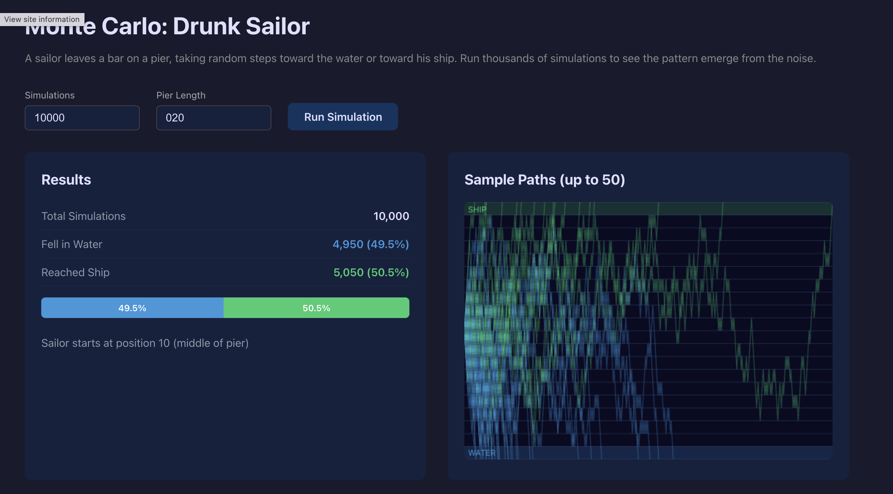

# Monte Carlo Simulation - Drunk Sailor

A Monte Carlo simulation of the classic drunk sailor problem. A sailor leaves a bar on a pier, taking random steps toward the water or toward his ship. Each individual run is random, but running thousands of simulations reveals the true probabilities.



* Backend: Rust + Actix Web + Tokio
* Frontend: React + TypeScript + TanStack React Query + Vite + Bun

## How it works

* The sailor starts at the middle of the pier
* Each step is random: +1 (toward ship) or -1 (toward water)
* Position 0 = fell in water, position >= pier_length = reached ship
* The backend runs N simulations and returns aggregate stats + sample paths
* The frontend visualizes the results with a canvas path chart and statistics

## Requirements

* Rust 1.93+
* Bun

## Run

```bash
./run.sh
```

* Backend: http://localhost:8080
* Frontend: http://localhost:5173

## API

**POST /simulate**

```json
{
  "num_simulations": 1000,
  "pier_length": 20
}
```

Returns simulation results with stats and up to 50 sample paths.
