<p align="center"></p>

# Movies Map

Movies Map is a macOS desktop app (Electron) that plots movies and TV shows filmed in San Francisco on a map, using their posters as the markers. Type an address to see what was shot near it. Click a poster to see the year, actors, genres, description, credits and every SF location the title used.

## How it Works

1. `tools/build-data.mjs` runs once during setup. It downloads the official DataSF *Film Locations in San Francisco* dataset, which already includes latitude and longitude for each shoot.
2. It groups the rows into titles (299 titles, 2,121 locations). For each title it searches Wikipedia, checks the Wikidata entity (a film or series released within about 2 years), and keeps the poster, the plot summary, the genres and the extra cast.
3. The result is written to `data/movies.json`, so the app never calls those services at runtime.
4. When the Electron app starts, it shows a boot screen and runs `scripts/start-all.sh`. That script starts a small Node API with no framework.
5. The UI loads the movies from the API and groups nearby posters on a pixel grid. It redraws on every pan or zoom.
6. Typing an address calls `/api/geocode`, which asks Nominatim with a San Francisco bounding box first, then California. The UI then calls `/api/nearby`, which returns the titles within the chosen radius, closest first.
7. When you quit, the app runs `scripts/stop-all.sh`.

## Architecture

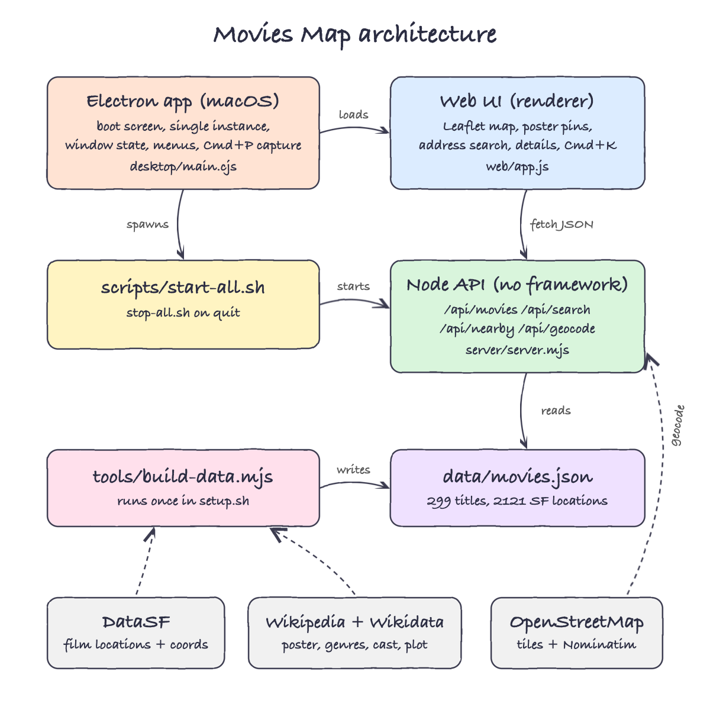

## Features

* **Poster markers on a map**: each pin is the movie's poster, so you can tell what was filmed where at a glance.
* **Poster clusters with a count**: dense areas like the Golden Gate Bridge stay readable. Clicking a cluster zooms in, and at street level it lists every title shot there.
* **Address search**: type any SF or California address. The search is bounded to San Francisco first, then California, so "Lombard Street" means the one in SF.
* **Radius filter (500 m to 5 km)**: controls how far from the address the list reaches.
* **Movie details**: poster, year, genres, actors, description, director, writer, studio, distributor, all SF locations with fun facts, and a Wikipedia link.
* **Filters: type, genre and decade**: a bar shared by both tabs filters the map pins, the sidebar list, address-search results and the poster grid. Choose Movies (249) or TV shows (50), one of 17 broad genres, or a decade. The counts update as you combine filters, so a choice never leads to an empty map.
* **Focus on one movie**: clicking a movie anywhere (the grid, the list, a poster pin, or Cmd+K) opens the map with only that movie's locations. Clicking the empty map, pressing Esc, closing the details panel or clicking **Show all** brings every movie back.
* **Location jump**: click a location in the details panel to fly the map to that exact spot.
* **Movies tab**: a poster grid of all 299 titles, filtered by title, actor, director, genre or decade.
* **Cmd+K search**: finds movies, actors, genres, places, or runs an address lookup, all from the keyboard.
* **Cmd+/ shortcuts**: a searchable modal with color-coded groups.
* **Boot screen**: shows Node.js, movie data, API and map tiles coming up, so a failure is visible and not just a blank window.
* **One instance, one install**: a second launch focuses the running window, and `install.sh` always uninstalls first.
* **Remembers the window**: position, size, maximized and full-screen state are restored on the next launch.

## Stack

* **Electron**: macOS app shell with menus, a single-instance lock, window-state persistence and page capture.
* **Node.js 24 `http` module**: the API needs 5 routes, so there is no framework.
* **Leaflet**: a small, dependency-free map library with custom `divIcon` poster markers.
* **OpenStreetMap tiles + Nominatim**: map tiles and geocoding with no API key.
* **DataSF Film Locations**: the official city dataset, with coordinates included.
* **Wikipedia + Wikidata APIs**: posters, plots, genres and cast with no API key.
* **node:test**: the built-in test runner, so no test library is needed.

## API

Base URL: `http://localhost:4545`

| Method | Path | Returns |
|---|---|---|
| GET | `/api/health` | `{status, movies, locations, posters}` |
| GET | `/api/movies` | every title with its locations |
| GET | `/api/movies/:id` | one title, or 404 |
| GET | `/api/search?q=` | titles ranked: exact title, title prefix, title contains, actor, director, genre, year, location |
| GET | `/api/nearby?lat=&lng=&km=` | `[{id, title, year, poster, location, distanceKm}]`, closest first, one row per title; 400 without lat/lng |
| GET | `/api/geocode?q=` | `[{label, lat, lng}]` searching San Francisco first, then California; 400 without q |

A movie in `data/movies.json`:

```json
{
  "id": "vertigo-1958",
  "title": "Vertigo",
  "year": 1958,
  "director": "Alfred Hitchcock",
  "writer": "Alec Coppel",
  "actors": ["James Stewart", "Kim Novak", "Barbara Bel Geddes"],
  "type": "movie",
  "genres": ["mystery film", "thriller film"],
  "categories": ["Drama", "Thriller", "Mystery", "Romance"],
  "description": "Vertigo is a 1958 American psychological thriller film...",
  "poster": "https://upload.wikimedia.org/...",
  "locations": [{ "name": "California Palace of the Legion of Honor (34th Avenue & Clement, Lincoln Park)", "lat": 37.7844661, "lng": -122.5008419, "neighborhood": "Lincoln Park", "funFact": "Built in 1924, the Legion of Honor is a 3/4 replica of the Parisian Palais de la Legion d'Honneur." }]
}
```

## Key design decisions

* **Build the data once, not per request**: enriching 299 titles takes minutes and Wikipedia rate-limits (HTTP 429). The build honors `Retry-After` and caches every match in `data/wiki-cache.json`, so a rerun only retries what failed.
* **Strict matching over coverage**: a Wikidata candidate must be described as a film or series and released within about 2 years. That rejects the 1954 novel behind *Vertigo* and same-name remakes. A title with no safe match gets a colored title card instead of a wrong poster.
* **Movie or TV show**: a title is a TV show if it names a season, episode or pilot, if its Wikidata genre says "television", or if the first sentence of its Wikipedia summary calls it a series, sitcom or miniseries. "Film" appearing earlier in that sentence wins, so *Star Trek II* (a film based on a TV series) stays a movie.
* **Broad genres**: Wikidata has 100+ fine-grained labels ("psychological thriller film", "buddy cop film"). `broadGenres` maps them with keyword rules to 17 genres people can pick from (Drama, Comedy, Action, Thriller, Crime, Science Fiction, and others). The original labels are kept in `genres`.
* **TV episodes resolve to the show**: rows like `Chance - Season 1 ep105` are searched as `Chance`, which raised poster coverage from 235 to 265 titles.
* **Same title and different year are different movies**: *The Parent Trap* 1961 and 1998 stay separate.
* **Clustering by screen pixels**: markers are grouped by 110 px cells at the current zoom, so there is no clustering library and no overlapping posters.
* **The installed app points at the repo**: `install.sh` writes `config.json` with the project root and the Node path. The app then uses the same `scripts/` and data you run by hand.
* **Cmd+0 resets zoom**: the tabs use Cmd+1 and Cmd+2. Cmd+0 keeps the standard macOS "actual size" meaning instead of selecting a tab.

## How to run

```bash
./scripts/setup.sh
./scripts/install.sh
open -a "Movies Map"
```

Run it in a browser without installing:

```bash
./scripts/start-all.sh
./scripts/ui.sh
```

Run the tests: 32 tests covering data grouping, Wikidata matching, movie/TV classification, broad genres, the filters, distance and nearby, search ranking, geocode bounds, the shortcut filter, and the live API over the real dataset (including no-cache static files).

```bash
./scripts/test-all.sh
```

Remove the app:

```bash
./scripts/uninstall.sh
```

## Printscreens

### Boot screen
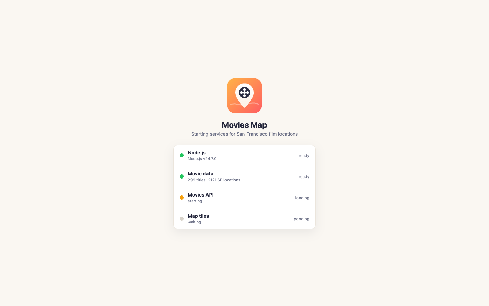
The app starts every service it needs and shows each step: Node.js, the movie data, the API and the map tiles.

### Map
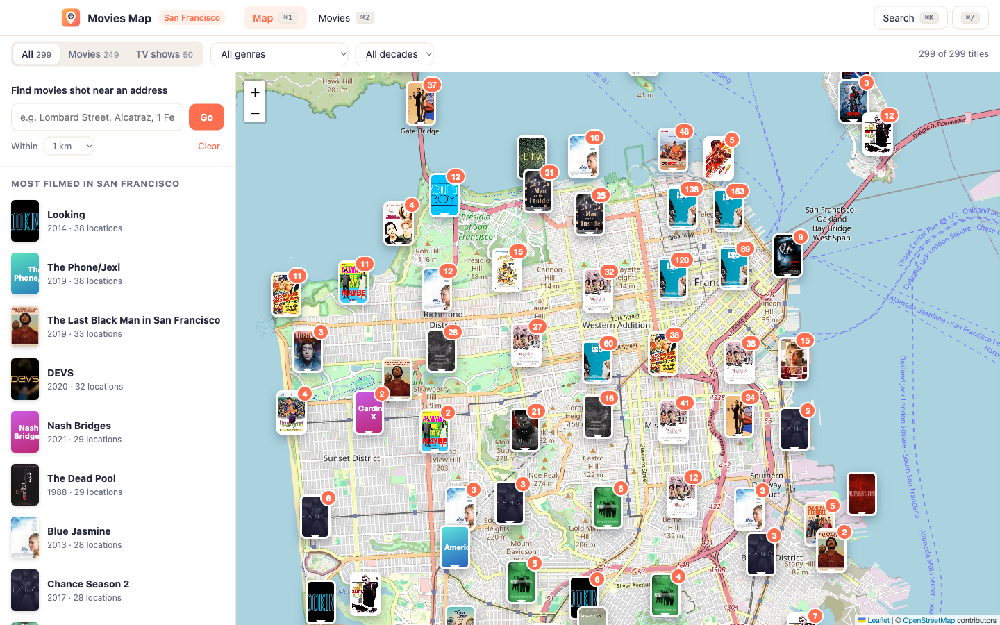
San Francisco with a poster pin for every filming spot. The orange badge is how many titles share that cluster. The sidebar lists the titles with the most SF locations.

### Address search
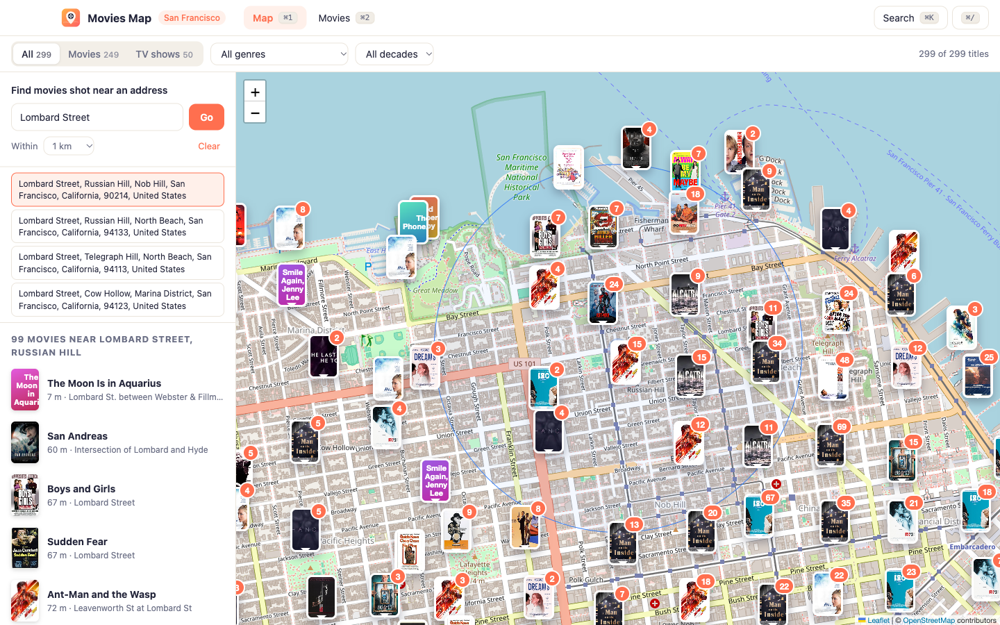
After searching "Lombard Street", the matching SF streets are listed and the first one is selected. A blue circle shows the 1 km radius, and the sidebar lists 99 titles shot inside it, closest first, with the distance and the exact location.

### Movie details
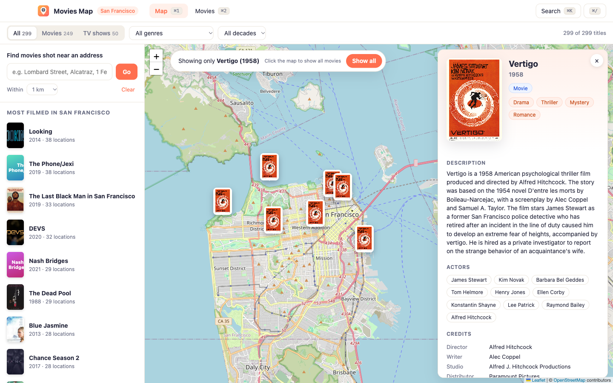
Clicking a poster opens the details panel: *Vertigo* (1958) with its genres, Wikipedia description, cast, credits and, below them, every SF location it used.

### Focus on one movie
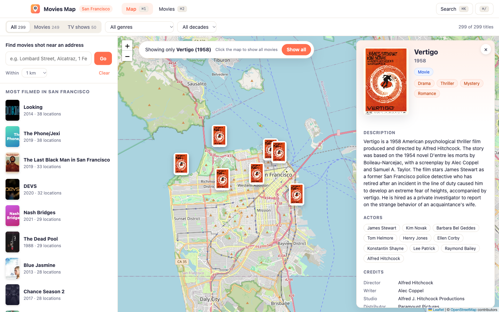
Clicking *Vertigo* in the Movies tab switches to the map and shows only its SF filming locations. The banner says what is shown; clicking the map or **Show all** restores every movie.

### Filter: TV shows + Drama
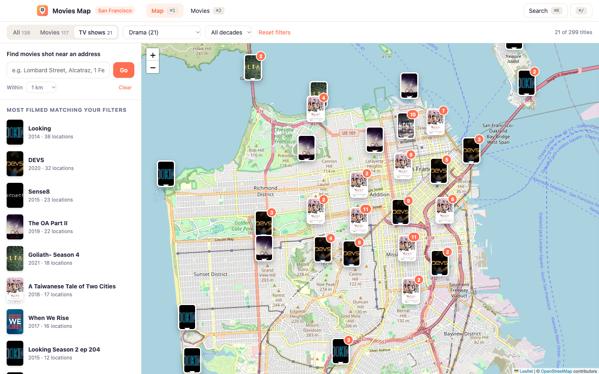
Choosing TV shows and Drama leaves 21 titles, such as *Looking*, *DEVS*, *Sense8* and *The OA*. The map, the sidebar and the counts all follow the filter.

### Filter: Movies + Thriller + 1970s
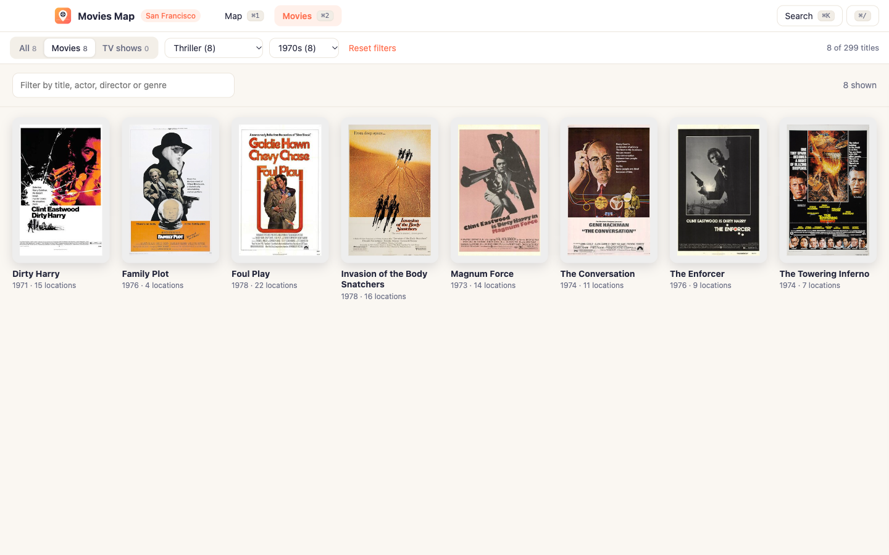
The same bar on the Movies tab: 1970s thriller movies shot in SF, including *Dirty Harry*, *The Conversation* and *Invasion of the Body Snatchers*. **Reset filters** clears all three.

### Movies tab
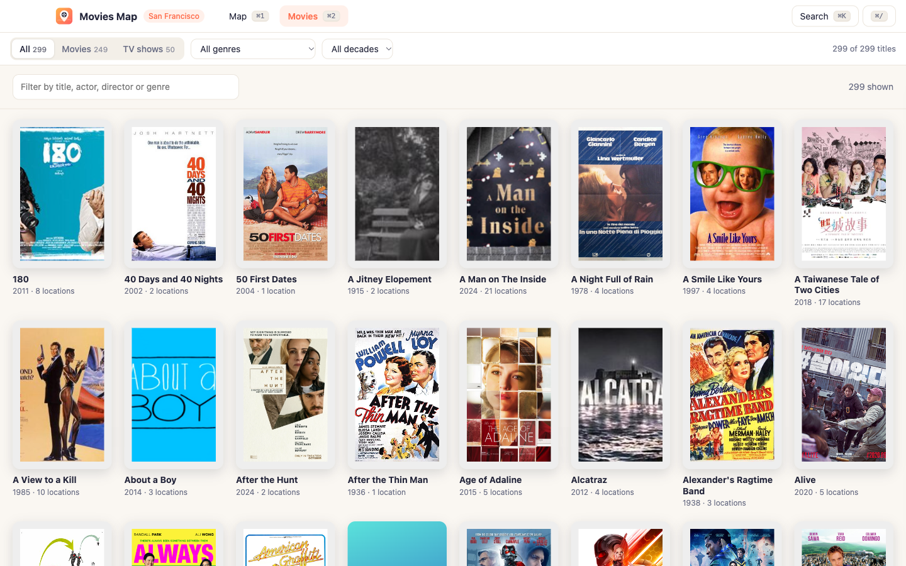
All 299 titles as a poster grid with a text filter and a decade filter.

### From the grid to the map
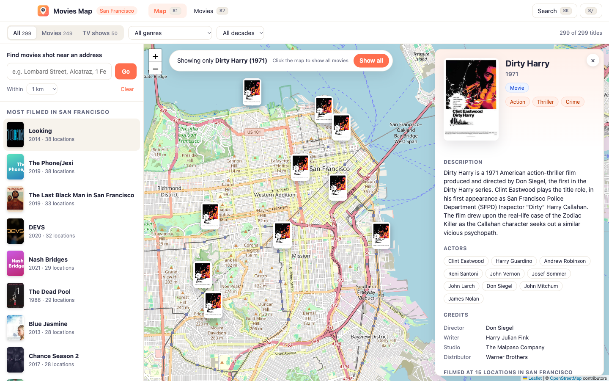
After typing "Clint Eastwood" in the Movies tab, clicking *Dirty Harry* jumps to the map with only its 15 SF locations. The details panel shows it is a Movie, with Action, Thriller and Crime.

### Cmd+K search
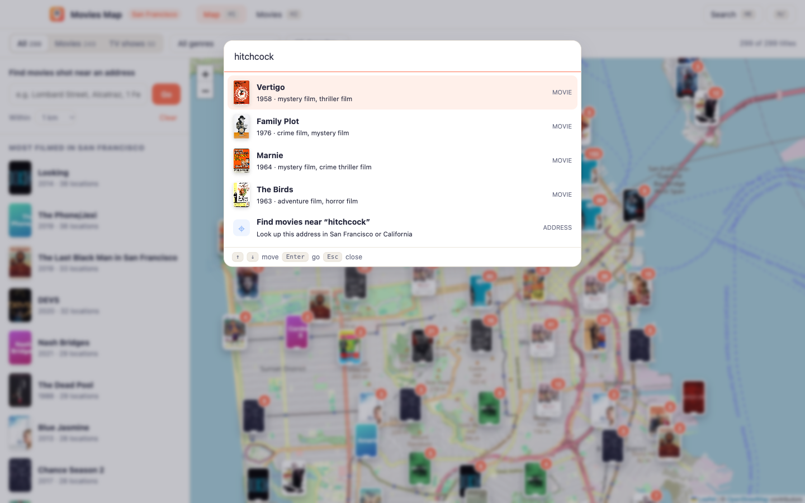
Searching "hitchcock" finds his SF movies by director. The last row runs the text as an address lookup.

### Cmd+/ shortcuts
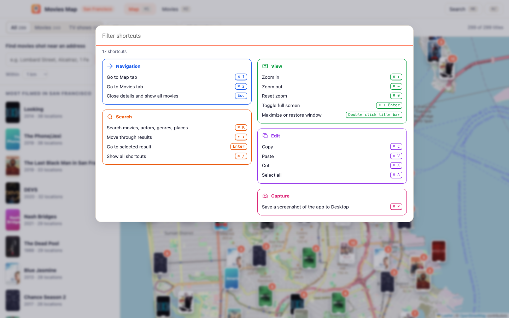
Every shortcut, grouped by area with its own color and icon. The box on top filters as you type.

## Scripts

All scripts live in `scripts/` and run from any directory of the repository.

| Script | What it does |
|---|---|
| `./scripts/setup.sh` | Installs dependencies and builds `data/movies.json` when missing |
| `./scripts/start-all.sh` | Starts the API and prints the full link of each service |
| `./scripts/status.sh` | Shows every service port as UP or DOWN |
| `./scripts/test-all.sh` | Runs every test suite |
| `./scripts/ui.sh` | Opens the UI in the browser |
| `./scripts/stop-all.sh` | Stops every service |
| `./scripts/install.sh` | Uninstalls any previous version, then installs `Movies Map.app` into `/Applications` |
| `./scripts/uninstall.sh` | Quits and removes `Movies Map.app` |

Ports are declared in `scripts/ports.env` (`api=4545`).

```bash
./scripts/setup.sh
./scripts/start-all.sh
./scripts/status.sh
./scripts/ui.sh
./scripts/stop-all.sh
```
