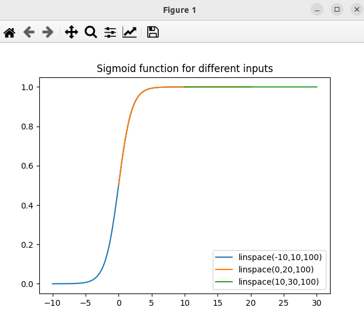
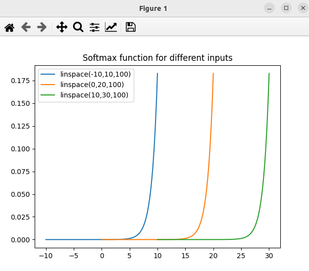

#### Sigmoid

* The sigmoid function will always produce an "S" shaped curve
* and the curves will overlap when plotted over the same range. 
* However, you can shift the curves along the x-axis to avoid overlap.
* Sigmoid functions are used in neural networks to introduce non-linearity in the model. Makes the values between 0 and 1.
* The sigmoid function is defined as:
    * f(x) = 1 / (1 + e^(-x))

```
/bin/python src/sigmoid.py
```


#### Softmax

* Softmax is a generalization of the logistic function that "squashes" a K-dimensional vector of arbitrary real values to a K-dimensional vector of real values in the range (0, 1) that add up to 1.
* Softmax is often used in neural networks, to map the non-normalized output of a network to a probability distribution over predicted output classes.
* The softmax function is defined as:
    * f(x)_i = e^(x_i) / sum(e^(x_j)) for j = 1 to K

```
/bin/python src/softmax.py
```
