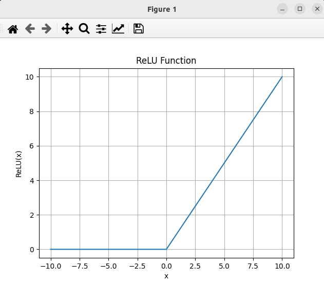

### Result
* ReLU
* ReLU means Rectified Linear Unit
* Activation function commonly used in neural networks and deep learning models
* The function returns 0 if it receives any negative input, but for any positive value x it returns that value back
```
f(x) = max(0, x).
```



