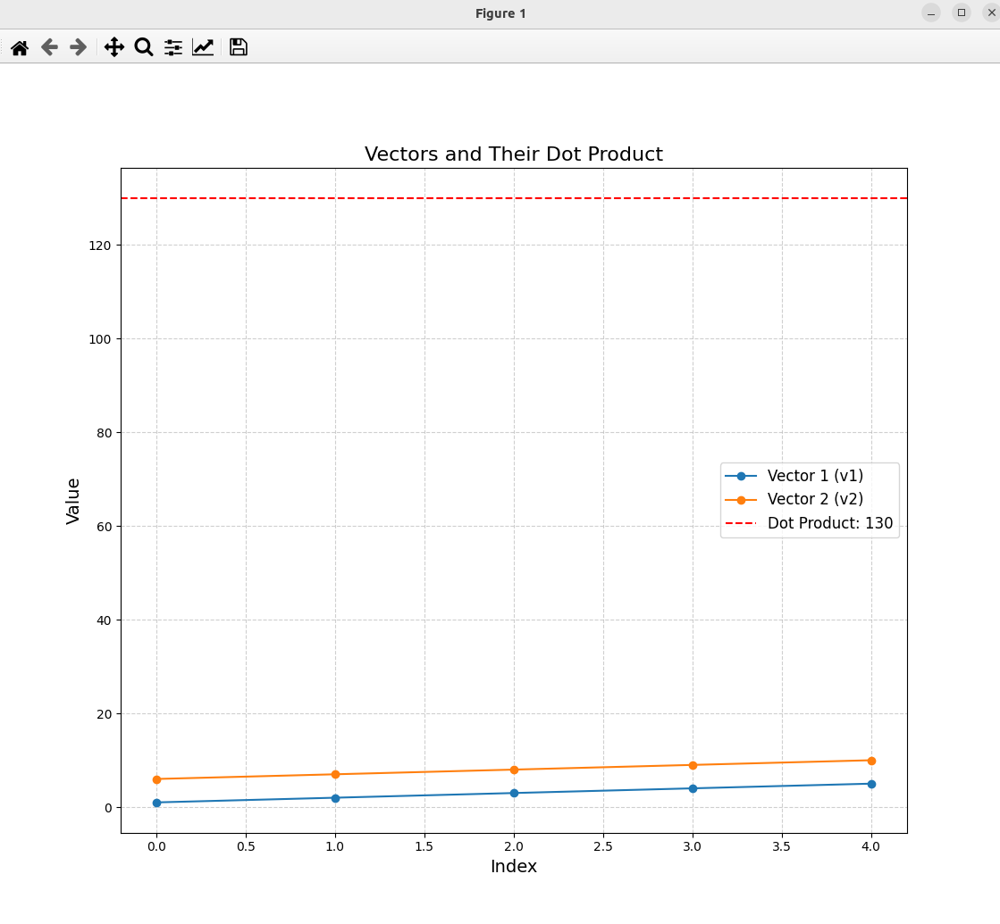

### Result
* Numpy
* Dot Product
* The dot product is a scalar value that is calculated by multiplying two vectors and adding up the result
* It is calculated as the sum of the products of the corresponding entries of the two sequences of numbers.
* Dot Product is used for:
  * Calculating similarity: KNN and PCA
  * Weighted sum: Neural networks
  * Matrix multiplication: common operation in ML
  * Projection: SVMs

