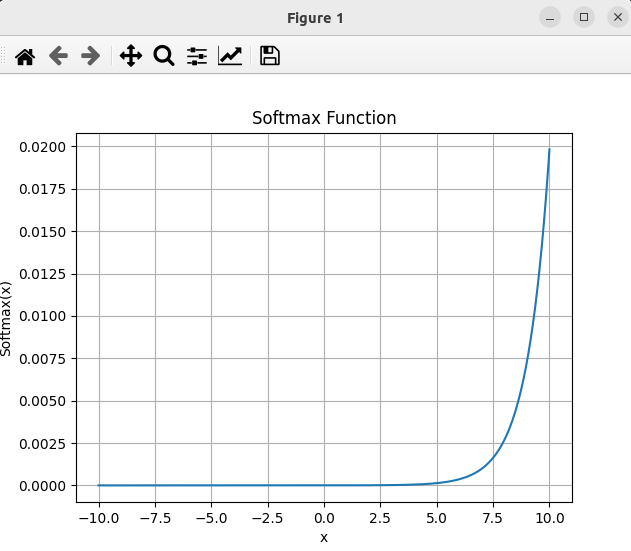

### Result
* Numpy
* Softmax
* Softmax is a function that provides probabilities for each possible outcome
* The softmax function, also known as normalized exponential function, is a function that takes as input a vector of K real numbers, and normalizes it into a probability distribution consisting of K probabilities.
* The softmax function is often used in the final layer of a neural network-based classifier.
* Such networks are commonly trained under a log loss (or cross-entropy) regime
```
softmax(x)_i = exp(x_i) / Σ_j exp(x_j)
```
* The softmax function is used in various multiclass classification methods
* Multiclass linear discriminant analysis, naive Bayes classifiers, and artificial neural networks
* Logistic regression and neural networks
* Softmax function is often used in the output layer to represent a probability distribution over K different possible outcomes



