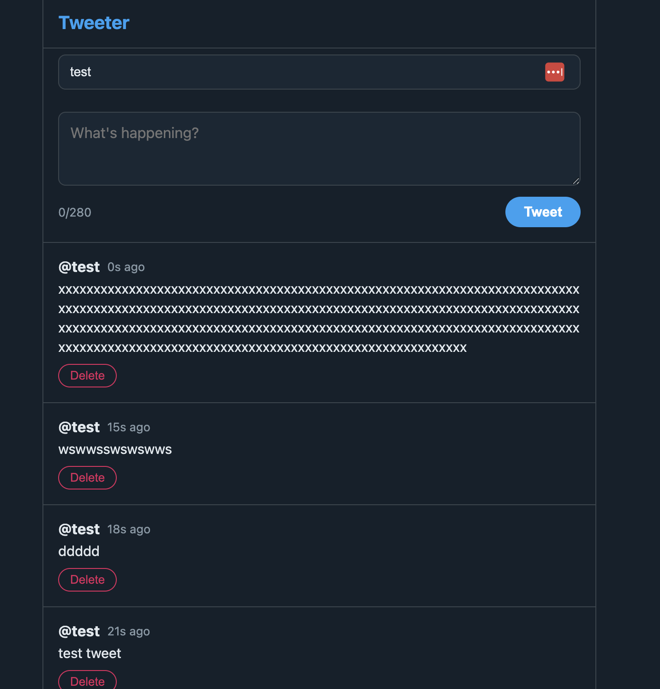

# Oh My Claude Code

https://github.com/Yeachan-Heo/oh-my-claudecode

## Install

```
/plugin marketplace add https://github.com/Yeachan-Heo/oh-my-claudecode
/plugin install oh-my-claudecode
/oh-my-claudecode:omc-setup
```

## Result

```
❯ /oh-my-claudecode:autopilot Build a tiwitter like app. make sure frontend is tanstack, backend is rust edition: 2024, version:
1.93+ and there is a run.sh and stop.sh
```



## Experience Notes

* It worked with once shot BUT...
* The UI was kind of okay
* the backend was all in one file and not well structured
* The result application had just 1 UI, had no profile, no login, no follow, just posting tweets and timeline...