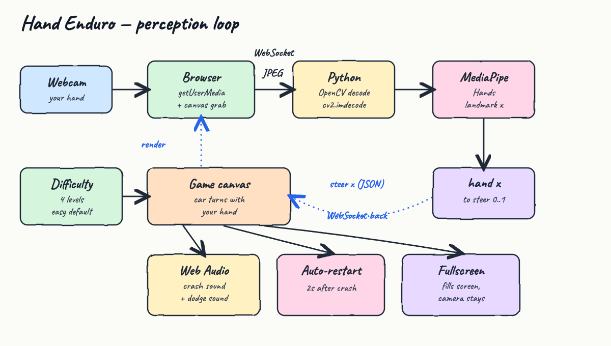
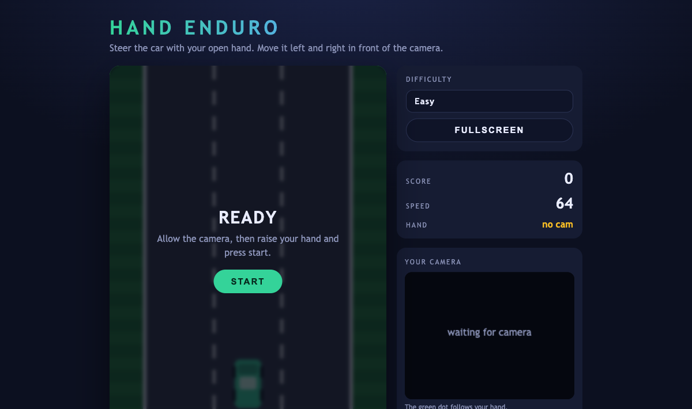
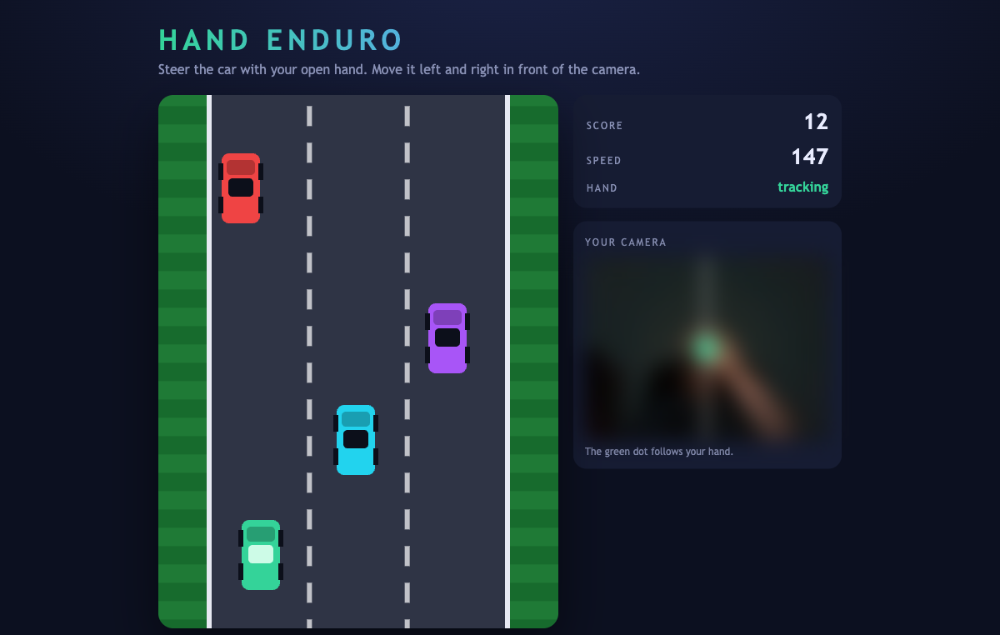

# Hand Enduro

A tiny browser racing game in the spirit of Atari's *Enduro* — but there is no keyboard.
Your **webcam** is the controller: hold up an open hand and slide it left and right to steer the car.

The webcam lives in the browser, and **Python + OpenCV + MediaPipe** is the perception brain.
This is the "vision-reactive" idea made concrete: live frames are turned into an action (steering),
in a fast loop.

## How perception drives the car



1. The browser grabs the webcam with `getUserMedia` and draws each frame to a small hidden canvas.
2. That frame is JPEG-encoded and pushed to Python over a **WebSocket**.
3. Python decodes it with **OpenCV** (`cv2.imdecode`) and runs **MediaPipe Hands** (the Tasks `HandLandmarker`).
4. The palm landmark's horizontal position becomes a single number — `steer` in `0..1` — and is sent back as JSON.
5. The game canvas smooths that number into the car's position. Hand right → car right.

The forward path (black, solid) is the capture pipeline; the dotted blue path is the steering number coming back.

### Why no LLM in the steering loop

A racer needs the wheel to react ~30 times a second. An LLM call takes hundreds of milliseconds to
seconds, so routing every steer through a model would make the car undriveable. Steering is therefore
**pure computer vision**. An LLM still fits this design well — but as a slow, async *watcher* layer
(auto-pause when no hand is present, "a person appeared behind you" alerts), never on the per-frame path.

## What it looks like

**Start screen** — pick a difficulty (Easy by default), allow the camera, raise a hand, press start. The
right panel holds the difficulty spinner, a fullscreen button, and your live feed.



**Driving** — `HAND: tracking` is lit, opponents scroll toward you, and the green dot in the camera
panel follows your hand. The camera panel here is deliberately blurred for privacy; on your machine it
shows your sharp live feed with the tracking dot.



## Controls

| Action | Control |
| --- | --- |
| Steer left / right | Move your open hand left / right in front of the camera |
| Start / restart | `START` button, or press `R` |
| Difficulty | The spinner in the right panel — Easy (default), Medium, Hard, Insane |
| Fullscreen | The `FULLSCREEN` button — the game fills the screen and the camera panel stays visible |

The car accelerates on its own and speeds up over time. Pass cars without touching them; each pass is a point.

## Difficulty, sound, and restart

- **Difficulty** (spinner, Easy by default) sets the starting speed, how fast it ramps up, and how
  often cars appear — from a relaxed Easy to a frantic Insane.
- A short rising tone plays each time you slip past a car; a low crash burst plays when you hit one.
  The sound is synthesized in the browser with the Web Audio API — no audio files.
- When you crash, the game **restarts on its own after 2 seconds**, using the difficulty still selected.
- **Fullscreen** scales the track to fill the screen while the camera panel stays on the right, so you
  can keep steering with your hand.

## Run it

You need a machine with a webcam and a Chromium-based browser or Safari. `localhost` counts as a secure
context, so the browser will grant camera access.

```bash
./start.sh
```

First run creates a virtualenv, installs the dependencies, downloads the MediaPipe hand model
(~7.8 MB), and starts the server. Then open:

```
http://localhost:8000
```

Stop it:

```bash
./stop.sh
```

## Tests

`test.sh` boots the server and drives the full pipeline end to end — it confirms the page is served and
feeds a real frame through OpenCV + MediaPipe over the WebSocket:

```
http page ok
GL version: 2.1 (2.1 Metal - 90.5), renderer: Apple M4 Max
INFO: Created TensorFlow Lite XNNPACK delegate for CPU.
websocket pipeline ok -> {'present': False}
ALL TESTS PASSED
```

(`present: False` is correct: the test sends a blank frame with no hand in it.)

```bash
./test.sh
```

## Stack

| Piece | Choice |
| --- | --- |
| Hand tracking | MediaPipe `HandLandmarker` 0.10.35 |
| Frame decode | OpenCV (`opencv-python`) 4.13.0 |
| Transport | `websockets` 15.0.1 |
| Static server | Python stdlib `http.server` |
| Game | plain HTML canvas + vanilla JS, no framework |
| Python | 3.9 |

No game engine, no frontend framework, no build step.

## Files

```
server.py            WebSocket hand-tracking + static file server
web/index.html       layout
web/style.css        styling
web/game.js          canvas game loop, camera capture, steering
test_client.py       sends one frame through the pipeline
requirements.txt     mediapipe, opencv-python, websockets, numpy
start.sh stop.sh test.sh
diagram.html         source of the hand-drawn architecture image
```

## Notes

- The webcam never leaves your machine: frames go browser → local Python over `ws://localhost`.
- Because the browser owns the camera, the Python side never opens a camera device — no OS camera
  permission prompts for the server.
- The hand model and the virtualenv are git-ignored; `start.sh` recreates them.
