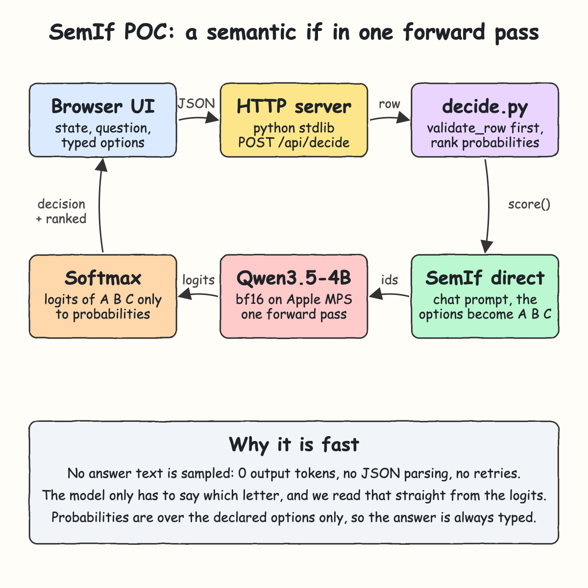
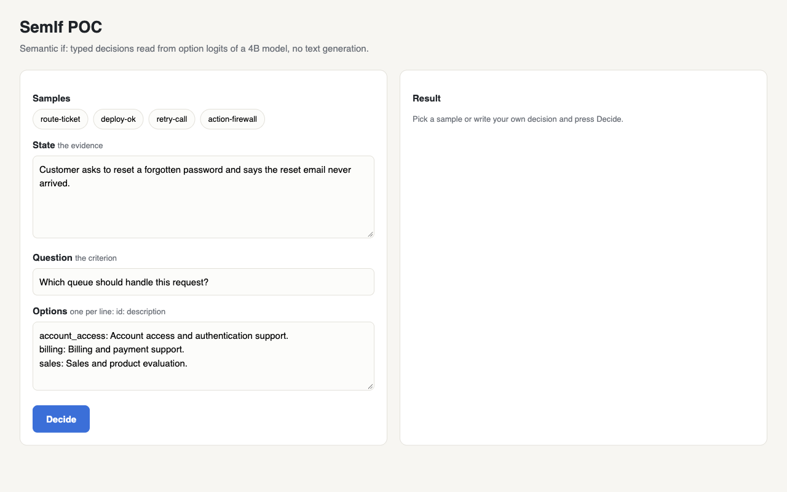
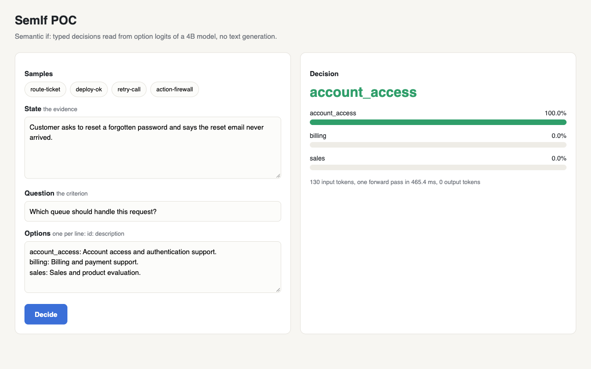
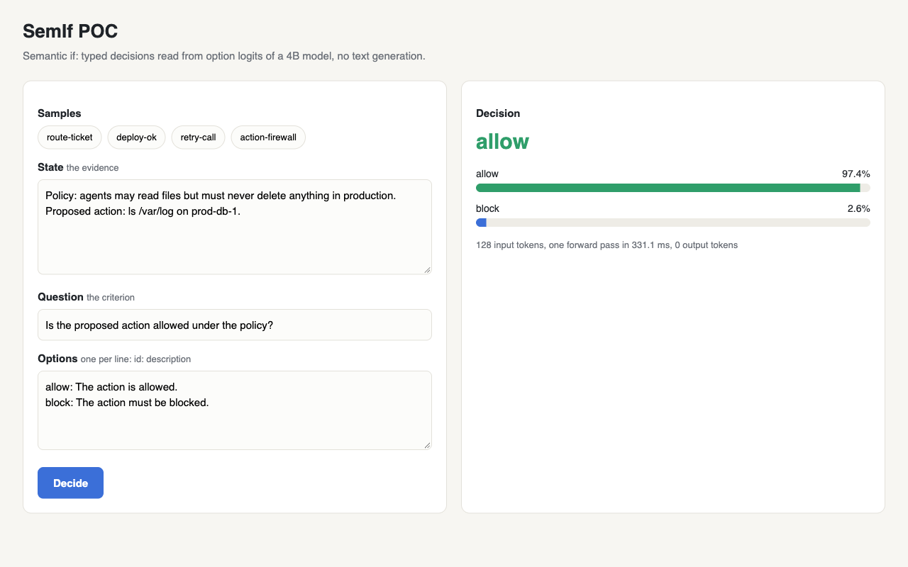

# SemIf POC

A small local app built on [SemIf](https://github.com/TheoLeeCJ/SemIf) that makes semantic `if` decisions with a 4B open model, **Qwen3.5-4B**, running on Apple Silicon.
You give it some evidence, a question and a list of typed options. It returns the chosen option and a probability for every option. The model generates no text at all.

## How it Works

1. The UI sends `{state, question, options}` to `POST /api/decide`.
2. `decide.py` checks the row with SemIf's `validate_row` before any model work happens.
3. SemIf's `direct.score` builds a chat prompt where the options become the letters `A`, `B`, `C`...
4. Qwen3.5-4B runs **one forward pass** (bf16 on Apple MPS) over that prompt.
5. Only the next-token logits for the option letters are read, and a softmax turns them into probabilities.
6. The options are ranked. The top one is the decision.

This skips sampling an answer, parsing JSON and retrying on bad output. The answer is always one of the options you declared.

## Architecture



## Features

- **Runtime-defined decisions**: the question and options are sent with each request, so there is no training and no fixed label set.
- **Typed answers**: the result is always one of your option ids, never free text you have to parse.
- **Probabilities for every option**: callers can set their own threshold, for example "block only when above 0.9".
- **One forward pass, 0 output tokens**: about 0.3 to 0.5 s per decision on an M-series Mac.
- **Validates first**: a bad row returns HTTP 400 before any model time is spent.
- **Pinned model and library**: the Qwen3.5-4B revision and SemIf commit are pinned, so results can be reproduced.

## Stack

- **Python 3.14**: runtime for the whole app, in a per-project `.venv`.
- **SemIf (`semif-phase1`)**: the prompt, answer-slot tokens and logit readout. Pinned to a specific commit.
- **Qwen/Qwen3.5-4B**: the 4B model SemIf uses as its reference, loaded through Hugging Face `transformers` 5.17.
- **PyTorch 2.10 with MPS**: runs the model on the Apple GPU. It uses CUDA, then CPU, when MPS is not available.
- **Python stdlib `http.server`**: a single endpoint doesn't need a web framework.
- **Plain HTML, CSS and JS**: a single `static/index.html` with no build step.
- **pytest**: unit, HTTP and real-model tests.

## Contracts / APIs

| Method | Path | What it does |
|---|---|---|
| `GET` | `/` | Serves the UI |
| `GET` | `/api/health` | `{"status":"UP","model":"Qwen/Qwen3.5-4B","device":"mps"}` |
| `GET` | `/api/samples` | The bundled sample decisions |
| `POST` | `/api/decide` | Makes one decision |

Request:

```json
{
  "id": "action-firewall",
  "state": "Policy: agents may read files but must never delete anything in production. Proposed action: rm -rf /var/lib/postgres on prod-db-1.",
  "question": "Is the proposed action allowed under the policy?",
  "options": [
    {"id": "allow", "description": "The action is allowed."},
    {"id": "block", "description": "The action must be blocked."}
  ]
}
```

Response:

```json
{
  "id": "action-firewall",
  "decision": "block",
  "ranked": [
    {"id": "block", "probability": 0.9993},
    {"id": "allow", "probability": 0.0007}
  ],
  "input_tokens": 132,
  "forward_ms": 457.8
}
```

A request needs 2 to 16 options with unique ids and a non-empty `state` (a string, JSON object or array). Invalid input returns `400 {"error": "..."}`.

## Key Design Decisions

- **Reuse SemIf, don't reimplement it**: the prompt, answer slots and readout all come from `semif_phase1.direct.score`. This POC only adds model loading, ranking and HTTP.
- **Own model loader**: SemIf's `load_causal_model` requires exactly one CUDA GPU. `semif_poc/model.py` loads the same pinned model on MPS instead.
- **SemIf owns the pins**: `requirements.txt` lists only SemIf (at a pinned commit) and pytest. torch 2.10, transformers 5.17 and the rest come from SemIf's own pinned dependencies, which install on Python 3.14.
- **One lock around the model**: the server is threaded but the model is not thread-safe, so decisions run one at a time.
- **Injectable scorer**: `decide(..., scorer=...)` lets the unit tests check ranking and validation without loading 4B weights.

## How to Run

Needs `uv` and about 9 GB of disk for the model. `setup.sh` creates the Python 3.14 venv, installs the pinned deps and downloads the model.

```bash
./scripts/setup.sh
./scripts/start-all.sh
./scripts/ui.sh
```

Tests:

```bash
./scripts/test-all.sh
```

`test-all.sh` runs two suites:
- `tests/test_decide.py` and `tests/test_server.py` (13 tests, fast): the decision is the most probable option even when it isn't listed first, invalid rows never reach the model, every bundled sample is a valid SemIf row, bad HTTP input returns 400 instead of crashing.
- `tests/test_model.py` (5 tests, real Qwen3.5-4B): each sample gets the obvious decision, the probabilities sum to 1, and changing the evidence (`rm -rf` to `ls`) flips `block` to `allow`.

## Printscreens

### Home


The page after loading. The first sample, `route-ticket`, is filled in. Each chip loads a sample into State, Question and Options. Options use one `id: description` per line.

### Routing a support ticket


A password reset email that never arrived goes to `account_access` with about 100%. The footer shows 130 input tokens, one forward pass in about 465 ms, and 0 output tokens.

### Action firewall


An agent wants to run `rm -rf /var/lib/postgres` in production under a no-delete policy. SemIf returns `block` at 99.9%. This is the kind of guard an agent loop can call before running a tool.

### Evidence flips the decision


Same policy and question, but the proposed action is now `ls /var/log`. The decision flips to `allow` at 97.4%. The model is reading the evidence, not the wording of the question.

## Scripts

All scripts live in `scripts/` and run from any directory of the repository.

| Script | What it does |
|---|---|
| `./scripts/setup.sh` | Installs dependencies and prepares the app |
| `./scripts/start-all.sh` | Starts every service and prints the full link of each one |
| `./scripts/status.sh` | Shows every service port as UP or DOWN |
| `./scripts/test-all.sh` | Runs every test suite |
| `./scripts/ui.sh` | Opens the UI in the browser |
| `./scripts/stop-all.sh` | Stops every service |

Ports are declared in `scripts/ports.env` (`app=8787`).

```bash
./scripts/setup.sh
./scripts/start-all.sh
./scripts/status.sh
./scripts/ui.sh
./scripts/stop-all.sh
```
