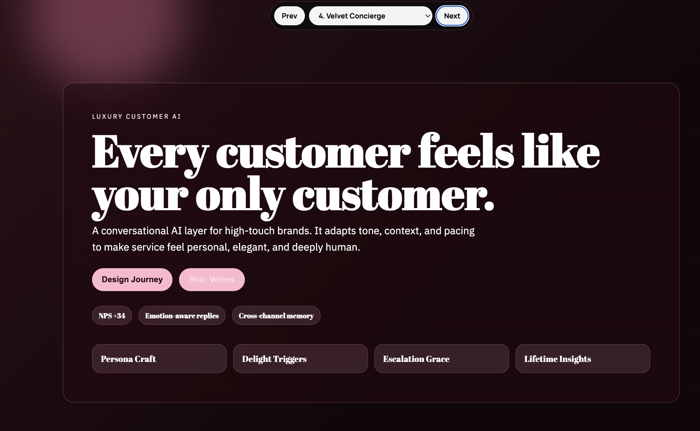
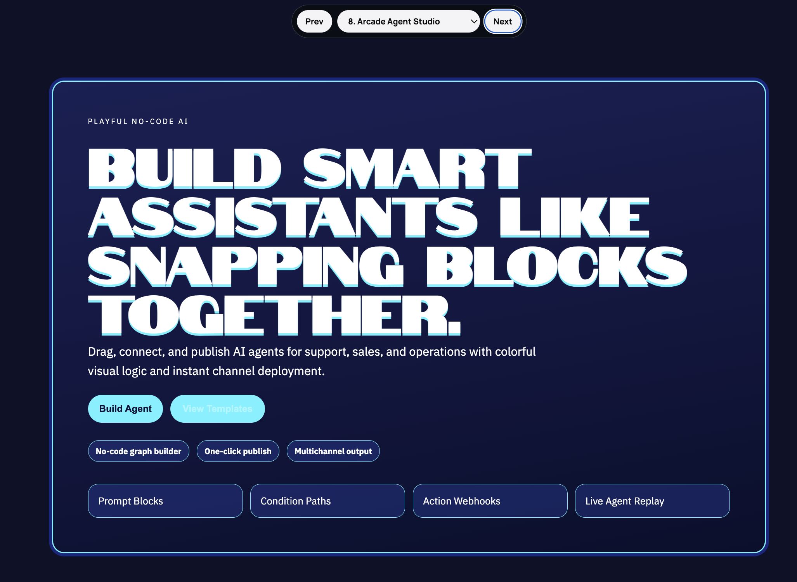

# Frontend Skill Fun

A small frontend project with HTML, CSS, and JavaScript focused on polished UI and interaction.

## Skill Used

https://skills.sh/anthropics/skills/frontend-design

## Stack

- HTML
- CSS
- JavaScript

## Run

```bash
./run.sh
```

## Project Files

- `index.html`
- `styles.css`
- `app.js`
- `run.sh`

## Screenshots

<table>
  <tr><th>#</th><th>Image</th></tr>
  <tr><td>1</td><td><a href="./1.png"></a></td></tr>
  <tr><td>2</td><td><a href="./2.png"></a></td></tr>
  <tr><td>3</td><td><a href="./3.png"></a></td></tr>
  <tr><td>4</td><td><a href="./4.png"></a></td></tr>
  <tr><td>5</td><td><a href="./5.png"></a></td></tr>
  <tr><td>6</td><td><a href="./6.png"></a></td></tr>
  <tr><td>7</td><td><a href="./7.png"></a></td></tr>
  <tr><td>8</td><td><a href="./8.png"></a></td></tr>
  <tr><td>9</td><td><a href="./9.png"></a></td></tr>
  <tr><td>10</td><td><a href="./10.png"></a></td></tr>
</table>
