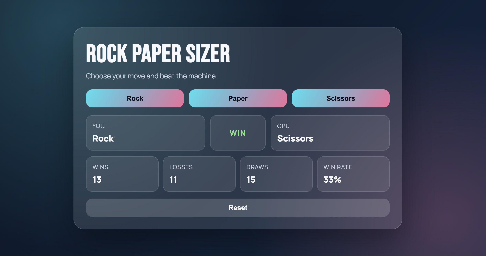

# Rock Paper Sizer



## Model
GPT-5 Codex

## Codex Version
5.3

## Prompt
build a rock paper sizer game with react. have a run.sh to start the app. Use latest react and make it nice. save this prompt on the README and make a simple and good readme.md with model, codex version, prompt, what the app doers, wetc...

## What the App Does
This app is a Rock Paper Scissors game built with React.
You pick Rock, Paper, or Scissors and play against the CPU.
The app shows round result, score tracking, and win rate.
It has a responsive polished UI for desktop and mobile.

## Run
```bash
./run.sh
```

## Stack
- React
- Vite
- CSS
