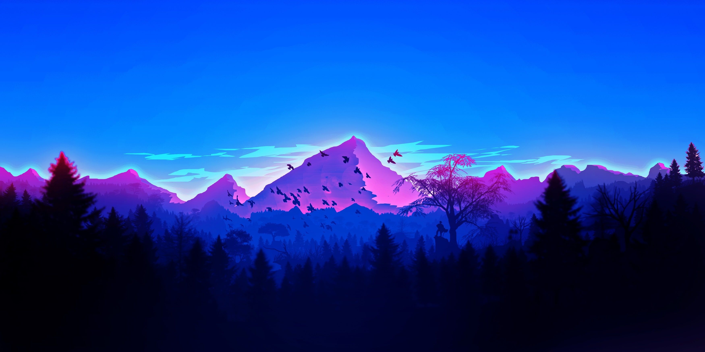

### Result
```
❯ ./run.sh
Image downscaled successfully!
```
Orignal Image(3500x1750 - 241kb):

AI Downscaled Image result(800x600 - 56 kb):


### Resize algorithims
OpenCV include:

*cv2.INTER_NEAREST*: This is the simplest interpolation method. It selects the value of the nearest pixel to the calculated location.

*cv2.INTER_LINEAR*: This is the default interpolation method in OpenCV. It uses bilinear interpolation, which considers the closest 2x2 neighborhood of known pixel values surrounding the unknown pixel's computed location.

*cv2.INTER_CUBIC*: This method uses bicubic interpolation over 4x4 pixel neighborhood. It's more computationally expensive than cv2.INTER_LINEAR but can produce smoother images.

*cv2.INTER_LANCZOS4*: This method uses Lanczos kernel for interpolation over 8x8 pixel neighborhood. It's more computationally expensive but can produce high-quality images.