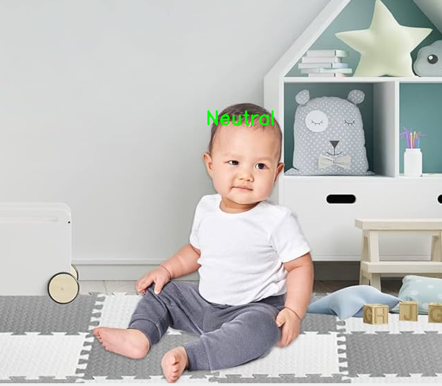

### Train

The CNN Model
```
model = Sequential([
    Conv2D(32, (3, 3), activation='relu', input_shape=(48, 48, 1)),
    MaxPooling2D((2, 2)),
    Conv2D(64, (3, 3), activation='relu'),
    MaxPooling2D((2, 2)),
    Flatten(),
    Dense(64, activation='relu'),
    Dropout(0.5),
    Dense(len(emotions), activation='softmax')
])
```
is a simple Convolutional Neural Network with 2 Convolutional Layers, 2 MaxPooling Layers, 1 Flatten Layer, 1 Dense Layer, 1 Dropout Layer and 1 Output Layer. For face detection, the model uses the Haar Cascade Classifier. The model is trained on the FER2013 dataset which contains 48x48 grayscale images of faces with 7 different emotions. The model is trained for 10 epochs with a batch size of 32. The model is saved as emotion_model.h5.
```
./train.sh
```
10 epoch - optimizer='adam', loss='sparse_categorical_crossentropy', metrics=['accuracy']
```
  self._warn_if_super_not_called()
898/898 ━━━━━━━━━━━━━━━━━━━━ 37s 40ms/step - accuracy: 0.2268 - loss: 1.8552
Epoch 2/10
898/898 ━━━━━━━━━━━━━━━━━━━━ 37s 41ms/step - accuracy: 0.2543 - loss: 1.7905
Epoch 3/10
898/898 ━━━━━━━━━━━━━━━━━━━━ 34s 38ms/step - accuracy: 0.2659 - loss: 1.7667
Epoch 4/10
898/898 ━━━━━━━━━━━━━━━━━━━━ 29s 32ms/step - accuracy: 0.2845 - loss: 1.7358
Epoch 5/10
898/898 ━━━━━━━━━━━━━━━━━━━━ 29s 33ms/step - accuracy: 0.3026 - loss: 1.7115
Epoch 6/10
898/898 ━━━━━━━━━━━━━━━━━━━━ 35s 39ms/step - accuracy: 0.3211 - loss: 1.6787
Epoch 7/10
898/898 ━━━━━━━━━━━━━━━━━━━━ 30s 33ms/step - accuracy: 0.3334 - loss: 1.6587
Epoch 8/10
898/898 ━━━━━━━━━━━━━━━━━━━━ 40s 45ms/step - accuracy: 0.3469 - loss: 1.6325
Epoch 9/10
898/898 ━━━━━━━━━━━━━━━━━━━━ 31s 35ms/step - accuracy: 0.3510 - loss: 1.6197
Epoch 10/10
898/898 ━━━━━━━━━━━━━━━━━━━━ 29s 32ms/step - accuracy: 0.3634 - loss: 1.6018
WARNING:absl:You are saving your model as an HDF5 file via `model.save()` or `keras.saving.save_model(model)`. This file format is considered legacy. We recommend using instead the native Keras format, e.g. `model.save('my_model.keras')` or `keras.saving.save_model(model, 'my_model.keras')`.
Model saved to emotion_model.h5
```
10 epoch - optimizer=sgd, loss='sparse_categorical_crossentropy', metrics=['accuracy']
```
Epoch 1/10
/home/diego/.local/lib/python3.10/site-packages/keras/src/trainers/data_adapters/py_dataset_adapter.py:120: UserWarning: Your `PyDataset` class should call `super().__init__(**kwargs)` in its constructor. `**kwargs` can include `workers`, `use_multiprocessing`, `max_queue_size`. Do not pass these arguments to `fit()`, as they will be ignored.
  self._warn_if_super_not_called()
898/898 ━━━━━━━━━━━━━━━━━━━━ 33s 36ms/step - accuracy: 0.2455 - loss: 1.8264   
Epoch 2/10
898/898 ━━━━━━━━━━━━━━━━━━━━ 29s 32ms/step - accuracy: 0.2523 - loss: 1.7945  
Epoch 3/10
898/898 ━━━━━━━━━━━━━━━━━━━━ 31s 34ms/step - accuracy: 0.2513 - loss: 1.7865  
Epoch 4/10
898/898 ━━━━━━━━━━━━━━━━━━━━ 32s 36ms/step - accuracy: 0.2608 - loss: 1.7706  
Epoch 5/10
898/898 ━━━━━━━━━━━━━━━━━━━━ 30s 33ms/step - accuracy: 0.2657 - loss: 1.7663  
Epoch 6/10
898/898 ━━━━━━━━━━━━━━━━━━━━ 24s 27ms/step - accuracy: 0.2695 - loss: 1.7578  
Epoch 7/10
898/898 ━━━━━━━━━━━━━━━━━━━━ 29s 32ms/step - accuracy: 0.2791 - loss: 1.7512  
Epoch 8/10
898/898 ━━━━━━━━━━━━━━━━━━━━ 26s 29ms/step - accuracy: 0.2901 - loss: 1.7363  
Epoch 9/10
898/898 ━━━━━━━━━━━━━━━━━━━━ 28s 31ms/step - accuracy: 0.2972 - loss: 1.7245  
Epoch 10/10
898/898 ━━━━━━━━━━━━━━━━━━━━ 28s 31ms/step - accuracy: 0.3026 - loss: 1.7074  
WARNING:absl:You are saving your model as an HDF5 file via `model.save()` or `keras.saving.save_model(model)`. This file format is considered legacy. We recommend using instead the native Keras format, e.g. `model.save('my_model.keras')` or `keras.saving.save_model(model, 'my_model.keras')`. 
Model saved to emotion_model.h5
```
15 epoch - optimizer='adam', loss='sparse_categorical_crossentropy', metrics=['accuracy']
```
Epoch 1/15
/home/diego/.local/lib/python3.10/site-packages/keras/src/trainers/data_adapters/py_dataset_adapter.py:120: UserWarning: Your `PyDataset` class should call `super().__init__(**kwargs)` in its constructor. `**kwargs` can include `workers`, `use_multiprocessing`, `max_queue_size`. Do not pass these arguments to `fit()`, as they will be ignored.
  self._warn_if_super_not_called()
898/898 ━━━━━━━━━━━━━━━━━━━━ 45s 47ms/step - accuracy: 0.2331 - loss: 1.8373
Epoch 2/15
898/898 ━━━━━━━━━━━━━━━━━━━━ 44s 48ms/step - accuracy: 0.2561 - loss: 1.7808  
Epoch 3/15
898/898 ━━━━━━━━━━━━━━━━━━━━ 41s 46ms/step - accuracy: 0.2734 - loss: 1.7581  
Epoch 4/15
898/898 ━━━━━━━━━━━━━━━━━━━━ 42s 46ms/step - accuracy: 0.2878 - loss: 1.7353  
Epoch 5/15
898/898 ━━━━━━━━━━━━━━━━━━━━ 40s 45ms/step - accuracy: 0.3115 - loss: 1.7001  
Epoch 6/15
898/898 ━━━━━━━━━━━━━━━━━━━━ 42s 46ms/step - accuracy: 0.3228 - loss: 1.6835  
Epoch 7/15
898/898 ━━━━━━━━━━━━━━━━━━━━ 42s 46ms/step - accuracy: 0.3329 - loss: 1.6611  
Epoch 8/15
898/898 ━━━━━━━━━━━━━━━━━━━━ 41s 46ms/step - accuracy: 0.3495 - loss: 1.6347  
Epoch 9/15
898/898 ━━━━━━━━━━━━━━━━━━━━ 41s 46ms/step - accuracy: 0.3539 - loss: 1.6246  
Epoch 10/15
898/898 ━━━━━━━━━━━━━━━━━━━━ 42s 47ms/step - accuracy: 0.3661 - loss: 1.5985  
Epoch 11/15
898/898 ━━━━━━━━━━━━━━━━━━━━ 42s 46ms/step - accuracy: 0.3677 - loss: 1.5933  
Epoch 12/15
898/898 ━━━━━━━━━━━━━━━━━━━━ 42s 47ms/step - accuracy: 0.3788 - loss: 1.5780  
Epoch 13/15
898/898 ━━━━━━━━━━━━━━━━━━━━ 36s 39ms/step - accuracy: 0.3831 - loss: 1.5678  
Epoch 14/15
898/898 ━━━━━━━━━━━━━━━━━━━━ 46s 51ms/step - accuracy: 0.3891 - loss: 1.5527  
Epoch 15/15
898/898 ━━━━━━━━━━━━━━━━━━━━ 28s 31ms/step - accuracy: 0.3911 - loss: 1.5467  
WARNING:absl:You are saving your model as an HDF5 file via `model.save()` or `keras.saving.save_model(model)`. This file format is considered legacy. We recommend using instead the native Keras format, e.g. `model.save('my_model.keras')` or `keras.saving.save_model(model, 'my_model.keras')`. 
Model saved to emotion_model.h5
```

### Result
```
./run.sh
```
