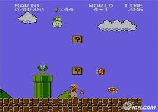
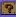
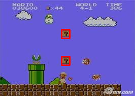
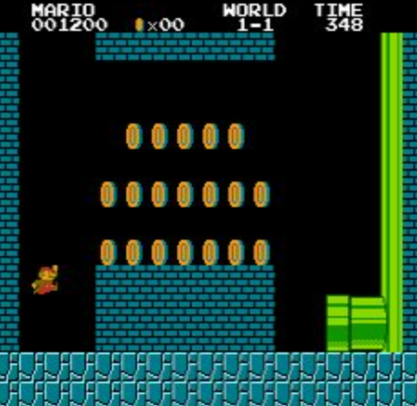
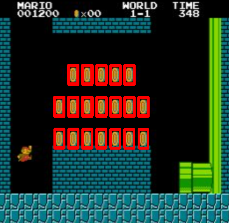

### Detect template on image.

Mario #1 - Image <BR/>
 <BR/>
Mario #1 - Template <BR/>
 <BR/>
Mario #1 - Result <BR/>
 <BR/>

Mario #2 - Image <BR/>
 <BR/>
Mario #1 - Template <BR/>
 <BR/>
Mario #1 - Result <BR/>
 <BR/>

### Code
```python
import cv2 as cv
import numpy as np
from matplotlib import pyplot as plt
import random

def randint(min=0,max=100):
    a = random.randint(min,max)
    return a

def detect(source_input,template_input):
    img_rgb = cv.imread(source_input)
    assert img_rgb is not None, "file could not be read, check with os.path.exists()"

    img_gray = cv.cvtColor(img_rgb, cv.COLOR_BGR2GRAY)
    template = cv.imread(template_input, cv.IMREAD_GRAYSCALE)
    assert template is not None, "file could not be read, check with os.path.exists()"

    w, h = template.shape[::-1]
    res = cv.matchTemplate(img_gray,template,cv.TM_CCOEFF_NORMED)
    threshold = 0.8
    loc = np.where( res >= threshold)
    for pt in zip(*loc[::-1]):
        cv.rectangle(img_rgb, pt, (pt[0] + w, pt[1] + h), (0,0,255), 2)
    cv.imwrite('res' + str(randint()+randint()) + '.png',img_rgb)
    print("done -> " + source_input)

detect("mario.jpg","mario_template.jpg")
detect("mario_with_coins.png","mario-coin-template.png")
```