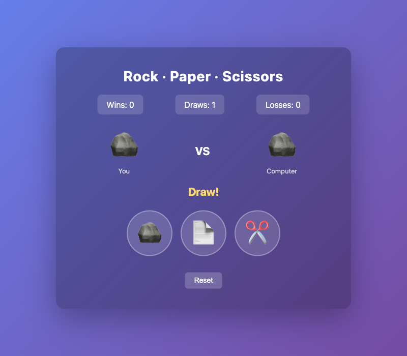
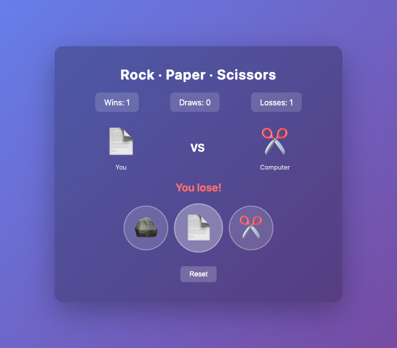
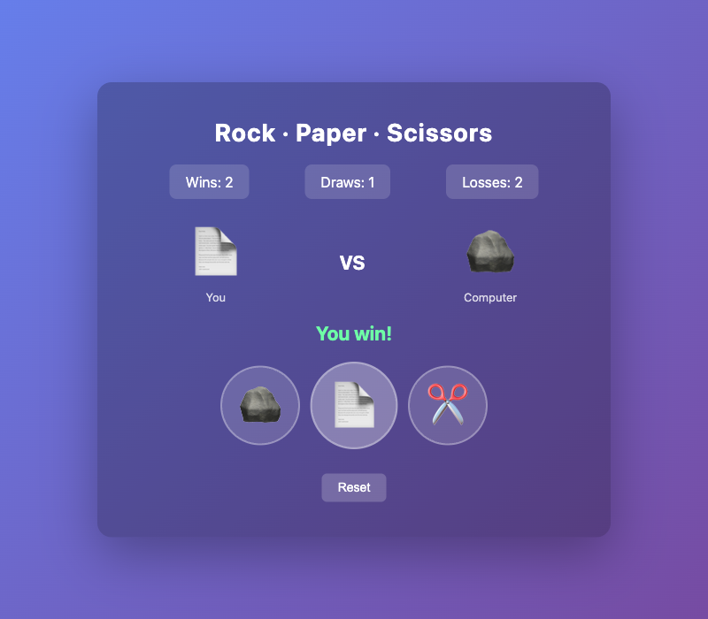

# Rock · Paper · Scissors

A small web Rock-Paper-Scissors game built with React. It runs as a single static `index.html` file using React via CDN — no build step, no `node_modules`.

## Features

- Three-choice gameplay: rock, paper, scissors
- Live scoreboard for wins, draws, and losses
- Win / lose / draw verdict per round with color-coded result
- One-click reset of the round and the score
- Pure React (UMD CDN) and vanilla CSS — no bundler required

## Run

```bash
./run.sh
```

Then open http://localhost:8080 in your browser.

The script just serves the directory with `python3 -m http.server` on port 8080.

## Files

- `index.html` — the whole app (HTML, CSS, React component)
- `run.sh` — starts a local static file server
- `screenshots/` — captures of the running app

## Screenshots

### Initial round — draw


### Round lost


### Round won


## Prompt

> build a web paper cizer rock game, with react, have a run.sh
>
> have a nice read me and add the prompt: build a web paper cizer rock game, with react, have a run.sh and also take print screens of the game and refer on the readme.

## Experience notes

* Claude Code with Opus 4.7 High Effort
* It was able to one-shot it
* used 20% of my subscription tokens
* I asked for React but was pure HTML.