<p align="center">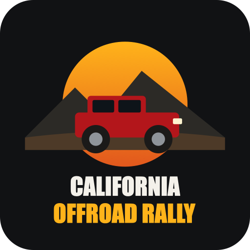</p>

# California Offroad Rally

A 3D off-road rally game that runs in the browser. You pick one of four muddy California stages (San Francisco, Los Angeles, Lake Tahoe, Yosemite), one of 7 off-road 4x4s, a paint color and finish, and the weather (clear, rain or snow). Then you race 3 laps against 3 CPU drivers, with an automatic gearbox, a synthesized engine sound, mud spray, tire ruts, jumps and puddles.

## How it Works

1. `./play.sh` starts a zero-dependency Node static server and opens the game in the browser.
2. The menu has 4 steps (track, vehicle, paint, conditions). A 3D showroom turntable shows the chosen 4x4 with its real paint finish.
3. When the race starts, the track is built from a closed Catmull-Rom spline. It is resampled every 2 m and carved into a seeded Perlin heightfield, with smoothed road height, kicker jumps and puddles.
4. A fixed 120 Hz simulation steps every car: engine torque curve, 6-speed automatic gearbox, tire grip per surface and weather, weight transfer, suspension, airtime and collisions.
5. CPU drivers follow the racing line. They brake from a curvature-based speed profile, slow down for jumps, overtake, and reverse out when stuck.
6. three.js renders the stage: sky, fog, terrain, mud road with normal and roughness maps, forests, landmarks, rain, snow, mud spray and tire marks.
7. Web Audio synthesizes each engine from its rpm and throttle, plus tire, gravel, slide, wind and rain noise, with 3D panning for the rivals.
8. A quality governor watches the FPS every second. It lowers resolution, shadows and particles until the game holds at least 30 FPS, and raises them again when there is headroom.

## Architecture

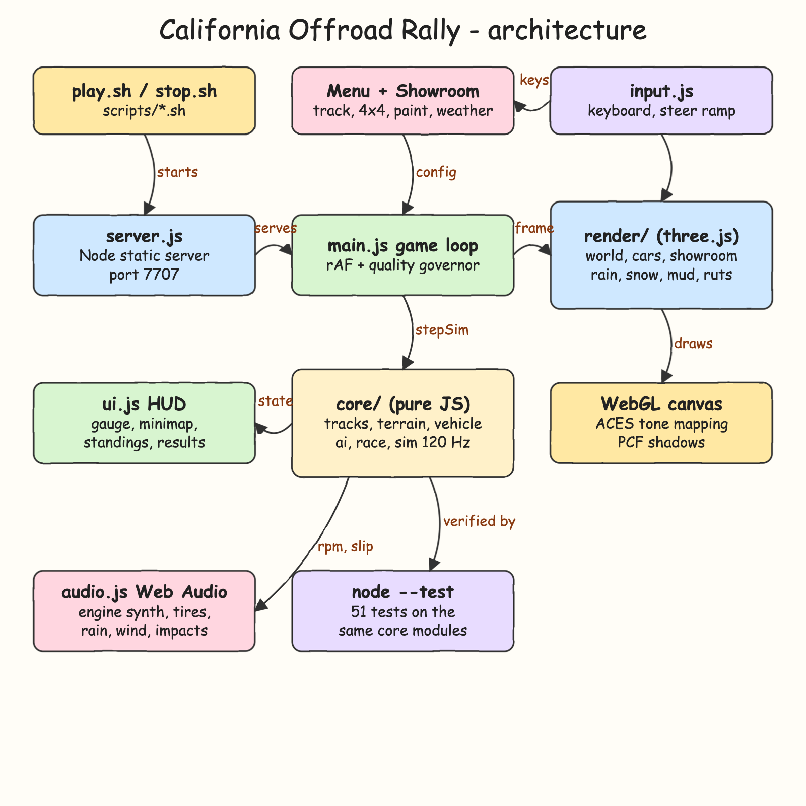

The source is `docs/architecture.svg`.

- `server.js` serves `public/` and `node_modules/three`, so the game runs fully offline once set up.
- `public/js/core/` holds pure JavaScript with no DOM and no three.js: tracks, terrain, vehicle physics, AI, race rules, simulation and quality levels. The browser and the tests run the same modules.
- `public/js/render/` holds everything three.js: world, car models, showroom, effects and procedural textures.
- `public/js/main.js` runs the game loop and the quality governor. `ui.js` draws the menu, HUD and results. `audio.js` is the engine synth. `input.js` handles the keyboard.

## Features

- **4 California stages**: Presidio Mud Run (SF, with the Golden Gate Bridge and skyline), Griffith Canyon Rally (LA, with the observatory, palms and downtown), Emerald Bay Trail (Lake Tahoe, with the lake, pines, boathouse and Sierra peaks) and Yosemite Valley Floor (El Capitan, Half Dome, Yosemite Falls and sequoias).
- **7 off-road 4x4s**: Jeep Wrangler Rubicon, Ford Bronco Raptor, Toyota Land Cruiser 70, Land Rover Defender 110, Ford F-150 Raptor R, Hummer H1 Alpha and a Baja Trophy Truck. Each has its own mass, torque, grip, gearing, dimensions and body.
- **Paint**: 10 colors plus a custom color picker, and 6 finishes (Gloss, Metallic, Matte, Pearl, Camo, Carbon) built with physically based clearcoat, iridescence and procedural textures.
- **Weather**: clear, rain or snow. Each changes grip (rain -16%, snow -34%), the sky, fog, road wetness, snow cover, particles and sound.
- **Muddy track**: rutted mud texture with normal and roughness maps, glossy puddles that slow you down and splash, tire ruts left behind every car, and mud building up on the paint.
- **3 laps vs 3 CPU drivers**: live standings with gaps, lap and best-lap times, a minimap, a countdown, final-lap and wrong-way warnings, and a results table.
- **Fully automatic**: a 6-speed automatic gearbox with launch slip and upshift/downshift logic. Holding brake at a standstill engages reverse.
- **Engine noise**: a synthesized engine per car (V6 or V8 firing frequency, burble, intake roar, distortion), plus tire, gravel, slide, wind, rain and impact sounds.
- **Jumps and airtime**: two kickers per stage, placed on straights so you land on the road.
- **30 FPS floor**: 5 quality levels (Ultra to Potato), stepped down automatically when frames drop.
- **4 cameras**: chase, far chase, hood and bumper.
- **On-screen shortcuts**: the controls panel is always on the HUD. Press H to hide it.

## Controls

| Key | Action |
|---|---|
| `W` / `Up` | Accelerate |
| `S` / `Down` | Brake, hold to reverse |
| `A` `D` / `Left` `Right` | Steer |
| `Space` | Handbrake |
| `C` | Change camera |
| `R` | Reset to track |
| `M` | Mute |
| `P` / `Esc` | Pause |
| `H` | Hide or show the controls panel |
| `Enter` | Next step in the menu |

## Stack

- **three.js 0.186**: the only runtime library. It provides WebGL rendering, PBR materials, shadows and the Sky shader.
- **Vanilla ES modules + import map**: no bundler and no framework, so the code runs as written.
- **Web Audio API**: every sound is synthesized, with no audio files.
- **Canvas 2D**: procedural mud, grass, camo, carbon, tread, water and cloud textures, plus the gauge and minimap.
- **Node.js (`node:http`)**: a static server with no dependencies.
- **`node --test`**: the built-in test runner, so there is no test framework to install.

## Contracts / APIs

There is no backend API. The server only serves static files:

| Path | Served from |
|---|---|
| `GET /` and `GET /*` | `public/` |
| `GET /vendor/three/*` | `node_modules/three/` |

Paths that resolve outside those folders return `403`. Everything is served with `Cache-Control: no-cache`.

## Key data structures and design decisions

- **Track**: `Float32Array`s of `xs`, `zs`, `heading`, `curvature` and `vmaxUnit` sampled every 2 m, plus a spatial hash (24 m cells) for fast nearest-point lookup. `vmaxUnit` is `sqrt(g / curvature)`, the cornering speed at grip 1 that the AI scales by surface grip.
- **Terrain**: a 301x301 heightfield (4 m cells) that blends the raw Perlin terrain into the smoothed road profile. Physics samples it with the same triangle split the mesh uses, so wheels sit exactly on the rendered ground.
- **Vehicle model**: a bicycle-model body with longitudinal and lateral velocity kept in world space. Drift happens naturally when lateral grip saturates. The 4 wheel contact heights drive pitch, roll, suspension compression and airtime.
- **Fixed-step simulation**: `stepSim` runs 120 Hz steps from a frame accumulator, so physics does not change with frame rate. That is also what lets the quality governor trade resolution for FPS safely.
- **Lap rule**: a lap counts only after passing the far side of the loop, so reversing over the line never scores.
- **Quality governor**: it drops a level below 36 FPS and climbs back after 4 seconds above 58 FPS. It skips the first window after each change and doubles its cooldown after every drop, so it never flickers between two levels.
- **Pure core, thin render**: everything that decides the outcome of a race is in `core/` and tested headlessly. That includes 3-lap CPU races on all four stages.

## How to run

```bash
./play.sh
./stop.sh
```

`play.sh` installs dependencies on first run, starts the server on `http://localhost:7707` and opens the browser. `stop.sh` stops it.

Tests:

```bash
./scripts/test-all.sh
```

```
ℹ tests 51
ℹ pass 51
ℹ fail 0
```

The tests cover:
- Track geometry: tightest radius, no self-overlap, a flat road cross-section, and the road staying above the lakes.
- Tree and rock placement kept off the racing line.
- Grid slots.
- Gearbox upshifts and downshifts.
- Top speed.
- Reverse.
- Snow grip.
- Handbrake rotation.
- Steering direction.
- Jumps.
- Lap rules and standings.
- A full 3-lap CPU race in rain on every stage.
- The countdown freeze.
- The quality governor settling at 30+ FPS without flicker.
- Server path-traversal refusal.

## Printscreens

The in-race shots were taken in a headless browser without a GPU. That is why the HUD shows the governor at the `Potato` level holding 30 FPS. On a real GPU it climbs to High or Ultra.

**1. Track selection**: the four California stages, each with a map thumbnail of its layout. The 3D showroom turntable is on the right.
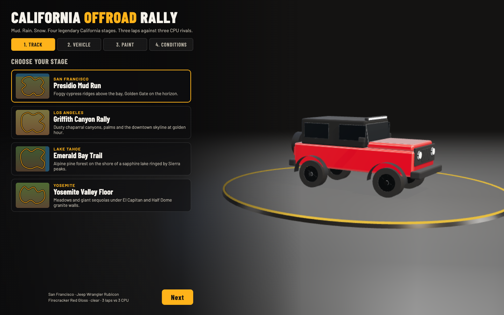

**2. Vehicle selection**: the 7 off-road 4x4s with torque, acceleration, grip and top-speed bars. The Ford Bronco Raptor is selected and shown in the showroom.
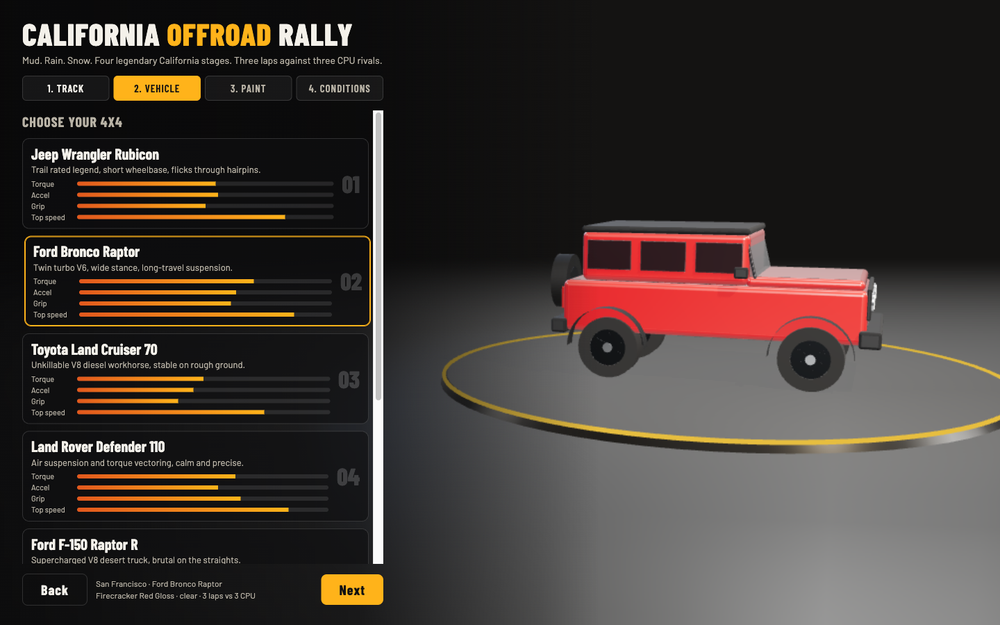

**3. Paint, camo finish**: Sarge Green with the Camo finish. The procedural camouflage pattern is wrapped on the body.
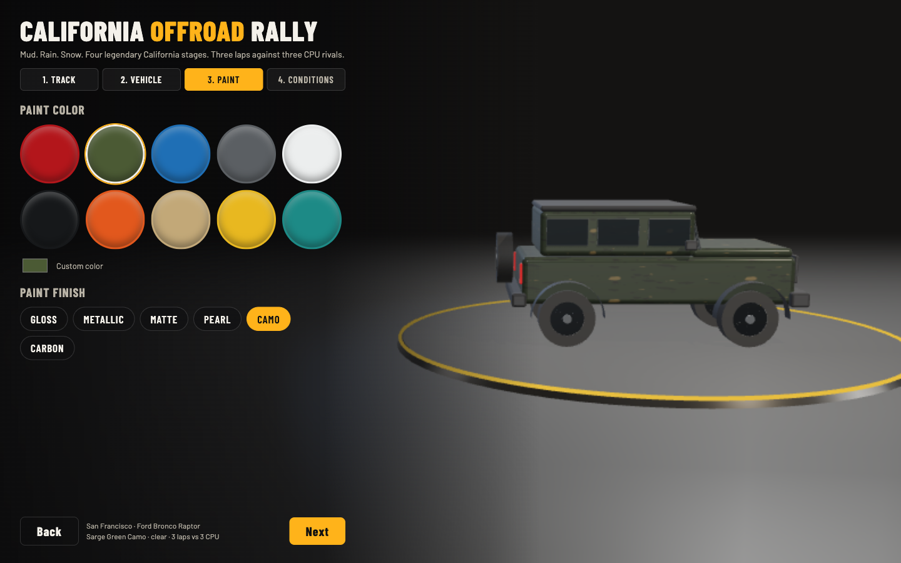

**4. Paint, pearl finish**: Hydro Blue with the Pearl finish (iridescent clearcoat) under the showroom spotlights.
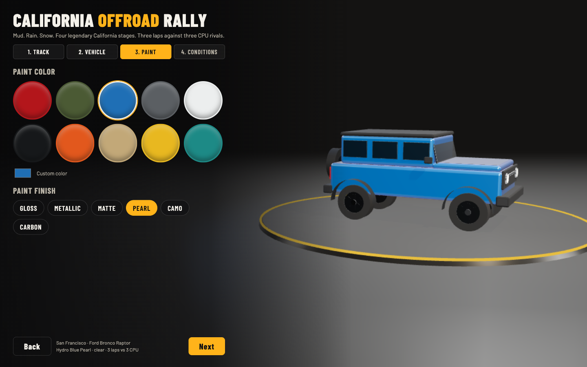

**5. Conditions**: pick clear, rain or snow. The summary at the bottom shows the full race setup.
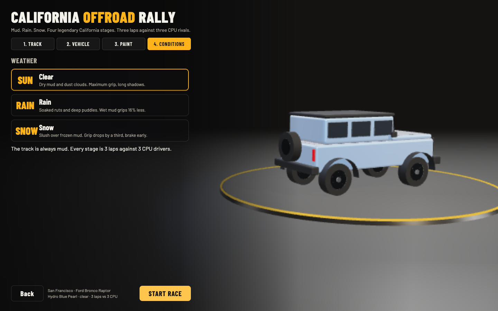

**6. San Francisco, clear**: the Jeep, already dirty, kicks up dust and mud clumps on the Presidio stage among Monterey cypress. Rivals are ahead on the rutted mud road. The HUD shows position, lap, times, live standings with gaps, the minimap, FPS and quality, the rpm and speed gauge in D2, and the controls panel.
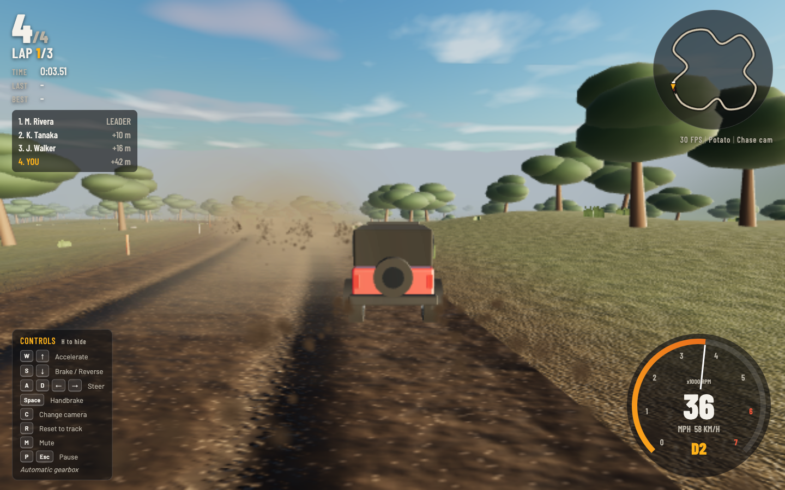

**7. Yosemite, snow**: the Hummer H1 on a slush-covered mud road. There are snowflakes, fog, snow cover on the meadows and giant sequoias.
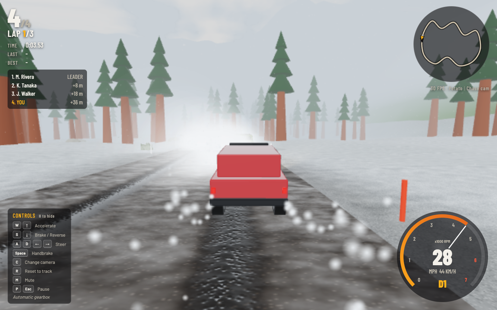

**8. Lake Tahoe, rain**: the Defender in a downpour under an overcast sky. The road is soaked, with glossy ruts and splashes, and pine forest on both sides.
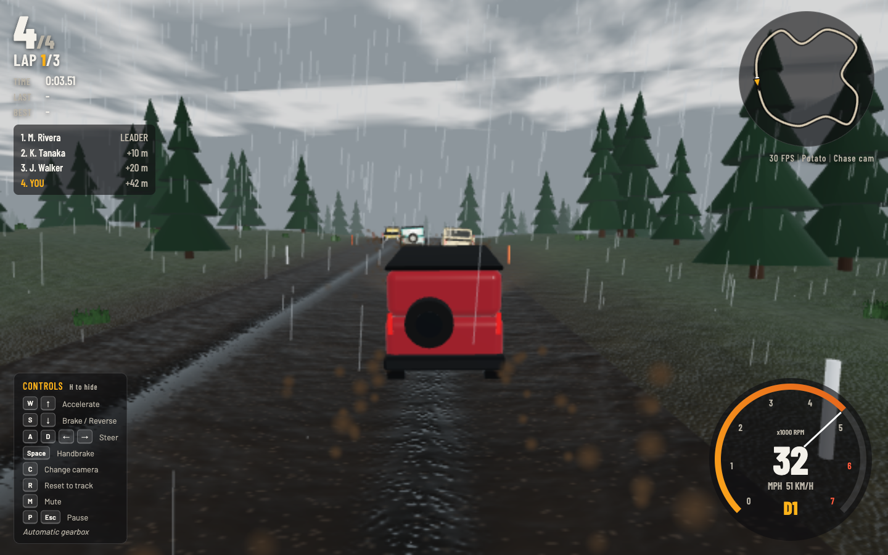

**9. Los Angeles, clear**: the F-150 Raptor R in the dusty Griffith canyon at golden hour, with palms on the ridges.
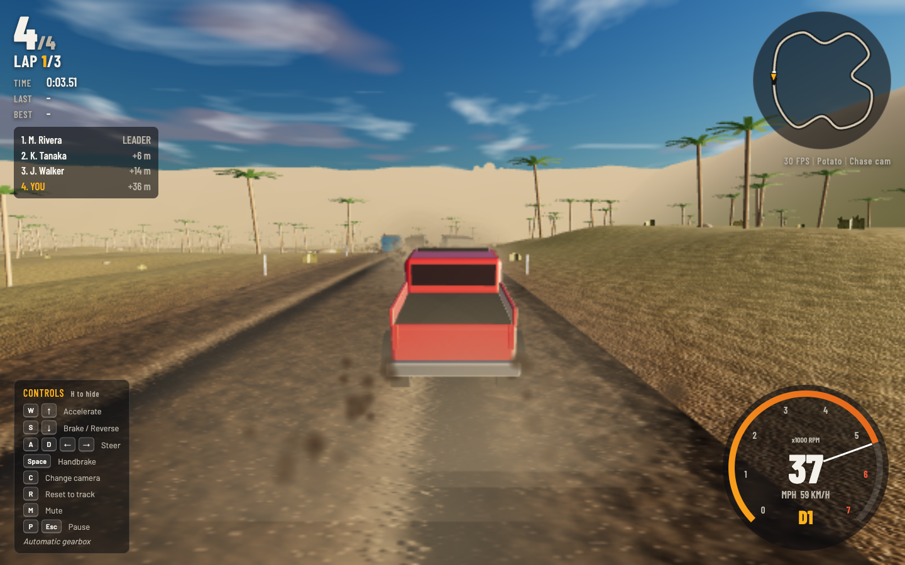

**10. Hood cam**: press `C` to cycle cameras. This is the hood view over the glossy paint, following the CPU drivers into the pines.
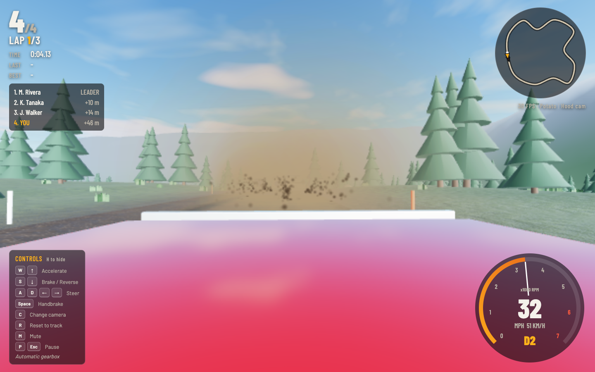

**11. Pause**: `P` or `Esc` pauses the race and the audio, with resume, restart and main menu.
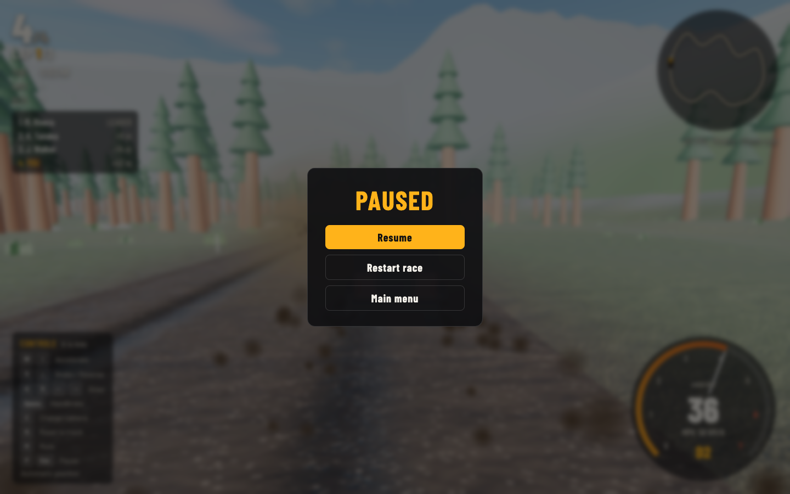

**12. Results**: the finish table with position, driver, vehicle, total time and best lap. A driver who did not finish shows the laps completed. This shot uses a sample race state rendered by the real `showResults`, because a full 3-lap race takes about 5 minutes.
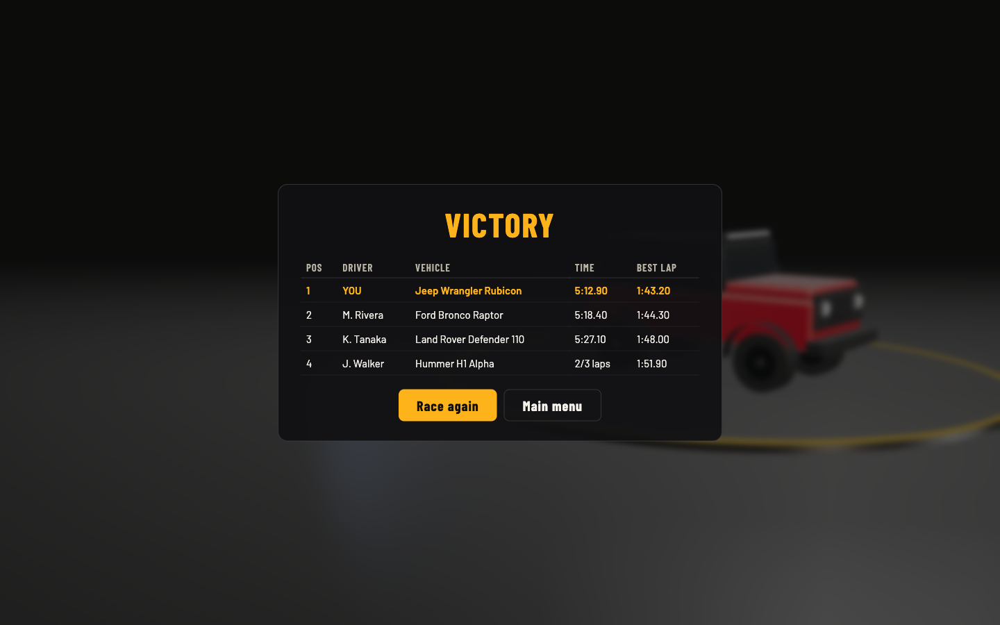

## Scripts

All scripts live in `scripts/` and run from any directory of the repository.

| Script | What it does |
|---|---|
| `./play.sh` | Starts the game and opens it in the browser |
| `./stop.sh` | Stops the game |
| `./scripts/setup.sh` | Installs dependencies and prepares the app |
| `./scripts/start-all.sh` | Starts every service and prints the full link of each one |
| `./scripts/status.sh` | Shows every service port as UP or DOWN |
| `./scripts/test-all.sh` | Runs every test suite |
| `./scripts/ui.sh` | Opens the UI in the browser |
| `./scripts/stop-all.sh` | Stops every service |

Ports are declared in `scripts/ports.env` (`game=7707`).

```bash
./scripts/setup.sh
./scripts/start-all.sh
./scripts/status.sh
./scripts/ui.sh
./scripts/stop-all.sh
```
