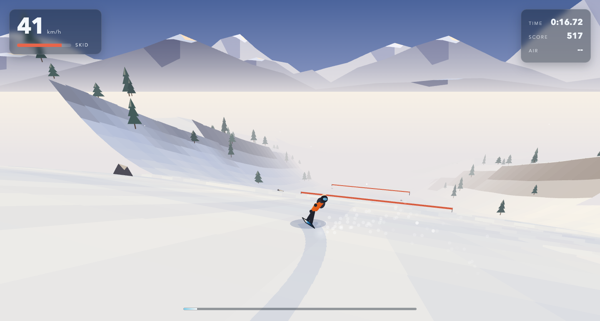
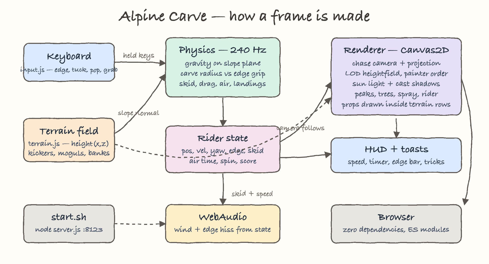
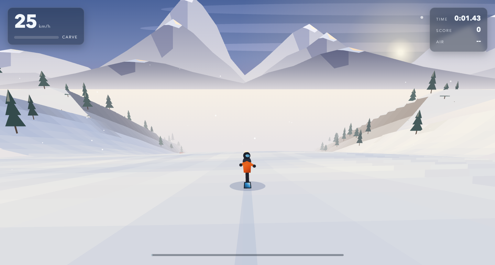
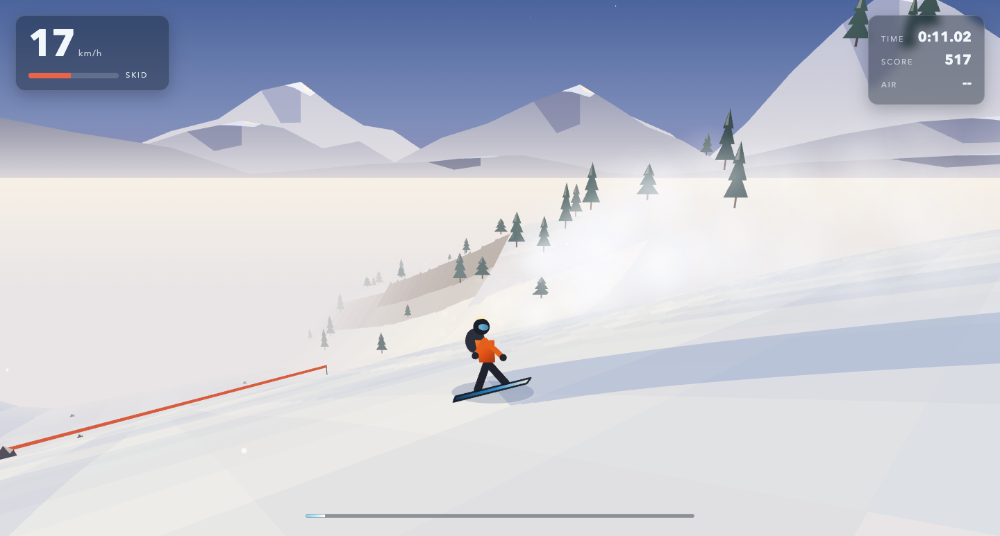
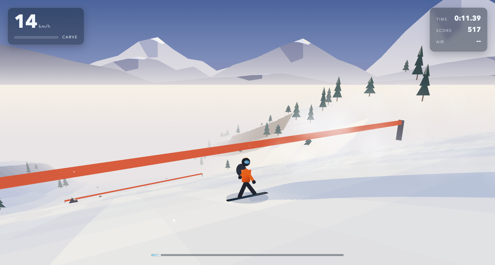
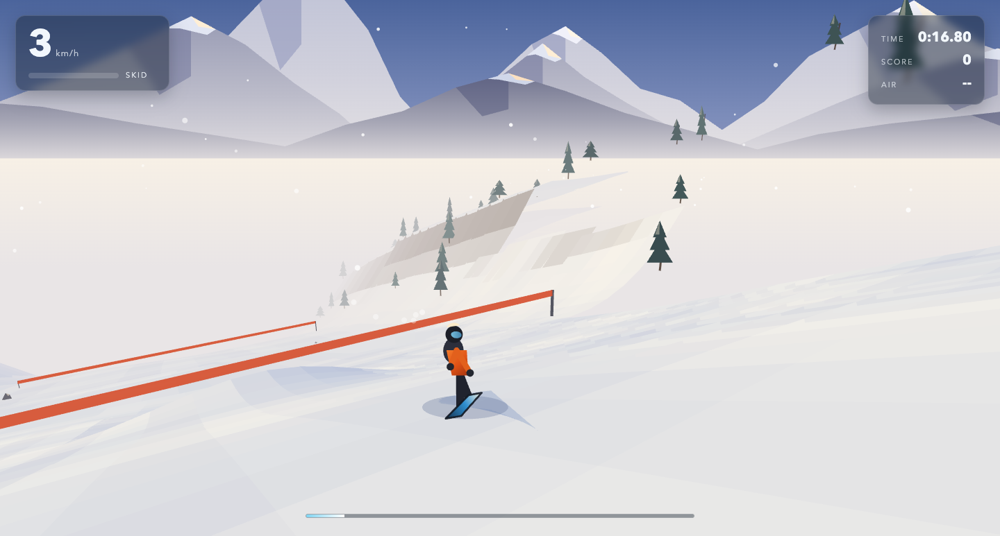
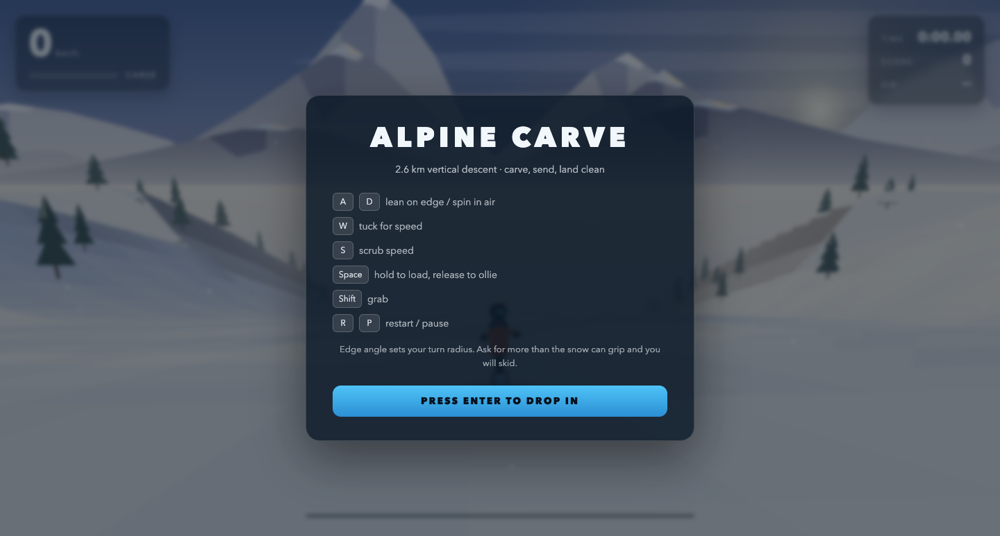

# Alpine Carve

A snowboard game with a real carving model, rendered in a hand written 3D software renderer on a 2D canvas. No engine, no libraries, no build step — plain ES modules served by a small Node static server.

The run is a 2.6 km descent: groomed piste between tree lined banks, seven kickers, two mogul fields, and a finish line. You are scored on time, air, spins, grabs and clean carves.



## Run it

```bash
./start.sh     # serves http://localhost:8123 (PORT env var to override)
./stop.sh      # stops the server and frees the port
```

`start.sh` writes `.server.pid` and polls the port until the server answers, so it returns only when the game is actually reachable. `stop.sh` kills the pid, waits for it to exit, then sweeps anything still holding the port.

## Controls

| Key | Action |
| --- | --- |
| `A` / `D` | Lean onto the toe or heel edge. In the air, spin. |
| `W` | Tuck — lower drag, more speed |
| `S` | Scrub speed with a heel side skid |
| `Space` | Hold to load the board, release to ollie |
| `Shift` | Grab (1.35x trick multiplier) |
| `Enter` | Drop in |
| `R` / `P` | Restart / pause |

## The physics

This is the part that makes it feel like a snowboard rather than a car on ice. Everything runs at a fixed 240 Hz step, decoupled from the render frame rate.

**Gravity is projected onto the slope.** The terrain is an analytic height field, so the surface normal comes from a central difference of `height(x, z)`. Acceleration is `g - N(g·N)`, which means steep pitches pull hard and flats do not.

**Turn radius comes from edge angle, and grip decides whether you get it.** A tilted board wants to carve an arc, so the requested yaw rate is `v · sin(edge) / sidecut`. That arc needs centripetal force `v · ω`. The snow can only supply `grip = g_n · (0.5 + 1.15 · sin edge)`. Ask for more than that and the turn is scaled down to what grip allows and the excess becomes lateral slip — the board skids, throws snow, and scrubs speed. The consequence is the real world behaviour: **tight arcs at low speed, wide arcs at high speed**, and over-edging at speed washes out instead of turning tighter.

Measured from the model, holding a full edge:

| Speed | Yaw rate | Turn radius | State |
| --- | --- | --- | --- |
| 68 km/h | 0.69 rad/s | 27.6 m | skidding |
| 36 km/h | 0.96 rad/s | 10.2 m | gripping |
| 12 km/h | 0.22 rad/s | 15.3 m | gripping |

**Edge angle is limited by speed.** You cannot hold a 57° lean at walking pace — there is no centrifugal force to lean against. Max edge scales with speed, so slow riding is a pivot and fast riding is a carve.

**Air is ballistic.** Leaving a lip is not scripted: the board simply keeps its tangential velocity while the terrain drops away underneath. A small stick tolerance suppresses chatter on rollers without blocking real pops. Landings are judged on impact speed along the surface normal and on the angle between the board and the direction of travel — land sideways or too hard and you wipe out.

**Drag and friction** are the usual quadratic air drag (tuck roughly halves it) plus base friction and a kinetic scrub term that grows with slip. Terminal speed on the pitch works out around 130 km/h tucked.

## The renderer

There is no WebGL. Every frame is drawn with `CanvasRenderingContext2D` path fills:

- **Projection** — a chase camera builds a view basis and perspective divides each vertex; FOV widens with speed.
- **Terrain** — the height field is walked in four LOD rings (2.5 m cells near the rider out to 15 m cells at 340 m) and drawn far to near in painter order, about 1800 quads per frame.
- **Occlusion for props** — trees, rocks and banners are sorted by z once at build time and drawn *inside* the terrain row loop at their own depth, so a hill in front actually hides them.
- **Light** — a low sun with warm sunlit snow and cool blue shadowed snow, plus two-tap ray marched cast shadows on the near bands, which is what gives the slope its relief. Steep faces switch from snow to rock shading.
- **Detail without cost to handling** — the fine wind ripple relief is added analytically to the shading normal only. It never enters `height()`, so it cannot push the rider around.
- **Peaks, spray, snowfall** — jagged parallax ranges on the horizon, powder built from soft sprite puffs mixed with hard grains, and carve tracks left in the snow.

Wind and edge hiss are synthesised with WebAudio from filtered noise, driven by speed and skid. The audio context is suspended on pause and whenever the tab is hidden, so it never drones in the background.



## Screens

Drop in at the top of the run:



Tucked and running at 100 km/h toward a course banner:



Coming out of a jump:



Scrubbing speed:



The menu:



## Verification

The physics module runs headless in Node (it imports nothing from the DOM), which is how the handling was tuned. Driving it with scripted controllers:

```
pilot (steers to kickers):  finished 260.6s  top 124 km/h  12 tricks  3 crashes  max air 3.20s
straight tuck (no input):   finished 106.9s  top 133 km/h   0 crashes
```

Both reach the finish. Three real bugs were found and fixed this way rather than by playing: a mogul trough that formed a local minimum and trapped the rider permanently, edge grip that froze a stalled rider sideways with no way out, and terrain detail that was quietly steering the board off the piste.

Measured in Chrome at 1440x860: 120 fps, which is the frame cap, not the ceiling.

## Layout

```
index.html        canvas, HUD, overlays
css/style.css     HUD and menus
js/main.js        loop, particles, trail, HUD, state machine
js/physics.js     rider model, 240 Hz fixed step
js/terrain.js     height field, kickers, scenery
js/render.js      camera, projection, terrain, sky, rider
js/input.js       keyboard state
js/audio.js       wind and carve synthesis
server.js         dependency free static server
start.sh stop.sh  lifecycle
```
